# Guía de Usuario — Comprehensive Social System

Este es un intento de modelar un sistema realista toda una sociedad entera (compleja o simple) en Netlogo, con sus parámetros potenciales y partes fundamentales.

```mermaid
graph TB
    subgraph ENV["ENTORNO: E_bio ∪ E_tech"]
        E_bio["E_bio: Biofisico"]
        E_tech["E_tech: Tecnosfera"]
        subgraph DEMO["ACOPLAMIENTO DEMOGRAFICO (parametros de frontera)"]
            rho["ρ: densidad poblacional<br/>N / area"]
            kappa_meso["κ_meso: capacidad de carga<br/>f(Ω_arq, Ω_sem, C_macro)"]
            rho_crit["ρ_crit: umbral de bifurcacion<br/>f(M_E, Ω_sem, Ω_arq, C_macro)"]
            lambda_enc["λ: tasa de encuentros<br/>f(N, ρ, Ω_red)"]
            phi_demo["Φ_demo: disipacion migratoria<br/>Hawley + Chase-Dunn"]
            circumsc["circunscripcion: <br/>si Φ_demo bloqueado → presion interna"]
            regime_dem["Regimen demografico<br/>0=silencio / 1=morfogenico / 2=destructivo"]
            vel_demo["d²N/dt²: aceleracion<br/>bifurcacion estructural"]
        end
    end

    subgraph SIGMA["SIGMA: SISTEMA SOCIAL"]
        subgraph MACRO["MACRO — medio: comunicacion"]
            SRTEE["SRTEE: eventos→expectativas→persistencia"]
            Cmacro["Cmacro: complejidad estructural"]
            dEs["dEs/dt: frecuencia social<br/>= estructural + demografica + endógena"]
            P_vital["P_vital: previsibilidad vital"]
            Fop["Fop: filtro de frontera<br/>(codigo binario por subsistema)"]
            h_acop["h: filtro F_op agregado<br/>(decrece con C_macro)"]
            event_count["event-count: comunicaciones<br/>endogenas desde interacciones"]
            gap_f["gap_frecuencia = dEs − dEp"]
            gap_e["gap_expectativas = Σσ × (1−P_vital)"]
        end

        subgraph MESO["MESO — medio: interaccion + espacio"]
            Ored["Ω_red: topologia de red<br/>(poder = centralidad)"]
            Oarq["Ω_arq: arquitectura fisica/digital<br/>(accesibilidad del espacio)"]
            Osem["Ω_sem: ecosfera semiotico-afectiva<br/>(valencia del espacio)"]
            N_t["N_t: nodos terapeuticos"]
            D_ter["D_ter: diferenciacion terapeutica"]
            dEp_prest["dEp_prestado (TTOM)"]
            SincEnerg["Sincronizacion Energetica<br/>Ω_red → ΔM_E"]
            ExpTopol["Expansion Topologica<br/>Ω_sem → ΔM_Ω"]
            SuspCont["Suspension Contingente<br/>Ω_arq → dEs/dt↓"]
        end
    end

    subgraph PSI["PSI: SISTEMA MICRO — S = Sbio ∪ Spsych"]
        subgraph ESTRATOS["Estratos de S"]
            Gen["σ^gen"]
            Epi["σ^epi (monotona ↑)"]
            Neuro["σ^neuro"]
            Pers["σ^pers"]
        end
        Gen --> Epi --> Neuro --> Pers

        subgraph CORE["Variables nucleares"]
            M_Omega["M_Ω: diversidad topologica<br/>cardinalidad de atractores"]
            M_E["M_E: energia potencial<br/>disponible para transiciones"]
            A_load["A_load: carga alostatica<br/>daño acumulado en Sbio"]
            G_vuln["G_vuln: vulnerabilidad genetica<br/>⊂ Sbio, ~15% poblacion"]
        end

        subgraph SIGMA_T["σ: tensor bidimensional"]
            s_pred["σ_pred: precision epistemica<br/>(Modelo del Mundo)"]
            s_pref["σ_pref: precision teleologica<br/>(Modulo de Costo)"]
        end

        subgraph IOP["Iop: S × M_Ω × M_E × E → S'"]
            Nav["Navegar: explora trayectorias"]
            Pred["Predecir: proyecta consecuencias"]
            Sel["Seleccionar: elige transicion"]
        end
        Nav --> Pred --> Sel

        subgraph STATES["Estados operativos"]
            fluid["fluid: sano, Iop activo"]
            tight["tight: atenuado"]
            isolated["isolated: episodico"]
            rigid["rigid: Arigid, Lmeta"]
        end

        M_int["M-int: intencion motora<br/>{explorar, afiliar, retirar, agredir, inmovilizar}"]
        dEp["dEp/dt: ancho de banda"]
        sigma_apr["σ-Aprendizaje (§6.12)<br/>opera sobre σ_pred"]
        Dev["Dev(t): trayectorias<br/>de desarrollo, T_critica"]
        age_sigma["modulacion σ por edad<br/>(positivity effect)"]
    end

    subgraph DYNAMICS["DINAMICAS DEL SISTEMA"]
        Acoplam["Acoplamiento M_Ω↔M_E:<br/>lim_{M_E→0} M_Ω = M_Ω_floor"]
        cascada["CASCADA (descendente):<br/>Macro→Meso→Micro→Lmeta"]
        mega["MEGA (ascendente):<br/>Micro→Meso→Macro"]
        mega_["MEGA boserupiano (9.3b):<br/>densidad como gradiente<br/>morfogenico"]
        igerm["I_germ (catastrofico):<br/>supersaturacion→transicion fase"]
        laser["Laser Social: I_germ poblacional<br/>modulado por bifurcacion"]
    end

    subgraph INTERV["INTERVENCIONES — emergentes via N_t + σ_confianza"]
        REBT["REBT: opera sobre σ_pred<br/>requiere N_t + σ_confianza + D_ter"]
        Neuro["Neuromodulacion: ΔM_E<br/>requiere N_t prescriptor"]
        MesoInt["Reconfig. Meso: Suspension<br/>requiere N_t central"]
        Discon["Desconexion: Aislamiento<br/>Predictivo vs Reactivo"]
    end

    %% ─── ACOPLAMIENTOS ENTRE NIVELES ───
    E_bio -->|"irrita"| PSI
    E_bio -->|"irrita"| MESO
    E_tech -->|"irrita"| PSI
    E_tech -->|"irrita"| MESO
    E_bio -.->|"X NO directo"| MACRO
    E_tech -.->|"X NO directo"| MACRO

    MACRO -->|"estructura via Fop"| MESO
    MESO -->|"irritacion directa"| PSI
    PSI -->|"MEGA Fase 1: fluctuacion"| MESO
    MESO -->|"MEGA Fase 2: transduccion"| MACRO
    PSI -->|"MEGA Fase 1 boserupiana"| MESO

    %% ─── DEMOGRAFIA → RESTO DEL SISTEMA ───
    rho -->|"via λ×h"| dEs
    rho_crit -->|"determina regimen"| regime_dem
    kappa_meso -->|"κ_ratio = N/κ"| regime_dem
    lambda_enc -->|"× h × saturación Hill"| dEs
    phi_demo -->|"ΔN si disipacion"| rho
    circumsc -->|"bloquea"| phi_demo
    circumsc -->|"extra-stress si bloqueo"| PSI
    regime_dem -->|"modula boserup-mul"| mega_
    regime_dem -->|"modula reg-mul"| SincEnerg
    vel_demo -->|"d²N/dt² > dΩ_topo/dt"| igerm
    vel_demo -->|"d²N/dt² > dΩ_topo/dt"| laser

    %% ─── EVENTOS ENDOGENOS ───
    PSI -->|"estado + gap"| event_count
    event_count -->|"× h (filtro F_op)"| dEs

    %% ─── SRTEE ───
    P_vital -->|"modula"| gap_e
    gap_e -->|"golpea canales identitarios"| s_pref
    dEs --> gap_f
    gap_f -->|"drena"| M_E
    gap_e -->|"drena"| M_E
    M_E -->|"sostiene"| M_Omega
    Acoplam --> M_Omega
    A_load -->|"acelera drenaje"| M_E
    A_load -->|"degrada"| M_Omega

    s_pred -->|"alimenta"| Nav
    s_pref -->|"funcion de costo"| Sel
    sigma_apr -->|"actualiza"| s_pred
    Epi -->|"piso permanente"| s_pred
    age_sigma -->|"modula"| s_pred

    M_Omega -->|"requiere >1"| IOP
    M_E -->|"requiere >0"| IOP
    IOP -->|"consume"| M_E

    N_t -->|"via σ_confianza"| REBT
    D_ter -->|"modula efectividad"| REBT
    N_t -->|"prescriptor"| Neuro
    Ored -->|"habilita"| SincEnerg
    Osem -->|"habilita"| ExpTopol
    Oarq -->|"habilita"| SuspCont
    SincEnerg -->|"ΔM_E"| M_E
    ExpTopol -->|"ΔM_Ω"| M_Omega
    SuspCont -->|"dEs/dt↓"| dEs

    M_E -->|"M_E→0 fuerza"| rigid
    M_Omega -->|"M_Ω→1"| rigid
    G_vuln -->|"condicion necesaria"| rigid
    Dev -->|"ventana 17-27"| M_Omega

    dEp_prest -->|"reduce gap efectivo"| gap_f
    Ored -->|"provee"| dEp_prest

    igerm -->|"gatilla"| laser
    supersaturation -->|"condicion"| igerm
    cascada --> rigid
    mega --> MACRO
    mega_ --> MACRO

    M_int -->|"pre-reflectivo"| IOP

    %% ─── M_E → ρ_crit (histéresis) ───
    M_E -.->|"suavizado estructural"| rho_crit
    Oarq -->|"Ω_arq"| kappa_meso
    Osem -->|"Ω_sem"| kappa_meso
    Cmacro -.->|"via avg-M_Ω"| kappa_meso

    classDef env fill:#e8e0d4,stroke:#8b7355,stroke-width:2px,color:#5c4a3a
    classDef demo fill:#f5e6cc,stroke:#a67c52,stroke-width:2px,color:#5c3a1e
    classDef macro fill:#d4e6f1,stroke:#2471a3,stroke-width:2px,color:#1a5276
    classDef meso fill:#fef9e7,stroke:#b7950b,stroke-width:2px,color:#7d6608
    classDef micro fill:#fdedec,stroke:#c0392b,stroke-width:2px,color:#922b21
    classDef core fill:#f5b7b1,stroke:#922b21,stroke-width:2px
    classDef interv fill:#d5f5e3,stroke:#1e8449,stroke-width:2px,color:#145a32
    classDef dyn fill:#e8daef,stroke:#7d3c98,stroke-width:2px,color:#512e5f

    class E_bio,E_tech env
    class rho,kappa_meso,rho_crit,lambda_enc,phi_demo,circumsc,regime_dem,vel_demo demo
    class SRTEE,Cmacro,dEs,P_vital,Fop,gap_f,gap_e,h_acop,event_count macro
    class Ored,Oarq,Osem,N_t,D_ter,dEp_prest,SincEnerg,ExpTopol,SuspCont meso
    class Gen,Epi,Neuro,Pers,s_pred,s_pref,Nav,Pred,Sel,M_int,dEp,sigma_apr,Dev,age_sigma micro
    class M_Omega,M_E,A_load,G_vuln,fluid,tight,isolated,rigid core
    class REBT,Neuro,MesoInt,Discon interv
    class Acoplam,cascada,mega,mega_,igerm,laser,supersaturation dyn
```

### 👤 Nodos (Agentes)

| Atributo | Valor | Significado |
|----------|-------|------------|
| 🔵 Círculo azul claro→oscuro | state=0 (fluid) | Más oscuro = más M_E. Saludable |
| 🩵 Círculo cyan brillante | state=0 + M_E > 80% + M_Ω ≥ 5 | Modo MEGA activo. Innovando |
| 🟡 Círculo amarillo | state=1 (tight) | Bajo presión, no colapsado |
| 🟠 Círculo naranja | state=2 (isolated) | Aislado del sistema social |
| 🔴 Diana roja (3-15) | state=3 (rigid/Arigid) | Más oscuro = más tiempo cristalizado |
| 🟣 Triángulo magenta | state=4 (Cid) | Crisis de identidad. Spsych fragmentado |
| ⭐ Estrella violeta | N_t (nodo terapéutico) | Puede aplicar REBT, Neuromod, Meso |
| 📏 Tamaño 0.2–0.5 | Proporcional a M_E | Pequeño = agotado. Grande = energizado |
| 🏙️ Centro | Alta valencia + accesibilidad | Zonas seguras, institucionales |
| 🏚️ Periferia | Baja valencia | Zonas hostiles. Expulsados por sucesión o Schelling |

El tamaño de cada agente es directamente `M_E / M_E_max`:
Lo que estás viendo es el **metabolismo energético**: los agentes consumen M_E al procesar estrés, regeneran al descansar, y pierden tamaño cuando están agotados. Una sociedad donde **todos los círculos son chicos** = agotamiento generalizado.

### 🔗 Links (Conexiones)

| Color | Tipo | Significado |
|-------|------|------------|
| 🟤 Marrón | 0 — Proto-lazo | Encuentro sin historia. Percolación Fase 0 |
| 🟠 Naranja | 1 — Parentesco | Mismo grupo, peso ≥ 0.7. Piso estructural |
| 🟢 Verde | 2 — Amistad | Peso medio, grupos distintos. Homofilia + reciprocidad |
| 🟣 Violeta | 3 — Poder | Misma institución o asimetría. El subordinado paga más |
| ⚪ Gris | 4 — Público/Anónimo | Peso < 0.15. Encuentros sin compromiso |
| 🔵 Cian | 5 — Burocracia | Jerarquía formal. Peso fijo 1.0 |

- ✨ **Brillantes** = comparten institución
- 📏 **Finos** = un extremo en Arigid (state=3)
- 👻 **Ocultos** = peso < 0.05. Decaimiento por inactividad + costo espacial

### 🟫 Espacio (Patches)

| Color | Significado |
|-------|------------|
| ⬛ Negro | Sin tensión. Espacio neutral |
| 🟥 Rojo | Campo de tensión. Agentes rígidos cercanos irradian estrés |

### 🔍 Estado del Sistema (Lectura rápida)

| Lo que ves | Interpretación |
|-----------|---------------|
| 🔴🔴🔴 Muchas dianas rojas en periferia | Colapso avanzado. Arigid domina. N_SR probable |
| 🩵🩵🩵 Nube cyan densa en el centro | Democracia funcional. Agentes sanos, instituciones activas |
| 🟢🟢🟢 Líneas verdes densas | Cohesión social alta. Capital social preservado |
| 🟣🟣🟣 Líneas violetas concentradas | Captura institucional. Élite extractiva domina |
| 🟥🟥🟥 Manchas rojas en el fondo | Zonas de exclusión. Tensión irradiada por rígidos |
| 🟣🔺 Triángulos magenta dispersos | Fragmentación identitaria. Crisis de expectativas |
| 🔵📏 Todos círculos muy pequeños | Agotamiento generalizado. dEs ≫ dEp |
| ⭐❌ Estrellas violetas desapareciendo | Desierto terapéutico. Sin N_t, sin intervención |

## Cómo ejecutar una simulación

1. Abrir `abm.nlogo` en NetLogo 6.x.
2. Elegir un botón de setup rápido (S1–S5) según la hipótesis a testear, o configurar sliders manualmente.
3. Presionar el botón de la hipótesis y luego `go`.
4. Observar los 4 diagramas, 7 monitores estándar y 4 monitores de diagnóstico.

### Botones de setup rápido

| Botón | Hipótesis | Mecanismo principal |
|-------|-----------|--------------------|
| `setup-S1-A` | Democracia estable | Deliberación + filtro electoral preservan meta-anclaje |
| `setup-S1-B` | Colapso democrático | dEs alto + P_vital bajo → demonización activa |
| `setup-S2-A` | 2 grupos — sin N_SR | Schelling sin fragmentación crítica |
| `setup-S2-B` | 5 grupos → N_SR | Schelling + estereotipos → colapso topológico sin estrés macro |
| `setup-S3` | Demonización runaway | Ruido Q vectorizado + asimetría σ 17:1 |
| `setup-S4-A` | IED benévola efectiva | Ocupación reconstructiva (H-IED-1) |
| `setup-S4-B` | IED con G_vuln alto | Incluso benévola fracasa (H-IED-4) |
| `setup-S4-C` | IED malévola | Ocupación extractiva → rebote autoritario (H-IED-2) |
| `setup-S5-A` | Cooptación (ISS > 0) | Absorción del líder disidente |
| `setup-S5-B` | Fractura (ISS < 0) | Sin apoyo externo → régimen cae |

---
| `setup-S6-A` | Presión externa | ISS activo, meta-anchor bajo → presión natural |
| `setup-S6-B` | Aislado | ISS inactivo → colapso sin contrapeso |
| `setup-S6-C` | Aliados externos | ISS-pressure positivo → consolidación acelerada |

## Intervenciones durante la simulación

Las intervenciones **no son inputs externos** que modifican el sistema directamente. Son interacciones entre $N_t$ (nodos terapéuticos) y los agentes, mediadas por $\sigma_{confianza}$ (§6.11). Cada botón opera sobre un nivel distinto del sistema.

### 🧠 REBT — Expansión Topológica (Nivel Micro)

**Qué hace:** Terapia Racional Emotiva Conductual. Reduce $\sigma_{pred\_sh}$ y mejora $\sigma_{pred\_social}$ en agentes bajo presión que tengan un $N_t$ vecino.

**Efectividad según match $N_t \leftrightarrow A_{cog}$:**

| N_t | Agente | Efectividad | Resultado |
|-----|--------|------------|-----------|
| Genérico (-1) | Típico (0) | 1.0 | Terapia estándar |
| Genérico (-1) | Atípico (1 o 2) | 0.35 | Fricción parcial |
| Especializado | Mismo tipo | 1.5 | **Óptimo** |
| Especializado | Distinto tipo | 0.15 | **Fricción estéril** (§6.14) |

**Condiciones:** Estado = tight, $M_E > 5$, $N_t$ vecino, $\sigma_{pred\_social} > 0.2$ Y $\sigma_{pred\_sh} < 2.0$.

### 💊 Neuromod — Restitución Energética (Nivel Micro)

Inyecta $M_E$ directamente en $S_{bio}$. No "resetea" el estado — solo proporciona energía para que el sistema pueda re-expandir $M_\Omega$. **Sin $N_t$ en la red:** La intervención no emerge.

### 🏙 Meso — Reconfiguración del Entorno (Nivel Meso)

Suspensión Contingente (§16). $N_t$ con >5 vecinos reestructura $\Omega_{arq}$: $dE_s/dt$ se reduce a la mitad, accesibilidad de zonas seguras +0.1, agentes tight/isolated reciben $M_E + 20$.

### 📴 Disconnect — Desconexión Digital (Nivel Micro)

Aislamiento Predictivo (§5.2). Agentes con $M_E > 50\%$ y gap elevado entran en isolated 8 ticks voluntariamente — ANTES de acumular $A_{load}$.

### 🛡 IED — Intervención Externa Directa (Nivel Macro, §21.2)

**No es un botón manual.** Se dispara automáticamente cuando:
- `ied-policy != "none"` (configurado en el CHOOSER de interfaz)
- `rigid-frac > 50%` Y `meta-anchor-strength < 0.03` Y `current-N > 30`

**Políticas disponibles en el CHOOSER `ied-policy`:**
- `"none"` — sin intervención
- `"benevolent"` — reconstrucción democrática (Plan Marshall)
- `"malevolent"` — ocupación extractiva (colonialismo)
- `"restoration"` — vuelta al viejo orden (Congreso de Viena)

**Fases automáticas:** Estabilización (30 ticks) → Desmantelamiento N_SR (50 ticks) → Reconstrucción institucional (100 ticks) → Transformación educativa (herencia cognitiva en nuevos nacimientos). Ver §21 para detalles.

---

## Los Cuatro Diagramas — Qué significan y cómo leerlos

### Diagrama 1: Energía vs. Flexibilidad (arriba-derecha = sano)

Cada puntito es una persona. El eje horizontal (X) es su **energía disponible**: si está a la derecha, tiene recursos para actuar; si está a la izquierda, está agotada. El eje vertical (Y) es su **flexibilidad mental**: si está arriba, tiene muchas opciones y puede adaptarse; si está abajo, solo ve un camino.

- Una **nube de puntos arriba a la derecha** significa una población sana, con energía y creatividad.
- Si la nube **se desliza hacia la esquina inferior izquierda**, la gente está perdiendo tanto la energía como la capacidad de ver alternativas. Es el equivalente colectivo de la depresión, el burnout o el pensamiento dogmático.
- **Puntos rojos** = personas ya colapsadas (rígidas). **Puntos cyan** = personas en modo creativo (innovando).

### Diagrama 2: Cuándo se rompe todo (las tres líneas del colapso)

Este gráfico sigue tres cosas a la vez en el tiempo:

- **Línea de Carga Acumulada**: el "desgaste invisible" que la población va acumulando por estrés crónico. Como la deuda de una tarjeta de crédito: no la ves hasta que es demasiado tarde.
- **Línea de Volatilidad**: qué tan impredecible se vuelve el comportamiento de la gente. Cuando esta línea da un **pico repentino**, es la señal de alerta: el sistema está a punto de cambiar bruscamente.
- **Línea de Fracción Rígida**: el porcentaje de personas que ya colapsaron.

**La secuencia típica de un desastre**: primero explota la volatilidad (la gente se vuelve errática), después la carga acumulada cruza el umbral crítico, y finalmente la fracción rígida se dispara. Si ves las tres líneas subiendo juntas, el sistema está en caída libre.

### Diagrama 3: Lo que la sociedad te exige vs. lo que podés procesar

Dos líneas compitiendo:

- **Línea de arriba**: qué tan rápido te bombardea la sociedad con demandas, información, cambios. Es la "velocidad" del mundo.
- **Línea de abajo**: tu capacidad para procesar todo eso, más la ayuda que recibís de tu red de apoyo.

El espacio entre las dos líneas es **la brecha de sobrecarga**. Cuando la línea de arriba está consistentemente por encima de la de abajo, estás viendo la causa estructural del agotamiento colectivo. **Una brecha positiva sostenida garantiza que habrá bajas psicológicas en el futuro.** No es cuestión de "si" sino de "cuándo".

### Diagrama 4: ¿La gente todavía cree en el sistema?

Cuatro indicadores de salud institucional:

- **Previsibilidad**: ¿las promesas que hace la sociedad ("estudiá y tendrás trabajo") se cumplen en la realidad? Si esta línea cae, el contrato social se rompió.
- **Densidad de red**: ¿la gente tiene vínculos de apoyo? Si cae, la sociedad se está aislando.
- **Desigualdad de expectativas**: ¿todos pierden la fe al mismo tiempo o algunos la mantienen mientras otros ya se rindieron? Si esta línea sube, tenés polarización.
- **Meta-anclaje**: ¿las instituciones democráticas todavía funcionan como árbitros del conflicto? Si esta línea toca fondo, lo que viene es captura autoritaria o guerra civil.

**Señal de alarma**: si la Previsibilidad y la Densidad de red caen **al mismo tiempo**, la sociedad se está fragmentando y es extremadamente vulnerable a líderes autoritarios o movimientos radicales.

---

## Tests de Hipótesis — Qué pregunta cada experimento y cómo saber si pasó

### S1 — ¿Cuánto estrés aguanta una democracia antes de caer?

**La pregunta**: ¿Existe un límite de presión social a partir del cual cualquier democracia colapsa, sin importar qué tan fuerte empezó?

**S1-A ( democracia sana)**: poca presión, instituciones fuertes. La sociedad debería mantenerse estable por miles de ticks. Si el meta-anclaje cae por debajo de 0.3, la teoría está mal: incluso democracias sanas son frágiles.

**S1-B (democracia al borde)**: mucha presión, instituciones débiles. La sociedad debería volverse autoritaria en ~3000 ticks. Si sobrevive, la teoría sobrestima la resiliencia democrática.

**Qué mirar**: el monitor de Meta-Anclaje. Si está alto (>0.4) en S1-A y bajo (<0.1) en S1-B, la teoría funciona.

---

### S2 — ¿Puede la gente segregarse sola, sin que nadie los obligue?

**La pregunta**: Si ponemos varios grupos identitarios en el mismo espacio, ¿se separan solos? ¿Y esa separación puede destruir la democracia incluso sin crisis económica?

**S2-A (2 grupos, como un país bipartidista)**: la gente se agrupa pero no se odia. Los estereotipos no escalan. Si ves hostilidad entre grupos, la teoría del contacto intergrupal falla.

**S2-B (5 grupos, como una sociedad fragmentada)**: la segregación física produce desconfianza, y la desconfianza destruye el tejido social incluso sin presión externa. Si los grupos se mantienen pacíficos, la segregación por sí sola no basta para el colapso.

**Qué mirar**: en la visualización, si los círculos del mismo color se agrupan en zonas separadas (eso es Schelling). Si además aparecen dianas rojas (gente colapsada) y los links verdes entre grupos desaparecen, la cascada ecológica está funcionando.

---

### S3 — ¿Qué tan rápido se aprende a odiar, y qué tan lento se desaprende?

**La pregunta**: Si un líder carismático empieza a señalar a una minoría como enemiga, ¿cuánto tarda la población en desarrollar prejuicios? ¿Y cuánto tarda en recuperarse cuando el líder desaparece?

**Qué pasa**: durante 500 ticks, un "demonizador" (alguien con muchos seguidores) bombardea a la mayoría con mensajes contra un grupo minoritario. Luego se calla. La teoría predice que **la gente aprende a tener miedo 17 veces más rápido de lo que aprende a dejar de tenerlo**. Si los prejuicios bajan rápido después de los 500 ticks, la teoría de la asimetría del miedo es falsa.

**Qué mirar**: el valor de `σ_pred_exogrupo` en los monitores. Debería subir rápido (a >2.0 en 500 ticks) y bajar muy lento (quedarse arriba de 1.0 por más de 1000 ticks después).

---

### S4 — ¿Se puede reconstruir un país después de una guerra?

**La pregunta**: Si una potencia extranjera ocupa un país colapsado, ¿puede reconstruirlo? ¿Depende de qué tan amable sea el ocupante?

**S4-A (Plan Marshall)**: ocupación benévola. Inyecta recursos, reconstruye instituciones, reforma la educación. La fracción de gente colapsada debería bajar de más del 50% a menos del 10%.

**S4-B (Plan Marshall con mala genética)**: misma ocupación benévola, pero la población tiene alta vulnerabilidad genética (1 de cada 5 personas). La educación no alcanza a compensar la biología. El país recae.

**S4-C (Colonialismo)**: ocupación extractiva. El ocupante roba recursos, crea una élite títere, no invierte en educación. La gente colapsada primero baja (por el shock inicial) pero después rebota peor que antes.

**Qué mirar**: `rigid-frac` antes y después de que se dispare la IED. En S4-A debería desplomarse; en S4-B debería bajar apenas; en S4-C debería hacer una V (bajar y volver a subir).

---

### S5 — ¿Qué hace un movimiento social cuando el gobierno le ofrece plata a su líder?

**La pregunta**: Si un grupo disidente amenaza al régimen, ¿el gobierno los reprime o los compra? ¿Depende de si el régimen tiene amigos en el extranjero?

**S5-A (régimen con aliados externos)**: el gobierno le ofrece un cargo bien pago al líder del movimiento. El líder acepta, su credibilidad con las bases se desploma, el movimiento se desinfla.

**S5-B (régimen aislado)**: sin apoyo externo, el gobierno no puede comprar al líder. El movimiento crece y fuerza un cambio de régimen.

**Qué mirar**: en S5-A, la cohesión del grupo disidente debería caer a la mitad. En S5-B, el meta-anclaje debería caer y debería emerger un líder alternativo (`current-leader > 0`).

---

### S6 — ¿Sirven de algo las sanciones internacionales?

**La pregunta**: Cuando un país se vuelve autoritario, ¿el resto del mundo puede frenarlo con presión diplomática y económica? ¿O las sanciones solo empeoran las cosas?

**S6-A (presión internacional activa)**: el mundo sanciona al régimen apenas ve señales de autoritarismo. La presión debería frenar la consolidación.

**S6-B (sin presión)**: mismo sistema, pero el mundo mira para otro lado. El autoritarismo debería avanzar sin obstáculos.

**S6-C (el régimen tiene amigos poderosos)**: el mundo sanciona, pero el régimen tiene aliados que compensan la presión (como Rusia apoyando a Siria). Las sanciones no alcanzan.

**Qué mirar**: `current-iss-effect` (presión internacional neta) y `current-iss-drain` (cuánta energía le está sacando al régimen). En S6-A deberían ser positivos y crecientes con el autoritarismo. En S6-C deberían ser cercanos a cero aunque haya dictadura.
## Parámetros de Calibración (Sliders λ)

| λ | Default | Qué controla | Efecto de subirlo |
|---|---------|-------------|-------------------|
| `lambda-dano` | 0.80 | Conversión daño → pérdida de energía | Colapso más rápido |
| `lambda-prod` | 0.20 | Productividad metabólica basal | Más energía, colapso más lento |
| `lambda-rec` | 0.02 | Tasa de regeneración pasiva y social | Más recuperación, sistema más resiliente |
| `lambda-fric` | 0.20 | Intensidad de fricción asimétrica entre agentes | Más estrés social, cascadas más rápidas |
| `lambda-aprend` | 0.015 | Tasa de adaptación de sensibilidades ($\sigma$-aprendizaje) | Aprendizaje más rápido |
| `lambda-acople` | 0.003 | Sensibilidad del acoplamiento $M_\Omega \leftrightarrow M_E$ | Umbrales más sensibles a presión ambiental |

---

## Sliders Exógenos (Condiciones Iniciales)

| Slider | Default | Qué controla |
|--------|---------|-------------|
| `g-vuln-frac` | 0.15 | Prevalencia de vulnerabilidad genética ($G_{vuln}$). Crítico para S4. |
| `atipicidad-sist` | 0.10 | Fracción con arquitectura cognitiva de alta sistematización |
| `atipicidad-social` | 0.05 | Fracción con arquitectura cognitiva social-volátil |
| `early-adversity` | 0.05 | Fracción con trauma epigenético temprano |
| `d-ter-frac` | 0.08 | Densidad inicial de nodos terapéuticos ($N_t$) |
| `initial-pvital` | 0.60 | Confianza institucional basal. Crítico para S1. |
| `e-bio-regeneration` | 0.05 | Tasa de regeneración de recursos ambientales |
| `shMu` / `shSd` | 0.50 / 0.26 | Media y desviación de $\sigma_{pred\_sh}$ inicial |

---

## Chooser de Interfaz

| Chooser | Opciones | Efecto |
|---------|----------|--------|
| `ied-policy` | `"none"` `"benevolent"` `"malevolent"` `"restoration"` | Define qué tipo de IED se dispara automáticamente al cumplirse las condiciones de colapso (§21.2). Crítico para S4. |

---

## Nuevos Mecanismos (v4.2)

Estos mecanismos operan automáticamente durante `go` — no requieren intervención manual:

| Mecanismo | § | Gate de activación | Efecto |
|-----------|-----|--------------------|--------|
| **Estereotipos** | 22.5 | `homophily > 0.8` | $\sigma_{pred\_exogrupo}$ ↑ por segregación |
| **Demonización** | 22.6 | `meta ≤ 0.3` + `hostile?` + minoría <20% | Ruido Q vectorizado → $\sigma_{pred\_exogrupo}$ ↑↑ |
| **Cooptación** | 22.7 | `meta ≤ 0.3` + grupo disidente cohesionado | Absorción (ISS>0) o fractura (ISS<0) |
| **Filtro electoral** | 22.4 | `meta ≥ 0.2` + `emitters > 2` | Reduce oferta de liderazgo a N ≤ 2 |
| **Deliberación** | 22.8 | `meta ≥ 0.35` (débil) / `meta ≥ 0.5` (plena) | Reduce $dE_s/dt$, acelera $\sigma$-aprendizaje |
| **Schelling** | Eco | `similar-frac < 0.3` | Movimiento hacia parches con mayor similitud grupal |
| **Costo espacial** | Eco | Siempre activo | Links distantes decaen más rápido → clustering local |
| **IED** | 21.2 | `rigid > 50%` + `meta < 0.03` + `N > 30` | 4 fases automáticas: estabilización → N_SR → institucional → educativa |

---

## Interpretación de Errores y Qué Estamos Falsificando

### Qué mide cada monitor de diagnóstico

| Monitor | Si sale... | Significa | Acción |
|---------|-----------|-----------|--------|
| **current-leader** |  todo el tiempo | No emerge líder consolidado. Elite demasiado fragmentada o ISS muy fuerte | Aumentar g-vuln-frac o reducir ISS |
| **current-leader** |  y estable | Líder autoritario consolidado con ≥5 seguidores. Captura confirmada | Verificar rigid-frac y meta-anchor |
| **current-iss-effect** |  cuando rigid > 20% | ISS no responde. Posible: ISS-active? = false, o ally-support anula la presión | Verificar ISS-active? y iss-ally-support |
| **current-iss-effect** | negativo cuando meta < 0.3 | Aliados externos están compensando la presión (iss-ally-support > 0). Régimen consolidándose | Éste es el escenario S6-C o similar |
| **current-iss-drain** |  cuando ISS > 0.1 | No hay extractores que drenar. ISS está activo pero no encuentra blancos | Normal en etapas tempranas. Si persiste con rigid > 20%, verificar definición de extractores |
| **count-momega-anomaly** |  | Agentes con A_load > α_crit pero M_Ω > 1. Inconsistencia teórica | Puede indicar que MEGA está re-expandiendo M_Ω sin el guard A_load. Verificar fix aplicado |
| **count-zombi-inst** |  cuando inst/ag = 0 | Agentes con anclajes institucionales residuales (legitimidad zombi). Explica meta-anchor > 0 sin instituciones | El fix BUG6 degrada estos anclajes cada tick. Si persiste > 100 ticks, verificar que el fix está activo |
| **count-path4** |  | Agentes no-G_vuln colapsando por vía extrema. Colapso sistémico total | Condiciones: A_load > 2α_crit + M_E casi agotado + M_Ω = 1 |

### Errores comunes y su causa raíz

| Síntoma | Tick típico | Causa más probable | Diagnóstico |
|-----------|-------------|---------------------|-------------|
| **Todos los agentes con M_Ω = 1** | >3000 | A_load masivo (>1000) fuerza colapso topológico en toda la población. dEs >> dEp sostenido | Verificar gap termodinámico. Si dEs=3.5 y dEp=2.0, el colapso es inevitable sin intervención |
| **ISS-pressure = 0 con régimen autoritario** | >2000 | ISS-active? = false en el setup, o ally-support cancela toda la presión | Verificar que ISS-active? está true. Si S6-B, es esperado. Si S6-A, es bug |
| **Solo 1 extractor con rigid > 20%** | >5000 | ISS drena M_E de cualquiera con M_E > 60% (bug corregido en v4.2). Ahora drena solo extractores | Verificar que current-iss-drain usa la definición canónica de extractores |
| **Meta-anchor > 0 con inst/ag = 0** | >3000 | Legitimidad zombi: anclajes institucionales no degradan su strength. Meta-anchor residual de ~0.08 | El fix BUG6 degrada strength en 8% por tick. Debe converger a 0 en ~30 ticks post-disolución |
| **Rigid-frac estable en plateau sin crecer** | >2000 | Todos los G_vuln ya colapsaron. No-G_vuln van a isolated, no a rigid (M_Ω_floor > 1) | Esperado. Para más rigid, aumentar g-vuln-frac o esperar que Camino 4 active (A_load > 2α_crit) |
| **Cooptación nunca se activa** | Siempre | El grupo disidente no cumple condiciones (cohesión > 0.6, sin instituciones, masa > 5%) | Normal si no hay grupo disidente sembrado. En S5-A/B se siembra explícitamente |
| **Demonización nunca se activa** | Siempre | Falta hub demonizador (>5 vecinos, externo al grupo), o meta > 0.3, o no hay hostile | En S3 se siembra un hub. En runs normales, emerge si hay grupo minoritario y meta-anchor bajo |

### Qué estamos falsificando

Cada setup S1-S6 está diseñado para producir una predicción específica que PUEDE ser falsada por los datos:

| Setup | Hipótesis nula (lo que falsaría la teoría) | Qué observar |
|-------|------------------------------------------------|---------------|
| **S1-A** | La deliberación NO protege la democracia | meta-anchor < 0.3 en t=5000 |
| **S1-B** | El colapso NO es inevitable bajo alto estrés | meta-anchor > 0.25 en t=3000 |
| **S2-A** | La segregación emerge incluso con solo 2 grupos | sigma_pred_exogrupo > 1.5 en t=3000 |
| **S2-B** | Los estereotipos NO bastan para nuclear N_SR | avg-clustering < 0.4 en t=2000 |
| **S3** | La asimetría 17:1 de sigma-aprendizaje NO se cumple | sigma_pred_exogrupo < 1.0 tras 500 ticks de demonización |
| **S4-A** | IED benévola NO reduce rigid-frac | rigid-frac > 10% post-300 ticks |
| **S4-B** | IED benévola funciona incluso con G_vuln alto | rigid-frac < 10% post-300 ticks |
| **S4-C** | IED malévola NO produce rebote autoritario | rigid-frac no supera pico pre-intervención |
| **S5-A** | El movimiento disidente sobrevive a la cooptación | identity-cohesion NO cae >50% |
| **S5-B** | El régimen resiste sin apoyo externo | meta-anchor > 0.25 en t=2000 |
| **S6-A** | ISS NO frena la captura autoritaria | rigid-frac > 15% en t=2000 |
| **S6-B** | El sistema es más estable de lo previsto sin ISS | rigid-frac < 15% en t=2000 |
| **S6-C** | El ISS puede más que los aliados del régimen | rigid-frac < 15% en t=2000 |

### Nota sobre ISS y aliados (S6-C)

El ISS ahora incorpora `iss-ally-support` como parámetro exógeno (§6.5b: Γ_ISS = presión endógena − aliados). En S6-C se fuerza `iss-ally-support = 0.25`, lo que anula la presión externa computada de rigid-frac. Esto modeliza regímenes autoritarios con aliados geopolíticos que compensan las sanciones. Sin este parámetro, Γ_ISS nunca puede ser negativo porque rigid-frac ≥ 0 siempre.
