# Reporte Unificado: Sistema Cibernético de la Individualización, la Metastabilidad y la Ecología del Trauma

---

## Prefacio: Marco, Lenguaje y Principio Organizador

Este reporte integra:
- la teoria de sistemas de Luhmann (clausura operativa, diferenciacion funcional, acoplamiento estructural)
- la termodinamica social (Bailey, Georgescu-Roegen, Odum, Prigogine)
- la dinamica de sistemas no lineales (atractores, metastabilidad)
- la ecologia humana (Hawley, McKenzie)
- la cibernetica de Ashby
- la sociologia relacional (Archer, White, Lahire)
- la ciencia social cuantica (Khrennikov, Haven, Aerts)
- la etnometodologia (Garfinkel)
- la neurobiologia del estres, 
- la socioecología de Olstrom

bajo un unico lenguaje: **sistemas dinamicos**.

Toda traducción entre lenguajes es explícita:
- "Entropía social" → dimensionalidad efectiva del conjunto de perturbaciones en Esoc.
- "Carga alostatica" → A_load: acumulador independiente que mide el dano acumulado en Sbio, determinante de la profundidad del atractor Arigid.
- "Derrota social" → perturbación de alta frecuencia en el canal de acoplamiento social con peso de transición (σ) elevado.
- "Doble vínculo" → conjunto de perturbaciones {e₁, e₂} tal que e₁ ∩ e₂ = ∅ sin meta-estado unificador. Bajo lógica predictiva (Friston), la contradicción no produce explosión lógica (ex contradictione quodlibet) sino OSCILACIÓN COMPUTACIONAL: Iop intenta minimizar error predictivo contra dos priores incompatibles, alternando entre e₁ y e₂ sin convergencia. Esto consume Mpsy sin producir síntesis — un loop termodinámico, no una contradicción formal.
- "Reflexividad" (Archer) → mecanismo de autoobservación de segundo orden en Spsych.
- "Netdoms" (White) → navegación policontextural entre dominios de significado; fricción productora de identidad.
- "Resonancia / alienación" (Rosa) → divergencia entre frecuencia de irritación social (dEs/dt) y capacidad de procesamiento psíquico (dEp/dt).
- "Temperatura social" (Bailey, Khrennikov) → dEs/dt: tasa de agitación en el intercambio de información. Cuando T_soc cruza un umbral crítico, el sistema experimenta transiciones de fase (Lmeta individual o Láser Social colectivo).
- "Neguentropia social" (Prigogine, Bailey) → M_Omega como diversidad de atractores que el sistema sostiene importando M_E del entorno para mantenerse lejos del equilibrio (muerte por entropia maxima).

El principio organizador es una **matriz 2×2** que cruza dos variables independientes:
1. **Metastabilidad (Mpsy)**: propiedad emergente del acoplamiento M_Omega × M_E. El sistema es metaestable si y solo si M_Omega > 1 (diversidad de atractores) Y M_E > 0 (energia para transitar).
2. **Complejidad Estructural del Macro (Cmacro)**: grado de diferenciación funcional y policontexturalidad (±).

A esta matriz se añade una **tercera variable moduladora**: la **frecuencia de irritación (dEs/dt)** del entorno social frente a la **capacidad de procesamiento (dEp/dt)** del sistema psico-biológico. Cuando dEs/dt > dEp/dt, incluso sistemas con alta Mpsy colapsan por rebasamiento de ancho de banda (Ashby).

**Movilidad y limite de complejidad (Hawley).** La tecnologia de transporte (T) determina el costo de friccion del espacio. Sigma_meso se expande hasta el limite de T; una innovacion en T (ferrocarril, Internet) reduce friccion, expande poblacion soportable y genera diferenciacion (MEGA). Comunidades cerradas se fusionan en macrosistemas (Hawley, McKenzie).

*Bucle de retroalimentacion ecologica y movilidad como propiedad gregaria.* La movilidad no es exclusivamente humana: especies gregarias modifican su entorno al desplazarse; lo modificado fuerza nuevas adaptaciones. Sigma_meso modifica E_bio al construir; E_bio modificado genera presiones de segundo orden. La infraestructura es naturaleza transformada operando bajo leyes ecologicas (Hawley).

**Operador de Disipacion Demografica (Φ_demo) — Formalizacion de Hawley con correccion termodinamica (Chase-Dunn, Prigogine).** La migracion no destruye entropia — la TRANSFIERE asimetricamente entre sistemas. La entropia expulsada por el sistema A (origen) ingresa al sistema B (destino) como carga logistica. La Segunda Ley exige que esta transferencia tenga costo termodinamico para el receptor:

```
Definicion — Operador de Disipacion Demografica:

Φ_demo: (ΔN_exceso, Ω_red, Ω_arq) → {disipado, acumulado}

donde:
  ΔN_exceso(t) = N(t) - κ_meso(t)
    kappa_meso(t) = rho_crit evaluado en M_E = M_E_max (capacidad de carga ideal,
      derivada analiticamente del mismo operador que ρ_crit, sin variable independiente)
      Cuando N ≤ κ_meso: el sistema opera en regimen de densidad procesable.
      Cuando N > κ_meso: hay exceso poblacional que debe disiparse o acumularse.

  Φ_demo = disipado  si  migracion_efectiva(t) ≥ ΔN_exceso × δ_min
    La entropia se exporta. Pero NO desaparece — se transfiere.

  Φ_demo = acumulado  si  migracion_efectiva(t) < ΔN_exceso × δ_min
    Circunscripcion (Chase-Dunn): el exceso no puede disiparse topologicamente
    (barreras fisicas, politicas, economicas, o ausencia de destino accesible)
    y debe ser ABSORBIDO INTERNAMENTE por el sistema.
```

**Costo termodinamico — la transferencia asimetrica de entropia:**

```
ΔM_E(A) = +α · ΔS_expulsada(A)
  A recupera energia al reducir su exceso poblacional (disminuye presion sobre
  κ_meso(A) y evita la bifurcacion local).

ΔM_E(B) = -α · ΔS_expulsada(A) - β · ‖Φ_demo‖ · η(B)
  B paga doble: (1) recibe la entropia que A expulso, y (2) debe absorber
  el costo de integrar Φ_demo en su propio andamiaje meso.

donde:
  α ∈ (0,1) = eficiencia de transferencia (pérdida disipativa en el transito
              — Segunda Ley: parte de la entropia se pierde en el desplazamiento
              fisico de la poblacion, no llega intacta a B).
  β = costo de integracion por migrante (vivienda, educacion, salud, insercion
      laboral, redes sociales — consumo de M_E en Ω_arq y Ω_red de B).
  η(B) ∈ [0,1] = coeficiente de histeresis meso de B. Rigidez estructural de
      Ω_arq(B) + Ω_red(B) ante el influjo. η ≈ 1 si el Meso de B es rigido
      (infraestructura saturada, burocracia lenta, redes sociales fragmentadas).
      η ≈ 0 si el Meso de B es plastico (alta capacidad de expansion).
```

**Φ_demo como modulador de la inecuacion de anchos de banda en B:**

```
dEs/dt(B) = dEs/dt_base(B) + γ · ‖Φ_demo‖ · (1 - η(B))
  El influjo migratorio eleva la frecuencia de irritacion social en B,
  pero solo si el Meso de B tiene capacidad de integrarlo (η bajo).
  Si η es alto, el influjo no genera comunicacion — genera ruido no procesado.

dEp/dt(B) = dEp/dt_base(B) - δ · ‖Φ_demo‖ · η(B)
  La capacidad de procesamiento de B se degrada proporcionalmente a la
  rigidez de su Meso — un Meso rigido no puede absorber el influjo,
  y el costo recae sobre los S_psych individuales que deben procesar
  la irritacion sin apoyo meso.

donde γ, δ son coeficientes de acoplamiento migratorio.

Si ‖Φ_demo‖ es grande y η(B) → 1:
  dEs/dt(B) ↑ (irritacion creciente pero no integrada) y
  dEp/dt(B) ↓ (capacidad de procesamiento decreciente)
  simultaneamente → DESACOPLE ACELERADO por ambos lados de la inecuacion
  → B entra en Escenario II (si ya tenia Mpsy baja) o IV (colapso por
  acoplamiento directo). El destino paga la entropia del origen.
```

**Efectos de Φ_demo = acumulado (circunscripcion):**

Cuando la entropia demografica no puede disiparse, se acumula internamente y fuerza una de las siguientes respuestas sistemicas, en orden de menor a mayor costo termodinamico:

| Respuesta | Mecanismo | Costo en M_E |
|-----------|-----------|-------------|
| **Intensificacion (Boserup)** | Aumento de productividad via tecnologia | Medio (inversion en T, I+D) |
| **Jerarquizacion (Chase-Dunn)** | Centralizacion del poder; elites extraen excedente de poblacion cautiva | Bajo para la elite, alto para la periferia |
| **Diferenciacion funcional (Durkheim)** | Particion de SS en nuevos subsistemas | Alto (reconfiguracion de codigos binarios) |
| **Conflicto armado** | Destruccion de excedente poblacional + reconfiguracion violenta de Ω_red | Maximo (perdida neta de M_E sistemico) |
| **Colapso (M_E → 0, M_Ω → 1)** | El sistema no encuentra ninguna respuesta → Lmeta colectivo | Terminal |

**Conexion con OPAES (§3):** La transferencia entropica entre A y B establece un acoplamiento inter-sistemico que replica la logica de E_unequal (intercambio ecologico desigual): la estabilidad de un sistema se logra a costa de la estabilidad de otro, y el costo se concentra en los nodos con menor capacidad de absorcion (η alto, κ_meso bajo).

**Demografía y ciclo vital.** La población no es homogénea en edad. Cada agente sigue una trayectoria de desarrollo Dev(t) (§4.2) que determina su capacidad productiva, su fertilidad, y su vulnerabilidad. Los nacimientos requieren dos progenitores con edades compatibles (120-400 ticks, diferencia < 50) y responden a una función de fertilidad multivariante (§5 vectores): biológica (campana gaussiana con pico modulado por riesgo hp), energética (M_E de la pareja), topológica (red aloparental de apoyo), sociocultural (expect-future, sigma-pref-per), y estructural (C_macro como costo de inversión parental). La herencia es biparental: M_E_max y dEp del hijo promedian los de ambos padres con ruido. Los agentes mueren por vejez (age > 500) además de por Arigid prolongado o agotamiento. La formación de parejas (partner-id) ocurre en FASE 3b a partir de lazos fuertes con proximidad etaria, y se disuelve al morir uno de los miembros (viudedad).

**Metabolismo económico y aloparentalidad.** Los agentes producen M_E a partir de su capacidad de procesamiento (dEp) modulada por la edad y por los recursos disponibles en el parche que ocupan (E_bio). La producción está limitada por una restricción ecológica: cada parche tiene recursos finitos que se regeneran lentamente. Todo agente activo paga un costo basal de existencia (Segunda Ley). Los padres pagan un costo adicional por cada hijo dependiente (age < 100). Cuando el costo supera la producción, la red aloparental (lazos fuertes en Ω_red con weight > 0.4 y M_E suficiente) cubre el déficit mediante transferencias de M_E — modelando la crianza cooperativa (allocare). El excedente que supera M_E_max se acumula como wealth, que persiste como capital más allá del límite biológico. Los agentes mayores de 450 ticks reducen su producción progresivamente (jubilación) y dependen de su wealth acumulado o de su red de apoyo. Esta arquitectura produce dos predicciones falseables: (1) la densidad de la red aloparental predice la tasa de colapso familiar independientemente de la productividad base; (2) pequeñas diferencias iniciales en posición topológica o age-prod-factor generan una distribución de wealth que sigue una Ley de Potencia (desigualdad emergente).

**Convencion terminologica**: SS = Sigma (Sistema Social), S = Psi (Sistema Micro). Ambas notaciones son equivalentes y se usan indistintamente en el texto segun contexto.

**Relacion Cmacro/dEs/dt**: Cmacro (complejidad estructural) y dEs/dt (frecuencia operativa) son conceptualmente distintos pero empiricamente correlacionados. Cmacro --la topologia de diferenciacion funcional-- establece el *rango posible* de aceleracion; la coyuntura historica determina el valor efectivo de dEs/dt dentro de ese rango. No son estrictamente independientes, pero operan en planos distintos: Cmacro es estructural, dEs/dt es operacional.

---

## Parte I — Ontología de Sistemas: Niveles, Conceptos y Distinciones

### 1. Los Tres Niveles Ontológicos

**Principio rector**: Los niveles no se distinguen por escala, sino por **medio operativo**. La diferenciación funcional es un *tipo ideal* weberiano: las sociedades reales mezclan diferenciación segmentaria (parentesco), estratificada (clase), centro-periferia y funcional (Luhmann, Mascareño). La "sociedad mundial" es el horizonte comunicativo dentro del cual estas formas coexisten —un campo de probabilidades de conexión, no una entidad territorial. El sistema inter-societal (ISS) es una propiedad emergente de Ω_red a escala planetaria, no un nuevo dominio OPAES.

Los niveles no se distinguen por escala, sino por **medio operativo** —el sustrato sobre el que cada sistema ejerce su clausura—. La ciencia de redes demuestra que propiedades topológicas (leyes de potencia, small-world, clustering) pueden ser invariantes a través de niveles sin colapsar la distinción ontológica, porque el medio operativo es distinto aunque la topología de red se asemeje.

| Nivel | Medio operativo | Pertenece a este nivel | NO pertenece |
|-------|----------------|----------------------|-------------|
| **Macro** | Comunicación (sentido socialmente estructurado en códigos binarios) | Categorías sociales (racismo, clase, género como constructos históricos), expectativas, roles organizacionales, códigos de subsistemas funcionales, decisiones organizacionales. | Mentes, cuerpos, acciones individuales, interacciones cara a cara. |
| **Meso** | Interacción + espacio físico + recursos materiales | Ecología física (barrios, escuelas, lugares de trabajo), discriminación (la acción), normatividades locales, redes sociales concretas, fricción comunicativa cara a cara. | Categorías abstractas, códigos binarios, fluctuaciones de capital. |
| **Micro** | Sentido psíquico (Spsych) + estados neuroquímicos (Sbio) | Sistemas psico-biológicos individuales, autodescripciones, percepciones, latencias genéticas, metabolitos de estrés, reflexividad. | Roles, expectativas sociales, organizaciones, comunicación. |

**Asimetrías de acoplamiento entre niveles:**

*Que es la clausura operativa?* Un sistema operativamente clausurado no recibe instrucciones del exterior: todo lo que viene de fuera es solo ruido o irritacion. El sistema decide internamente --segun sus propias reglas-- si ese ruido se convierte en informacion y que hace con ella. Una ley no "toca" el cerebro; un pensamiento no es comunicacion hasta que se emite. Cada nivel procesa sus propios elementos con sus propias reglas, y solo se "tocan" en puntos de acoplamiento donde el ruido de uno irrita al otro sin determinar su respuesta.

```
Macro ⇄ Meso:  Acoplamiento mas firme. Las organizaciones —como sistemas de decision
               que acoplan el Macro con el Meso— estructuran directamente la topologia
               del espacio meso-ecologico (segregacion, diseno urbano, acceso).

Macro ⇄̸ Micro: Acoplamiento inexistente como instruccion directa. Macro no puede determinar
               operaciones de Micro. Solo irrita a traves de los otros niveles.

Dentro de Macro: Subsistemas funcionales mutuamente opacos (Spol ∩ Secon = ∅). Esta
               incomunicacion intra-Macro se propaga al Meso: la comunicacion familiar
               y la mediatica operan con expectativas estructuradas por codigos distintos;
               cuando colisionan en el Meso, la traduccion entre los codigos que estructuran
               cada interaccion es imposible sin un tercer codigo que las conecte.

Meso → Micro:  Irritacion directa. El sujeto escucha al periodista, experimenta la
               discriminacion, habita el barrio. La perturbacion llega sin mediacion.

Micro → Meso:  Variable. Depende del estado de los medios de comunicacion. Puedo escribir
               en redes sociales; puedo participar en asambleas; o puedo carecer de
               cualquier canal de retroalimentacion (entornos de exclusion extrema).
```

### 2. Capa Macro: El Sistema Social (SS)

| Concepto | Símbolo | Definición Formal |
|----------|---------|-------------------|
| Sistema Social | SS | Unión de subsistemas funcionales clausurados: SS = Secon ∪ Spol ∪ Sder ∪ Sciencia ∪ ... . Opera sobre comunicación. Los seres humanos están en su entorno. |
| Diferenciación Funcional | — | Subsistemas autónomos sin centro jerárquico. Utilizan **medios de comunicación simbólicamente generalizados** (dinero, poder, verdad) como algoritmos reductores de complejidad que permiten procesar decisiones binarias a velocidad que la deliberación consciente no puede igualar. |
| Complejidad Estructural | Cmacro | Grado de diferenciación funcional + policontexturalidad + claims inflation. Variable independiente de la matriz 2×2. |
| Subsistemas Funcionales | Secon, Spol, Sder | Cada uno con código binario propio. **Mutuamente opacos**: Spol ∩ Secon = ∅. Esta incomunicación interna al Macro se replica en el Meso. |
| Categorías Sociales | — | Constructos del Macro (raza, clase, género como sistemas de estratificación). Son creaciones históricas del sistema social —no propiedades de los cuerpos— que modelan la topología de Meso. |
| Filtro de Frontera | Fop | Operador de selectividad en la frontera de cada subsistema funcional: F_op: irritación_continua → decisión_binaria. Arquitectura en dos componentes: (1) **Separatriz Σ_op**: umbral topologico en el espacio de fase que divide la region de "irritacion no procesada" de la region de "irritacion codificable". Σ_op se define como el lugar geometrico donde la funcion de activacion cambia de signo. (2) **Funcion de activacion H_Σ**: funcion escalon de Heaviside indexada por Σ_op: H_Σ(s) = 1 si el estado continuo s(t) ha cruzado la separatriz (s(t) ≥ s_crit), 0 si no. La acumulacion de irritacion en el Meso/Micro es un proceso CONTINUO (gradientes de gap, M_E, σ); el cruce de Σ_op es el evento DISCRETO que la convierte en comunicacion Macro. Formalmente, F_op = H_Σ ∘ proyeccion(s_continua), donde la proyeccion mapea el estado continuo multivariado del Meso a un escalar comparable con s_crit. Cada subsistema funcional i tiene su propia separatriz Σ_op^i y su propio codigo binario; una irritacion puede no cruzar Σ_op para subsistema i pero si para subsistema j. Esta arquitectura resuelve el isomorfismo continuo→discreto sin apelar a metaforas: la separatriz es el mecanismo topologico preciso que colapsa la dimensionalidad continua en un autovalor binario. **kappa_Macro** en SSU (6.8). |
| Aceleracion Sistemica | dEs/dt | **Frecuencia operativa del sistema social**: numero de eventos comunicativos (transiciones de estado) por unidad de tiempo. No es una aceleracion magica; es el resultado estructural de la diferenciacion funcional usando medios simbolicamente generalizados que permiten procesar decisiones binarias a velocidades que la conciencia no iguala. Tambien denominada T_soc (temperatura social) en el contexto de la SFD (§6.3). |
| Contrapeso Global | Cglobal | **Inexistente e imposible.** Ningún subsistema puede operar dentro de otro. No hay centro regulador que frene la aceleración. |
| Atenuación Local | — | **Posible y distinta de Cglobal.** Acoplamientos estructurales diseñados que traducen una externalidad al código del subsistema generador (ej., impuesto al carbono → precio). No frena la aceleración; traduce consecuencias. |
| Resonancia | — | Un subsistema solo registra externalidades traducibles a su código binario. |
| Entorno Social | Esoc | Perturbaciones que SS dirige hacia el entorno. Su dimensionalidad efectiva define la entropía social; su frecuencia (dEs/dt) define la presión temporal. |
| Lenguaje Social | — | Medio de acoplamiento estructural SS ↔ Spsych. Penetra directamente las estructuras de expectativas. Su frecuencia de uso en el Meso determina la velocidad de irritacion sobre Micro. |
| **Previsibilidad Vital** | **P_vital** | Grado en que las expectativas normativas del Macro (trayectorias vitales socialmente estructuradas) son VALIDADAS por el Meso que S habita. P_vital ∈ [0,1] donde 1 = alineacion perfecta (lo que el Macro promete como estructura social, el Meso entrega) y 0 = ruptura total. ES DISTINTA de dEs/dt: se puede tener dEs/dt bajo con P_vital bajo (feudalismo: pocos eventos, pero el senor muere y la expectativa social de proteccion colapsa) o dEs/dt alto con P_vital alto (profesional en sociedad estable). P_vital bajo sostenido genera gap_expectativas que golpea canales identitarios con precision extrema — no es solo "mas estres", es "todo lo que las estructuras sociales te prometieron era falso". Las instituciones sociales estables DESCARGAN a Iop porque Seleccionar no necesita evaluar cada opcion; la perdida de P_vital obliga a Iop a trabajar constantemente, consumiendo Mpsy incluso si dEs/dt es bajo. |

#### 2.1 SRTEE: Como Persiste lo Efimero — Eventos, Expectativas y el Sistema Inmunologico

*De que estan hechas las estructuras sociales?* La intuicion cotidiana dice que las leyes, el dinero y las normas son "cosas" solidas que existen ahi fuera. Luhmann demostro que no: lo unico que existe son *eventos comunicativos* --alguien dice algo, alguien responde-- que duran cero segundos y desaparecen. Lo que llamamos "estructura" no es un esqueleto invisible sino una *expectativa* sobre que evento vendra despues. Como un rio: el agua (eventos) fluye y desaparece; el cauce (expectativas) persiste porque cada gota refuerza el camino.

Luhmann introduce la temporalizacion de la complejidad: la comunicacion no tiene duracion material; se compone exclusivamente de **eventos** —acontecimientos que aparecen para desvanecerse instantaneamente. La disolucion constante de sus elementos no es un defecto, sino la **condicion causal para la reproduccion autopoietica** del sistema social: la muerte del evento crea el espacio termodinamico para el siguiente.

Si todo desaparece en el instante, como sobrevive la sociedad? Luhmann distingue entre **eventos** (operaciones efimeras) y **estructuras** (expectativas). Las estructuras no son esqueletos fijos, sino *estructuras de expectativas* que mantienen abierto un repertorio limitado de posibilidades de conexion. Ante la decepcion de una expectativa, la sociedad ha evolucionado una tipologia bimodal:

| Tipo | Funcionamiento | Ejemplo |
|------|---------------|--------|
| **Expectativas Cognoscitivas** | Aprenden y cambian ante la decepcion. | La ciencia: una hipotesis refutada se descarta. |
| **Expectativas Normativas** | Se mantienen a pesar de ser defraudadas. Poseen **validez contrafactica**: sobreviven a la violacion. | El derecho: un delito no deroga la ley; desata una cascada de nuevos eventos (juicios, sentencias) para *reafirmar* la expectativa. |

**El anclaje de expectativas: de cognitiva a normativa.**
La distincion entre expectativas cognitivas y normativas no es fija. Una expectativa no nace normativa — se vuelve normativa porque hay un **anclaje** que la sostiene como contrafactica. Un anclaje es cualquier estructura en el Meso cuya presencia activa mantiene la validez contrafactica de una expectativa para un grupo especifico. Los tipos de anclaje incluyen:

| Tipo de anclaje | Ejemplo | Mecanismo | Condicion de fallo |
|---|---|---|---|
| **Persona** (nodo en Omega_red) | Líder, terapeuta, maestro | Presencia + sigma_confianza alto + centralidad topologica. El nodo reafirma la expectativa mediante actos comunicativos iterados | El nodo se va o pierde credibilidad (sigma_confianza → 0) |
| **Institucion formal** | Una ley, un contrato, una constitucion | Escritura + sistema inmunologico (cascada de reafirmacion). La expectativa persiste aunque las personas cambien | Colapso del sistema inmunologico (el estado de derecho se degrada) |
| **Programa / Politica publica** | Transferencia monetaria condicionada, beca, pension | Flujo material (dinero) + condicionalidad. La transferencia sostiene la expectativa normativa al alterar el calculo economico del hogar | Transferencia insuficiente (no altera el calculo), infraestructura ausente (no hay escuela donde asistir), o efecto acantilado (el beneficio se corta sin transicion) |
| **Proyecto compartido** | Una banda musical, una tesis grupal, una startup | Expectativa de futuro compartido + hitos intermedios que la reafirman | El proyecto se completa, el lider se va, o el horizonte temporal se desvanece |

La **fuerza del anclaje** (A_f) determina cuanta violacion puede soportar la expectativa antes de volverse cognitiva:

    A_f = presencia_del_anclaje × intensidad_del_soporte × soporte_estructural

  donde:
    - presencia_del_anclaje es 1 si el anclaje esta activo, 0 si no
    - intensidad_del_soporte es la magnitud del recurso que el anclaje provee
      (dinero, autoridad, presencia fisica, actos comunicativos)
    - soporte_estructural es la medida en que el entorno material valida la
      expectativa (escuelas que existen, docentes que ensenan, mercado laboral
      que absorbe graduados)

Cuando un anclaje falla (A_f < umbral), las expectativas que sostenia como normativas **revierten a cognitivas** — el grupo aprende de la decepcion, y la relacion social que se sostenia sobre ese anclaje entra en desgaste acelerado. Esto explica:
- Por que un grupo se disuelve cuando su lider se va (el anclaje persona desaparece)
- Por que una transferencia insuficiente no logra cambiar la decision de enviar hijos a la escuela (A_f muy bajo: la intensidad del soporte no supera el costo de oportunidad)
- Por que el efecto acantilado (cliff effect) genera dependencia: al cortar la transferencia sin transicion, el anclaje colapsa instantaneamente y la expectativa que sostenia no tiene tiempo de volverse estructural (no habia escuela, no hay trabajo)
- Por que la terapia funciona: el terapeuta actua como anclaje temporal que, si tiene exito, transfiere la normatividad al paciente (internalizacion). Si el anclaje se retira antes de la transferencia, ocurre la recaida.

**Conexion con MEGA (§9):** Cuando un anclaje de persona o proyecto desaparece, el sistema puede estabilizar la expectativa mediante MEGA — si la expectativa logra institucionalizarse (Fase 3), se vuelve anclaje de tipo institucion y sobrevive a la persona. Si MEGA fracasa, la expectativa revierte a cognitiva y la red se reconfigura.

Proponemos el **Sistema de Resonancia Temporal de Eventos Evanescentes (SRTEE)**:
1. **El Evento (singularidad termodinamica):** Comunicacion de cero-duracion. Su muerte crea espacio para el siguiente.
2. **La Estructura Normativa (atractor expectante):** Gradiente de probabilidad de conexion —memoria operativa que dicta que eventos estan probabilisticamente autorizados a suceder.
3. **La Persistencia (histeresis estructural):** Lograda cuando eventos efimeros reverberan sobre un sustrato medial asimetrico —textos, leyes escritas, registros digitales— que almacena la expectativa fuera de las operaciones mentales.

**La escritura como desacoplamiento espacio-temporal.** En las sociedades segmentarias, la persistencia dependia de la memoria psiquica. En la sociedad global, la escritura separa el acto de emitir del acto de entender. Las constituciones y los codigos se convierten en artefactos que almacenan la expectativa fuera de la psique.

*Que significa "contrafactico"?* Una expectativa cognoscitiva dice: "espero que llueva manana; si no llueve, actualizo mi modelo mental". Una expectativa normativa dice: "espero que no me robes; si me robas, no actualizo nada --exijo que me devuelvas lo robado y castigo al ladron". Lo contrafactico es resistirse a aprender de la decepcion. El derecho es el caso extremo: la norma sobrevive *precisamente porque es violada*, desatando una cascada de nuevos eventos para reafirmarla.

**El sistema inmunologico de la sociedad.** El derecho opera como sistema inmune: cuando ocurre un delito, no adapta la norma; desata una cascada de nuevos eventos —demandas, juicios, sentencias— para **reafirmar** la expectativa. La norma persiste *a traves* del desvanecimiento continuo de las comunicaciones. Las normas son el cauce; las comunicaciones son el agua efimera.

**Tipos ideales weberianos como expectativas condensadas.** En la sociologia comprensiva, los tipos ideales son constructos de sentido. Luhmann los lleva al plano operativo: son expectativas que, por su alta probabilidad de ser reutilizadas en la conexion de eventos, se estabilizan como estructuras. Un estereotipo persiste no porque refleje la realidad, sino porque cada activacion refuerza la expectativa que lo sostiene.

*Garfinkel y la informacion como practica situada.* Harold Garfinkel demostro que el mismo dato constituye informacion radicalmente distinta segun el orden secuencial de la interaccion. Lo que Shannon mide como informacion es potencial de sorpresa estadistico; la informacion socialmente significativa requiere el andamiaje de expectativas del SRTEE. Un evento comunicativo no porta informacion intrinseca: su valor depende enteramente de que expectativa activa en el sistema receptor.

*Nota*: SRTEE explica la persistencia de las estructuras. Su complemento --como cambian las estructuras-- es el modelo MEGA (vease 9.5). Ambos operan sobre el mismo sustrato: el evento comunicativo efimero.


### 3. OPAES: Los Cuatro Dominios y sus Reglas de Acoplamiento

Antes de desarrollar el modelo TIRME, debemos resolver un error categorial: pertenecen la naturaleza, la infraestructura y los algoritmos al nivel Meso? **No.** Proponemos la **Ontologia Plana de Acoplamientos de Entorno-Sistema (OPAES)** con cuatro dominios:

| Dominio | Simbolo | Definicion | Ejemplos |
|---------|---------|------------|----------|
| **Sistema Social** | Sigma | Operaciones comunicativas. Contiene Macro (codigos, eventos, expectativas) y Meso (organizaciones, interacciones, TIRME). | Leyes, decisiones judiciales, transacciones, normas. |
| **Sistema Micro** | Psi | Sistemas psico-biologicos individuales. Clausura autopoietica basada en sentido y neuroquimica. | Mentes, cerebros, cuerpos. |
| **Entorno Biofisico** | E_bio | Naturaleza, clima, ecosistemas. Opera bajo leyes termodinamicas. **No posee clausura operativa basada en sentido.** | Cuencas, bosques, temperatura. |
| **Tecnosfera** | E_tech | Infraestructura material y logica artificial. Opera bajo leyes fisicas y algoritmicas. **No toma decisiones comunicativas.** | Carreteras, servidores, algoritmos. |

*Que tienen en comun una carretera, un algoritmo y un bosque?* Ninguno puede "pensar" sobre si mismo. Ninguno puede cambiar sus propias reglas cuando el entorno cambia. Una carretera no decide por donde pasar; un algoritmo no se pregunta si sus recomendaciones son justas; un bosque no delibera sobre su temperatura. Son lo que Simondon llamaria "individuaciones incompletas": resolvieron un problema (transportar, computar, mantener homeostasis) pero quedaron atrapados en esa solucion, incapaces de reconfigurarse. Por eso son entorno, no sistema social. La metaestabilidad --la capacidad de cambiar sin romperse-- es lo que distingue a un sistema vivo de un cristal.

**El criterio simondoniano: por que E_bio y E_tech son entorno?** Simondon distingue dos tipos de individuacion. La **individuacion fisica** (cristal) resuelve un desequilibrio pero queda rigidamente acoplada a su entorno; no puede reaccionar a nuevas incompatibilidades. La **individuacion biologica** (viviente) mantiene una metaestabilidad activa: conserva potenciales preindividuales que le permiten seguir individualizandose. Aplicado a nuestros dominios: una carretera, un algoritmo, un ecosistema son *cristales funcionales* —resuelven un problema pero no pueden individualizarse, no poseen autoobservacion, no reconfiguran sus reglas. **Fracasan en individualizarse**, por tanto son entorno. **Lmeta es una des-individuacion hacia un modo fisico**: el sistema micro se vuelve cristalino, fusionandose con su entorno.

*Intercambio ecologico desigual (E_unequal).* A escala inter-societal, los centros importan neguentropia (recursos de baja entropia) de las periferias y exportan hacia ellas desechos de alta entropia (degradacion ambiental, residuos). La periferia sufre doble exposicion: volatilidad de mercados globales + devastacion ecologica. El E_bio periferico no es pasivo: es activamente modificado por el metabolismo del centro como condicion de su supervivencia (Hornborg, Martinez-Alier).

**Reglas de acoplamiento:** E_bio y E_tech afectan a Psi y Sigma_meso (irritan), pero **NO afectan a Sigma_macro directamente**. Una inundacion no es comunicacion; el Macro solo la procesa si Meso la traduce. Un algoritmo no es comunicacion; afecta al Macro solo a traves de Psi y Meso. La interfaz Psi int E_tech —el perfil de usuario— tiene agencia; el algoritmo (E_tech puro) es infraestructura coercitiva externa.

**Estatus ontologico de las variables demograficas.**

Las variables demograficas (densidad poblacional ρ, tasa de crecimiento dN/dt, composicion etaria, migracion como flujo Φ_demo) NO constituyen un quinto dominio de OPAES. Carecen de clausura operativa, autopoiesis, y medio operativo — no son sistemas sino PROPIEDADES EMERGENTES DEL ACOPLAMIENTO entre dominios existentes.

La poblacion (N) emerge del acoplamiento Ψ (cuerpos humanos) × E_bio (territorio, recursos) × E_tech (tecnologia de transporte, produccion). La densidad (ρ) agrega Ω_arq (decisiones sobre el espacio). La composicion etaria emerge de Ψ (reproduccion, mortalidad) modulada por Ω_sem (expectativas culturales sobre familia y crianza).

Para el observador teorico, estas variables son PARAMETROS DE FRONTERA: parametrizan la intensidad y distribucion de las irritaciones que el Meso recibe desde el acoplamiento Ψ ↔ E_bio ↔ E_tech. No son procesadas directamente por Σ; solo existen como representaciones comunicativas mediadas por el Meso, traducidas por F_op al codigo binario de cada subsistema funcional.

**Consecuencia metodologica:** las variables demograficas no deben tratarse como "causas" de cambios en Σ. Son indicadores del estado del acoplamiento entorno-sistema, que permiten al teorico estimar la intensidad de las irritaciones entrantes, pero no determinan la respuesta del sistema. Un cambio en ρ no "fuerza" diferenciacion funcional; irrita al Meso, que puede o no transducir esa irritacion al Macro segun su propia dinamica interna.

#### TIRME: El Andamiaje Topologico-Transductivo

El Meso es el **andamiaje** que soporta al Macro. Se descompone en tres subconjuntos (recordando que el sustrato fisico pertenece a E_tech, no al Meso):

| Subconjunto | Simbolo | Definicion |
|------------|---------|------------|
| Topologias de Red | Omega_red | Redes simmelianas, hubs, lazos debiles (Granovetter), Efecto San Mateo (Barabasi). **El poder es centralidad topologica**: un hub genera irritacion masiva simultanea. Un influencer inyecta discursos que viajan por lazos debiles.

**Genesis de Omega_red — percolacion desde la co-presencia (§3b).** Omega_red no preexiste a la interaccion. Nace de la colision espacial forzada por el medio biofisico (E_bio): dos sistemas Psi en el mismo radio de accion no pueden evitar interferir mutuamente en el mundo del otro (Luckmann). Esta co-presencia fuerza la **resolucion de la doble contingencia** (Luhmann): Ego depende de Alter, y viceversa, en un circulo que solo se rompe cuando alguien emite un primer gesto. Si ese gesto encuentra respuesta, se forma el primer enlace (proto-lazo).

Cuando el numero de proto-lazos supera un **umbral de percolacion**, ocurre una transicion de fase: emerge un cluster conectado que constituye la primera topologia de red. A partir de este momento, Omega_red existe como andamiaje y el sistema puede comenzar a procesar comunicacion via MEGA (§9).

**Tipologia de enlaces en Omega_red.** No todos los lazos son iguales. La topologia se diferencia segun el tipo de relacion que sostiene:

| Tipo de enlace | weight tipico | group-id | Singularidad | Duracion esperada | Mecanismo de ruptura |
|---|---|---|---|---|---|
| **Proto-lazo** (Fase 0) | ~0.3 | Distinto | Baja | Efimera | Gap bajo → disolucion |
| **Parentesco** | >= 0.7, piso 0.3 | **Mismo** | Maxima (historia compartida) | Permanente / estructural | Solo por cismogenesis (nunca por desgaste ordinario) |
| **Amistad** | 0.4 - 0.8 | Distinto o mismo | Alta (homofilia) | Media | Desgaste por distancia o falta de reciprocidad |
| **Poder** | 0.3 - 0.6 | Distinto | Media (rol asimetrico) | Variable | Desbalance cronico de gap (el subordinado se agota) |
| **Publico / Anonimato** | < 0.1 | Distinto | Minima (rol intercambiable) | Efimera | Fin del encuentro fisico |

Los lazos de **parentesco** operan como clausura restrictiva (Turner): son estructuralmente independientes del afecto, impuestos por sistemas de descendencia y alianza. En la red, esto se traduce en un **piso de peso** que evita su disolucion por desgaste ordinario — solo una cismogenesis (§6.3b) puede romperlos. La **amistad** emerge de la homofilia (proximidad de σ_pred entre los agentes) y la reciprocidad exitosa (ambos obtienen dEp_prestado de la interaccion). La **relacion de poder** emerge cuando un agente obtiene beneficio neto de la interaccion mientras el otro acumula perdida neta, pero el lazo se mantiene porque el beneficio del dominante sostiene la relacion (Weber, Emerson). Las **relaciones publicas** son el regimen de default en entornos de alta densidad: implementan protocolos de desatencion civil (Goffman) que minimizan el gasto de M_E en encuentros con extraños.

**Costo social diferencial (bateria social):** El costo de mantener un enlace no es fijo. Depende de:

  Costo_Social(S, link) = weight × (1 - σ_pred_social(S) + σ_pref_per(S) × 0.5)

  Donde:
    - σ_pred_social bajo → cada interaccion cuesta mas (el agente no confia, verifica constantemente)
    - σ_pref_per alto → la necesidad de pertenencia fuerza al agente a invertir aunque se desgaste

  El costo se multiplica por 1.8 para arquitecturas A_cog = 2 (social-volatil) y por 0.7 para A_cog = 1 (alta-sistematizacion). Esto produce el **desgaste diferencial** observado: dos agentes con el mismo lazo de weight 0.8 pueden pagar costos radicalmente distintos segun su perfil social. El agente con baja bateria social (σ_pred_social bajo + σ_pref_per alto + a-cog-type 2) gasta hasta 3× mas M_E por el mismo lazo que un agente tipico — y por tanto se agota primero, disolviendo lazos o cayendo en Arigid.

**Operador burocratico y despersonalizacion del conflicto.** En sistemas de alta complejidad estructural (C_macro alto), los enlaces de tipo **autoridad formal** (link-type = 5) emergen como solucion al problema de la coordinacion a escala. A diferencia del parentesco y la amistad, los enlaces de autoridad son **unidireccionales**: las decisiones fluyen del superior al subordinado, y la informacion (reportes, retroalimentacion) fluye en sentido inverso sin capacidad de decision vinculante. Esto implementa la jerarquia topologica que Weber llamo "casilla-en-casilla".

| Propiedad | Enlace de autoridad (burocracia) | Enlace de parentesco/amistad |
|---|---|---|
| Direccionalidad | Unidireccional (decision →, reporte ←) | Bidireccional |
| Anclaje | El rol (institution-id), no la persona | La persona misma |
| Peso del lazo | Fijo en 1.0 mientras el rol exista | Variable segun net-social (§3b) |
| Ruptura | Por reestructuracion organizacional | Por desgaste net-social < 0 |
| Filtro F_op | Solo admite comunicaciones codificables como "decision" (codigo binario decision/no-decision) | Sin restriccion de codigo |
| Condicion de emergencia | C_macro alto + poblacion > Dunbar + soporte estructural (Omega_arq) | Ninguna (emergencia natural desde Fase 0) |

La burocracia resuelve el conflicto entre liderazgos al **despersonalizar el anclaje**. Cuando una expectativa esta anclada en un rol en lugar de una persona, el anclaje sobrevive a la persona que lo ocupa. Mecanismo:

  1. Un lider carismatico (anchor-type = "person") establece expectativas normativas en un grupo.
  2. Si el grupo logra codificar esas expectativas en procedimientos escritos (Omega_arq) y cultura organizacional (Omega_sem), el anclaje se transfiere:
     - Antes: anchor-type = "person", anchor-id = who(lider)
     - Despues: anchor-type = "institution", anchor-id = id(rol)
  3. Cuando el lider se retira, la expectativa no colapsa porque el anclaje institucional permanece.
  4. Si la transferencia falla (no hay procedimientos, no hay cultura organizacional), el grupo colapsa al retirarse el lider — como en los grupos que dependen exclusivamente del carisma de un fundador.

**Limite:** La burocracia solo emerge donde hay soporte estructural suficiente: archivos, sistemas de informacion, edificios (Omega_arq), y cultura de cumplimiento de procedimientos (Omega_sem). En su ausencia, el sistema permanece en regimen de liderazgo personal, donde los conflictos entre lideres solo se resuelven por victoria de uno sobre el otro o por particion topologica de Omega_red.

**Especializacion de canales: enlaces como tensores de adyacencia tipificados (§3c).** Los enlaces de Ω_red no son escalares — son **tensores de adyacencia** indexados por el codigo binario del subsistema funcional que los procesa. La matriz de conectividad total se descompone en una superposicion de grafos parciales disjuntos:

  W_ij = (w_econ, w_pol, w_der, w_afect)

  Donde:
    - w_econ: peso del canal economico (codificable por F_op^econ como pago/no-pago)
    - w_pol: peso del canal politico (codificable por F_op^pol como voto/no-voto)
    - w_der: peso del canal juridico (codificable por F_op^der como legal/ilegal)
    - w_afect: peso del canal afectivo (co-regulacion, apoyo emocional; no codificado por ningun subsistema formal pero fundamental para el acoplamiento Micro↔Meso)

Cada subsistema funcional i solo "lee" el componente w_i de cada enlace. Una irritacion economica viaja EXCLUSIVAMENTE por w_econ y es filtrada por F_op^econ. Una irritacion politica viaja por w_pol y es filtrada por F_op^pol. Esto implementa algebraicamente la **ortogonalidad de subsistemas**: Spol ∩ Secon = ∅ se traduce en que los canales w_pol y w_econ de un mismo enlace son independientes — un lazo fuerte en el canal afectivo (amistad) no implica necesariamente un lazo fuerte en el canal economico (credito).

**Consecuencias:**

  1. **Reduccion de complejidad por especializacion:** La matriz de conectividad total (todos los pares, todos los canales) se convierte en un conjunto de matrices DISPERSAS (sparse matrices). Cada subsistema solo procesa su propio grafo parcial, lo que reduce la explosion combinatoria.

  2. **Emergencia de contradicciones entre canales:** Un mismo enlace puede tener w_afect alto (amistad) y w_econ bajo (desconfianza financiera). Esta disociacion es lo que permite que las relaciones personales sobrevivan a desacuerdos politicos o economicos.

  3. **F_op por canal:** La separatriz Σ_op (§2.0) no es unica — cada subsistema tiene su propia Σ_op^i. Una irritacion que cruza Σ_op^pol puede no cruzar Σ_op^der, produciendo efectos asimetricos: el sistema politico procesa un escandalo mientras el sistema juridico aun no lo ha codificado.

  4. **En el ABM, esta arquitectura se simplifica como channel-weights: [w_econ, w_pol, w_der, w_afect] en cada link (§ABM FASE 3b).** El peso total del enlace (weight) es una agregacion de los pesos por canal, y F_op filtra selectivamente segun el canal activo.
| Arquitectura Fisica y Digital | Omega_arq | **Decisiones organizacionales sobre el espacio**, no el asfalto. El sustrato fisico es E_tech. Lo que pertenece al Meso son las decisiones de zonificacion.

*Histeresis material (Hawley).* El sistema social externaliza su orden en la materia. Cada ciclo cristaliza decisiones en hormigon y asfalto; lo construido ayer se vuelve el E_bio que restringe la adaptacion de hoy. El medio fisico opera como *memoria estructural*: limita o potencia la densidad social igual que montanas o rios. |
| Ecosfera Semiotico-Afectiva | Omega_sem | Discursos, culturas, tipos ideales como expectativas condensadas. Las emociones son la **experiencia subjetiva del balance net-social**: emergen del balance entre beneficios (co-regulacion, validacion identitaria, historia) y costos (mantenimiento, asimetria, ritual) en cada enlace de Omega_red. Cuando net-social > 0, el enlace se refuerza; cuando net-social < 0, se desgasta (§3b). Donde las expectativas del SRTEE se almacenan como memoria social. |

**El Meso como locus de interpretacion.** Contiene interacciones, actos de habla, escritura en redes. La interpretacion ocurre aqui como transduccion entre sentido psiquico y sentido socialmente estructurado. Un tuit es acto de habla (Meso) que irrita a Spsych y, con suficiente centralidad en Omega_red, fuerza variacion en el Macro.

*Redes paralelas informales (N_SR).* Cuando los canales formales de Sigma_meso no pueden absorber la complejidad poblacional —porque Fop excluye a sectores enteros (desempleo estructural, segregacion juridica)— emergen configuraciones alternativas de Omega_red. Clientelismo, parentesco extendido, economias informales y organizaciones coercitivas (carteles, milicias) operan como reguladores ciberneticos paralelos. No son desviaciones: son soluciones termodinamicas a la ley de Ashby. Cuando la variedad del entorno excede la capacidad de los canales formales, el sistema genera nuevos canales. La violencia y la corrupcion, en zonas de exclusion, funcionan como mecanismos de inclusion y distribucion de recursos donde el Estado formal se ha evaporado (Mascareno, centros de exclusion en la sociedad concentrica).

| Concepto | Simbolo | Definicion Formal |
|----------|---------|-------------------|
| Nivel Meso-Ecologico | Meso | Andamiaje topologico-transductivo: Omega_red U Omega_arq U Omega_sem. |
| Discriminacion (accion) | — | Interaccion meso-ecologica. Categoria racial es Macro; acto de discriminar es Meso. |
| Poder (topologico) | — | Centralidad en Omega_red. Conectividad asimetrica. |
| Normatividades Hostiles | — | Reglas cristalizadas en Omega_sem que normalizan violencia simbolica. |
| Derrota Social | — | Perturbacion de alta frecuencia y sigma elevado en canal de acoplamiento social. |
| Ecuacion Fundamental | — | EstresEstructural = Macro -> DeltaMeso -> IrritacionCronica(Micro). |
| **Nodo Terapeutico** | **N_t** | Agente en Omega_red que ha internalizado mensajes macro beneficiosos (conocimiento psicologico, protocolos clinicos, psicoeducacion) tal que sigma(N_t, macro_cientifico -> identidad) > 0. Posee Mpsy suficiente para absorber la friccion asimetrica de interactuar con sistemas rigidos sin colapsar. Ocupa una posicion topologica que le permite acoplarse a sistemas en Arigid. Condicion clave: sigma_confianza(S_rigido, N_t) > 0 y sigma_amenaza(S_rigido, N_t) ≈ 0 — el canal de confianza esta abierto y el de amenaza cerrado. Sin esto, la energia terapeutica rebota. |
| **Desierto Terapeutico** | — | Region de Omega_red donde la densidad de nodos terapeuticos D_terapeutica_local ≈ 0. El macro-conocimiento cientifico existe globalmente pero no ha sido descargado en el Meso local via MEGA-Benefica (§9). En un desierto terapeutico, P(Intervencion) ≈ 0 independientemente de la profundidad de Arigid o la disponibilidad de conocimiento macro — la intervencion simplemente no emerge. |
| **Atipicidad Cognitiva** | **A_cog(S)** | Distancia estructural entre la arquitectura cognitiva de S y la arquitectura tipica de la poblacion. A_cog(S) = g(dEp_config(S), sigma_perfil(S), Tde_estado(S), Mpsy_estructura(S)). A mayor A_cog, menor es la probabilidad de que un N_t generico (no especializado) pueda acoplarse productivamente a S: el formato de los modelos predictivos del N_t es incompatible con el hardware de S, generando friccion asimetrica sin σ-aprendizaje. Sistemas con A_cog elevado requieren configuraciones terapeuticas DIFERENCIADAS: pares con arquitectura compatible, equipos distribuidos, o especialistas con conocimiento especifico de la condicion. |
| **Diferenciacion Terapeutica** | **D_ter** | Grado de especializacion del sistema terapeutico en una region de Omega_red. D_ter baja: pocos N_t genericos (terapeutas de orientacion unica, protocolos estandar). D_ter alta: multiples tipos de N_t con formaciones especializadas (trauma, autismo, TLP, adicciones), equipos multidisciplinarios, instituciones con programas diferenciados por condicion, comunidades terapeuticas con arquitectura de pares. La D_ter es el correlato meso de la diferenciacion funcional luhmanniana aplicada al cuidado: asi como la sociedad diferencia subsistemas para procesar complejidad, el sistema terapeutico diferencia configuraciones para procesar diversidad cognitiva. |
| **Capacidad de Procesamiento Prestada** | **dEp_prestado** | Capacidad de procesamiento que el grupo pone a disposicion de S a traves de TTOM (Thinking Through Other Minds, §5.3). Ontologicamente es un recurso Meso (proviene de Omega_red) que reduce el gap_efectivo de S: gap_efectivo = dEs − (dEp + dEp_prestado). La soledad elimina dEp_prestado, forzando a S a procesar toda la complejidad del entorno con sus propios recursos. |
| **MEGA-Benefica** | — | Caso especial de MEGA (§9) en direccion benefica: produccion de conocimiento cientifico (Fase 1, Macro) → descarga en instituciones educativas y formacion de N_t (Fase 2, Meso) → institucionalizacion de profesiones terapeuticas (Fase 3, Macro). Explica por que las intervenciones efectivas requieren que el macro-conocimiento haya completado su transduccion hasta el Meso local. Donde MEGA-Benefica esta incompleta, hay desierto terapeutico. |
| **Sincronizacion Energetica** | — | Operacion sobre M_E mediante acoplamiento con pares estables en Omega_red. Alter asume la carga termodinamica de estabilizar las expectativas, reduciendo el error predictivo de ego. Permite transferencia neta o conservacion de M_E. Requiere copresencia en Omega_red. Prescrito para agotamiento energetico (M_E bajo) con red de soporte disponible. **Fundamento empirico:** (a) las redes sociales operan bajo distribuciones de ley de potencia —los hubs concentran capacidad de absorcion de entropia— y la asortatividad (homofilia) determina que los pares estabilizadores suelen ser similares a ego; (b) la metaestabilidad neural se mide como coexistencia de sincronizacion (cooperacion) y segregacion (independencia) entre regiones cerebrales — el acoplamiento con un entorno predecible reduce la carga alostatica medible. |
| **Expansion Topologica Reflexiva** | — | Operacion sobre M_Omega mediante observacion de segundo orden. Al adoptar el rol de ayudante, el sistema proyecta expectativas sobre la situacion del otro, forzando la creacion de nuevas categorias de sentido que expanden la cardinalidad de atractores (M_Omega). Consume M_E pero restaura diversidad topologica. Requiere andamiaje semantico (Omega_sem) y un vector de proposito. No requiere copresencia fisica (puede operar en aislamiento). **Fundamento empirico:** el individuo no es un actor unificado sino un "actor plural" (Lahire) —un deposito de repertorios de habitos, roles y esquemas heterogeneos forjados en multiples contextos de socializacion—. Adoptar un nuevo rol no requiere reestructurar toda la personalidad; basta con activar un repertorio disposicional latente, estableciendo nuevas correspondencias entre la situacion presente y los esquemas de clasificacion disponibles. |
| **Suspension Contingente** | — | Operacion sobre dEs/dt mediante la suspension artificial de la doble contingencia. Las organizaciones formales (instituciones, retiros) externalizan y congelan las expectativas, eliminando la necesidad de negociar "que esperas tu que yo espere". dEs/dt es forzado a ≈ 0, permitiendo la recarga pasiva de M_E. Requiere acoplamiento estructural restrictivo con Omega_arq. Prescrito para colapso inminente donde el sistema no soporta ninguna contingencia interpersonal. **Fundamento empirico:** (a) la sintaxis espacial (Hillier) demuestra una correlacion robusta entre la configuracion del espacio construido (accesibilidad, integracion visual) y las densidades de movimiento y contacto humano — modificar Omega_arq modifica probabilisticamente los encuentros—; (b) las "instituciones totales" (Goffman) operan mediante aislamiento fisico y normativo, construyendo barreras que protegen de las logicas exogenas del mundo exterior. |

### 4. Capa Micro: El Sistema Psico-Biológico (S)

| Concepto | Simbolo | Definicion Formal |
|----------|---------|-------------------|
| Universo Preindividual | U | Conjunto de potenciales metaestables; campo simondoniano. |
| Individuacion | — | Funcion limite U -> S, S subset U. Ocurre una vez. Prerrequisito ontologico. |
| Sistema Psico-Biologico | S | S = Ssomatico U Spsiquico. Sistema autopoietico. Estratificado en capas genetica -> epigenetica -> neurocognitiva -> personalidad. |
| Subsistema Somatico | Sbio | Opera sobre neuroquimica. Alberga estratos genetico y epigenetico. |
| Subsistema Psiquico | Spsych | Opera sobre sentido. Alberga estratos neurocognitivo y de personalidad. |
| **Diversidad Topologica** | **M_Omega** | Cardinalidad de atractores **accesibles** en el espacio de fase: M_Omega = \|A(E,A_load)\|, donde A(E, A_load) ⊆ Ω_total(A_load) es el subconjunto de atractores alcanzables dadas la energia disponible M_E y las barreras existentes. Ω_total depende del **parametro de control α = A_load** (carga alostatica acumulada). Mientras A_load < α_crit, Ω_total es invariante — los atractores existen aunque M_E sea insuficiente para alcanzarlos (colapso cinético, no estructural). Cuando A_load cruza α_crit, ocurre una BIFURCACION: el paisaje de potencial se deforma, los atractores se fusionan o desaparecen, y Ω_total colapsa. M_Omega responde a AMBOS factores: (a) colapso cinético: lim_{M_E → 0} |A(E)| = 1 manteniendo Ω_total constante (el sistema queda confinado, los otros valles siguen existiendo); y (b) colapso estructural: lim_{A_load → α_crit} Ω_total = 1 (bifurcacion: los valles mismos desaparecen). En el regimen normal, A_load acelera el drenaje de M_E; en el regimen critico, A_load destruye el paisaje mismo. Esta distincion explica por que dos sistemas con M_E = 0 pueden tener trayectorias radicalmente distintas: uno (A_load bajo) puede recuperarse al restaurar M_E; el otro (A_load > α_crit) no, porque su paisaje topologico ha sido permanentemente degradado. |
| **Energia Potencial** | **M_E** | Magnitud de la energia disponible para efectuar transiciones entre atractores. Incluye tanto la profundidad de los valles que deben superarse (barreras topologicas) como la energia cinetica/stocastica (ruido Q) que impulsa al sistema fuera de las cuencas. Su restauracion (ΔM_E > 0) se logra inyectando energia exogena (neuromodulacion) o reduciendo la tasa de disipacion impuesta por el entorno (dEs/dt ↓, descanso, co-regulacion). Cuando M_E → 0, el sistema no puede cruzar ninguna barrera topologica — queda atrapado en el valle actual, independientemente de cuantos otros valles existan. |
| **Metastabilidad Psicologica** | **Mpsy** | Propiedad EMERGENTE del acoplamiento M_Omega × M_E. Un sistema es metaestable si y solo si M_Omega > 1 Y M_E > 0. La perdida de metastabilidad (Lmeta) ocurre cuando cualquiera de las dos condiciones falla: M_Omega → 1 (colapso topologico, Arigid) o M_E → 0 (agotamiento energetico, paralisis). |
| **Sensibilidad Estructural** | **sigma** | Tensor bidimensional: sigma = (sigma_pred, sigma_pref). **sigma_pred:** precision epistemica — grado de confianza que el sistema asigna a sus predicciones sobre el mundo (Modelo del Mundo). Responde a: "cuan seguro estoy de que X ocurrira?" Se actualiza mediante σ-aprendizaje (§6.12). Compuesto por estratos: sigma_pred = sigma^gen × sigma^epi × sigma^neuro × sigma^pers. **sigma_pref:** precision teleologica — costo intrinseco que el sistema asigna a cada estado (Modulo de Costo). Responde a: "cuanto me aleja este estado de mi homeostasis?" Es la funcion de valor que evalua las trayectorias. NO se modifica por terapia semantica (las necesidades homeostaticas no cambian); es el ancla externa que impide la circularidad del "valor". **La cesura es de tipo logico:** sigma_pred opera como expectativa cognitiva (se adapta al error); sigma_pref opera como expectativa normativa (§2.1: sobrevive a la violacion — "prefiero no ser agredido" no cambia aunque sea agredido). **kappa_Psi y rho_Psi** en SSU (6.8) refieren a sigma_pred. **Notacion:** sigma sin calificar en el texto refiere a sigma_pred (el uso mas frecuente). sigma_pref se explicita cuando la distincion es necesaria. Los subindices de canal (sigma_conf, sigma_amen, sigma_soc) refieren a sigma_pred sobre canales especificos. |
| Distincion M_Omega ⟂ M_E | — | **Ortogonales pero acopladas.** Agotamiento lucido (M_Ω alto, M_E bajo — "se que hacer pero no puedo") vs impulsividad ciega (M_Ω bajo, M_E alto — "actuo sin pensar"). El acoplamiento tiene dos rutas: (1) colapso cinético: lim_{M_E → 0} |A(E)| = 1 con Ω_total intacto (reversible); (2) colapso estructural: lim_{α → α_crit} Ω_total = 1 (irreversible). Ambas producen M_Ω → 1 pero con pronosticos radicalmente distintos. |
| **Vulnerabilidad Genetica** | **G_vuln** | Subconjunto de Sbio: G_vuln = { s in S \| sigma_gen(s) > theta_colapso }. Propiedad del estrato genetico, no modificable por experiencia. \|G_vuln\| / \|S\| ≈ 0.05–0.20 (prevalencia poblacional). **Condicion necesaria pero no suficiente para Lmeta**: solo sistemas en G_vuln pueden sufrir colapso topologico (Mpsy → 0). Sistemas fuera de G_vuln pueden entrar en estados atenuados o episodicos, pero poseen un suelo Mpsy_min > 0 que los protege de la cristalizacion. |
| Carga Alostatica | A_load | Acumulador independiente de M_E: A_load(t) = ∫ [gap(τ) × σ(τ) − R(τ)] dτ. **Doble rol:** (a) acelerador de drenaje cinético de M_E; (b) **parámetro de control de bifurcación α** en la familia de potenciales V_α(x). La notación unificada es α = A_load, con umbral crítico α_crit (≈50 en unidades del ABM). Cuando α < α_crit: el paisaje Ω_total es estable, solo la accesibilidad A(E) depende de M_E (colapso cinético reversible). Cuando α > α_crit: ocurre bifurcación — Ω_total se deforma permanentemente, M_Ω_floor → 1 (colapso estructural irreversible). |
| Reflexividad / Autoobservacion | — | Mecanismo de Iop via conversacion interna (Archer). **No es universal**: requiere funciones ejecutivas preservadas, sin comorbilidades graves, e inteligencia promedio+. |
| Navegacion Policontextural | — | Mecanismo de la Persona via salto entre netdoms (White). |
| Capacidad de Procesamiento | dEp/dt | Ancho de banda del sistema. |
| Operador de Individualizacion | Iop | Iop: S × M_Omega × M_E × E → S'. Requiere M_Omega > 1 (pluralidad de trayectorias) y M_E > 0 (energia para transitar). Puede operar via reflexividad, navegacion policontextural, o defensa termodinamica (Arigid). La velocidad de Iop esta acotada por dEp/dt; su alcance (novedad de las transiciones) por M_Omega; su frecuencia por M_E. |
| Personalizacion / Persona | Persona | Persona: SS ←→ Spsych (relacion de acoplamiento estructural, no interseccion conjuntista). Direccion comunicativa a la que SS atribuye expectativas y que Spsych reconoce como "yo". |
| Atractor Rigido | Arigid | Defensa termodinamica de emergencia (§8.2): cuando M_E se agota O A_load cruza α_crit, el sistema sacrifica M_Omega → 1 para frenar el drenaje energetico. Si el colapso es cinético (M_E → 0 con A_load < α_crit), es REVERSIBLE al restaurar M_E. Si es estructural (A_load > α_crit), es IRREVERSIBLE sin reconfiguracion topologica externa. |
| Perdida de Metastabilidad | Lmeta | Colapso de Mpsy: M_Omega → 1 (colapso topologico por A_load > α_crit) o M_E → 0 (agotamiento energetico). Dos rutas distintas al mismo destino: la cinética (reversible) y la estructural (irreversible). Por el acoplamiento, el agotamiento energetico sostenido acelera A_load, forzando eventualmente el cruce de α_crit: lim_{M_E → 0 sostenido} A_load = α_crit. |
| Crisis de Identidad | Cid | Sobrecarga informacional en Spsych. |
| Periodo Sensible | T_critica | Ventana temporal temprana donde la arquitectura de sigma_epi se establece. Durante T_critica, la adversidad produce modificaciones epigeneticas de maximo impacto (W(t) ≈ 1). Fuera de T_critica, la plasticidad epigenetica se reduce drasticamente (W(t) ≪ 1). Corresponde a la infancia temprana donde la sinaptogenesis masiva y la poda experiencia-dependiente esculpen Sbio. |
| Programacion Biologica Irreversible | — | Delta_epi > 0 acumulado durante T_critica. No es "dano" — es adaptacion optima de Sbio a un entorno hostil. El problema surge cuando el entorno cambia pero Sbio no puede reajustarse porque sigma_epi es monotona no-decreciente. |

#### 4.1 Arquitectura de Doble Procesamiento: Sbio Automatico / Spsych Estrategico

Sbio y Spsych no solo albergan estratos distintos — cooperan en el procesamiento de perturbaciones mediante dos modos operativos:

**Modo Automatico (Sbio):**
- Gatillado cuando gap_frecuencia(t) > theta_panico o Mpsy(t) < theta_deliberacion.
- Procesamiento directo: perturbacion → respuesta preprogramada sin mediacion de Spsych.
- Basado en sigma_gen × sigma_epi (respuestas filogeneticas y traumaticas consolidadas).
- Latencia minima (~1 ciclo). Costo en Mpsy: nulo (es un reflejo).
- Precision: baja en entornos novedosos; alta en entornos para los que evoluciono.
- Riesgo: si el entorno cambio pero la respuesta automatica no, produce error sistematico.

**Modo Estrategico (Spsych):**
- Gatillado cuando gap(t) ≤ theta_panico y Mpsy(t) ≥ theta_deliberacion.
- Procesamiento mediado: perturbacion → Iop(Navegar → Predecir → Seleccionar) → respuesta.
- Basado en sigma_neuro × sigma_pers (aprendizaje, reflexividad, modelos internos).
- Latencia: varios ciclos (requiere simulacion interna). Costo en Mpsy: proporcional a la complejidad de la navegacion.
- Precision: alta (incorpora contexto, historia, proyeccion a futuro).
- Riesgo: si dEs/dt es muy alto, el modo estrategico no termina a tiempo y el sistema es forzado a modo automatico (degradacion por rebasamiento).

**El umbral de deliberacion** theta_deliberacion(t) = f(Mpsy(t), A_load(t)). Cuando Mpsy cae por debajo de este umbral, Spsych se desconecta del bucle de procesamiento y Sbio asume control total. Esto NO es Arigid — es un modo de emergencia reversible. Pero si el modo automatico persiste, A_load se acumula (las respuestas automaticas generan errores en entornos complejos), empujando al sistema hacia Arigid.

**Corolario clinico:** El Trastorno de Estres Postraumatico (TEPT) no es meramente Arigid. Es un sistema atrapado en modo automatico con sigma_epi permanentemente elevado: Spsych esta intacto (Mpsy > 1) pero Sbio secuestra el control ante cualquier estimulo que recuerde el trauma original. La intervencion debe devolver el control a Spsych, no "descongelar" Sbio.

#### 4.2 Trayectorias de Desarrollo: dEp/dt, Mpsy y sigma como Funciones de la Edad

El marco trata dEp/dt, Mpsy y sigma como parametros que varian entre sistemas pero son constantes en el tiempo para cada sistema. Esto es insostenible frente a la neurobiologia del desarrollo. Proponemos:

```
Dev(t) = {dEp_max(t), Mpsy_volatilidad(t), sigma_social(t), W_epi(t)}

donde cada componente sigue una trayectoria dependiente de la edad del sistema:

dEp_max(t):
  - t in [0, t_ninez]:     crecimiento rapido (mielinizacion, sinaptogenesis)
  - t in [t_ninez, t_pico]: crecimiento lento, alcanza maximo ~25-30 anos
  - t in [t_pico, t_vejez]: declinacion gradual (perdida de volumen PFC)
  - Forma: curva en U invertida asimetrica (crecimiento mas rapido que declinacion)

Mpsy_volatilidad(t):
  - t < t_adolescencia: baja (sistema aun no complejo, pocos estados que perder)
  - t in [t_adolescencia, t_adulto_joven]: MAXIMA. El sistema tiene muchos estados
    (alta Mpsy) pero los acoplamientos entre ellos son inestables (PFC no totalmente
    mielinizado). Esto crea el pico de vulnerabilidad ~17-27 anos.
  - t > t_adulto_joven: volatilidad decreciente (estabilizacion de sigma_pers)

sigma_social(t):
  - t in [t_adolescencia, t_adulto_joven]: PICO. Sensibilidad maxima a recompensa
    y castigo social (maduracion del sistema dopaminergico mesolimbico antes que PFC).
  - t > t_adulto_joven: decreciente (el "positivity effect" en vejez es parcialmente
    una reduccion de sigma para canales sociales negativos).
```

**Teorema 6.9 — Ventana Critica de Vulnerabilidad:** La probabilidad de Lmeta dado gap > 0 se maximiza en el intervalo [t_adolescencia, t_adulto_joven] por la coincidencia de tres factores: (1) Mpsy_volatilidad maxima → los estados fluctuan, cualquier perturbacion tiene mayor probabilidad de empujar al sistema fuera de su cuenca metaestable; (2) sigma_social maximo → las perturbaciones del canal social tienen maximo peso de transicion; (3) dEp/dt aun no alcanza su pico → menor capacidad de procesamiento para amortiguar las perturbaciones amplificadas por (1) y (2).

#### 4.3 Intenciones Motoras (M-int) — El Cuerpo como Agente Pre-Reflectivo

*Fuentes teoricas: intenciones-M y intenciones-D de Pacherie (jerarquia de planes de accion); cognicion corporizada de Varela y Thompson (el cuerpo como sujeto, no solo como sustrato); intencionalidad motora de Merleau-Ponty (el movimiento como forma primaria de estar-en-el-mundo); teoria polivagal de Porges (estados autonomicos como sustrato neurofisiologico de disposiciones sociales); somatic experiencing de Levine (el cuerpo retiene y resuelve trauma a nivel pre-reflectivo).*

El marco distingue Sbio (neuroquimica, automatico) de Spsych (sentido, reflexivo), pero el *cuerpo como agente* —el organismo preparandose para actuar en el mundo— no pertenece exclusivamente a ninguno de los dos. Las intenciones motoras (M-int) ocupan la **interfaz somato-psiquica**: son disposiciones corporales hacia la accion que emergen del acoplamiento Sbio↔Spsych, irreductibles a pensamiento o a metabolito.

```
M-int ⊂ Sbio × Spsych  (interfaz somato-psiquica)

M-int(t) ∈ {aproximacion, afiliacion, exploracion, retirada, agresion, inmovilizacion}

M-int es el estado de preparacion para la accion del organismo como un todo.
No es un pensamiento (Spsych) ni un metabolito (Sbio): es la disposicion
corporal que emerge de su acoplamiento. Corresponde a lo que Pacherie
llama "intenciones-M" (motor intentions) — el nivel mas fundamental de
orientacion a la accion, por debajo de las intenciones distales (D-intentions)
que requieren deliberacion consciente.

Dinamica de M-int:
  - M-int(t) = f(σ_canales_activos(t), gap(t), estado_autonomico(t))
  - M-int puede cambiar SIN mediacion de Spsych:
    la exposicion repetida a entornos seguros modifica M-int directamente
    a traves de habituacion autonomica (Sbio aprende sin que Spsych "piense").
    Esto es la base neurofisiologica del somatic experiencing (Levine):
    el cuerpo resuelve el trauma a traves de la descarga motora, no a traves
    de la reinterpretacion cognitiva.
  - La teoria polivagal de Porges identifica tres sustratos autonomicos de M-int:
    * Sistema ventral vagal (mielinizado) → M-int de afiliacion y exploracion
    * Sistema simpatico → M-int de lucha/huida
    * Sistema dorsal vagal (no mielinizado) → M-int de inmovilizacion/colapso

Transicion terapeutica fundamental:
  M-int(defensivo: retirada, agresion, inmovilizacion)
    → M-int(exploratorio: aproximacion, afiliacion, exploracion)

  Esta transicion es el PRERREQUISITO para que las intervenciones semanticas
  funcionen (§16 Res_trans Etapa 3). Si M-int sigue en modo defensivo,
  Spsych esta secuestrado por Sbio (§4.1) y la informacion semantica rebota
  en las paredes de Arigid. Por eso "no se puede razonar con un organismo
  en modo de supervivencia" — la intervencion debe operar primero al nivel
  de M-int (co-regulacion, entorno seguro, contacto corporal) y solo despues
  al nivel de Spsych (terapia cognitiva, REBT).
```

**Conexion con el resto del marco:**
- M-int es el nivel donde opera la **Co-Regulacion** (§4.4): dos cuerpos sincronizan sus M-int a traves de senales autonomicas no mediadas por el lenguaje.
- M-int defensivo persistente sin Arigid explica el **TEPT**: Spsych intacto pero M-int atrapado en modo de amenaza —lo que Porges llama "falla del freno vagal".
- La **Cascada del Trauma** (§10) puede recorrerse en ambas direcciones: el colapso de M-int (inmovilizacion dorsal vagal) puede ocurrir antes del colapso de Mpsy, y la restauracion de M-int (re-enganche del ventral vagal) puede preceder a la restauracion de Mpsy.

#### 4.4 Co-Regulacion — Acoplamiento Directo Sbio ↔ Sbio

*Fuentes teoricas: teoria polivagal de Porges (el sistema nervioso autonomo como sustrato de la conexion social); sincronia interpersonal de Feldman (coordinacion fisiologica entre cuidador e infante como base del apego); regulacion diadica de Schore (el cuidador como regulador externo del sistema nervioso del infante — base neurobiologica de la teoria del apego de Bowlby); contagi ion emocional de Hatfield (transmision no consciente de estados afectivos); neurocepcion de Porges (deteccion subcortical de seguridad/amenaza sin mediacion cortical).*

La Co-Regulacion es un mecanismo de acoplamiento que opera **por debajo del nivel de sentido** (Spsych) y **por debajo del nivel de interaccion comunicativa** (Meso). Dos sistemas Sbio se acoplan directamente a traves de senales fisiologicas, sincronizando sus estados autonomicos sin que Spsych procese la interaccion como "comunicacion". Es el mecanismo mas primitivo de conexion entre sistemas vivos, compartido con todos los mamiferos (Porges).

```
Co-Regulacion: Sbio_i × Sbio_j → ΔEstado_Autonomico(Sbio_i, Sbio_j)

Mecanismos de acoplamiento:
  - Sincronizacion fisiologica: ritmo cardiaco, respiratorio, niveles de cortisol
    (Feldman documenta esto en diadas cuidador-bebe: los ritmos se entrelazan)
  - Contagi ion emocional: expresion facial, postura, tono de voz, feromonas
    (Hatfield: los estados afectivos se transmiten no conscientemente)
  - Neurocepcion: el sistema nervioso evalua seguridad/amenaza sin mediacion cortical
    (Porges: "no es cognicion, es neurocepcion")
  - Presencia calmada: el Sbio del terapeuta/cuidador actua como regulador externo
    (Schore: el cuidador ES el cortex prefrontal del infante)

Mecanismo de igualacion autonomica:
  Si Sbio_i esta en hiperactivacion (gap alto, M-int defensivo)
  y Sbio_j esta en calma (gap bajo, M-int exploratorio),
  el acoplamiento directo tiende a IGUALAR los estados autonomicos:

  ΔSbio_i → estado de Sbio_j  (el paciente se calma — efecto terapeutico)
  ΔSbio_j → estado de Sbio_i  (el terapeuta se activa — costo de la co-regulacion)

  La ASIMETRIA es crucial: el terapeuta debe tener suficiente Mpsy
  para absorber esta perturbacion sin desregularse. Si el terapeuta
  tambien se desregula, la co-regulacion fracasa y ambos colapsan.
```

**Co-Regulacion vs. Res_trans vs. σ_confianza — tres niveles de acoplamiento terapeutico:**

| Nivel | Mecanismo | Opera sobre | Velocidad | Requiere Spsych? |
|-------|-----------|-------------|-----------|-------------------|
| **Co-Regulacion** | Sincronizacion fisiologica directa | Sbio ↔ Sbio | Segundos a minutos | NO (neurocepcion subcortical) |
| **σ_confianza** | Apertura/cierre de canales relacionales | σ(S, N_t) | Horas a dias | PARCIALMENTE (puede ser implicito) |
| **Res_trans** | Reestructuracion del entorno meso | Ω_arq, Ω_sem, Ω_red | Semanas a meses | SI (planificacion deliberada) |

Los tres niveles son secuencialmente necesarios: la Co-Regulacion estabiliza M-int (minutos), σ_confianza abre el canal terapeutico (dias), y Res_trans proporciona el andamiaje sostenido para la recuperacion (meses). Intentar Res_trans sin Co-Regulacion previa es construir una casa sin cimientos: el entorno estructurado no penetra si el sistema nervioso sigue en modo de amenaza.

**Implicacion para el modelo de intervencion (§16):** Res_trans Etapa 1 (Estabilizacion Meso) debe descomponerse en dos sub-etapas:
- **Etapa 1a — Co-Regulacion (minutos a horas):** El N_t ofrece presencia calmada. Sbio_i se sincroniza con Sbio_j. M-int transita de defensivo a exploratorio.
- **Etapa 1b — Estructuracion del Entorno (dias a meses):** Una vez que M-int permite exploracion, Ω_arq y Ω_sem se reconfiguran para mantener la estabilidad ganada.

**Paradoja de la Co-Regulacion:** ¿Como puede un sistema en Arigid (Iop congelado, σ → 0) beneficiarse de la co-regulacion si todos sus canales estan cerrados? La respuesta esta en la neurocepcion (Porges): la deteccion de seguridad opera a nivel subcortical, por debajo del cierre topologico de Arigid. El sistema puede estar cerrado a la *comunicacion* (sentido, Spsych) y a la *interaccion* (roles, Meso) pero NO a la presencia fisiologica de otro cuerpo. La co-regulacion atraviesa las defensas de Arigid porque opera en una capa mas primitiva que aquellas que Arigid sella. Esto explica por que incluso pacientes catatonicos o en estados psicoticos agudos responden a la presencia calmada — el cuerpo escucha aunque la mente no.

---

## Parte II — La Matriz 2×2 + Frecuencia: Cuatro Escenarios Modulados por Ancho de Banda

El cruce de Mpsy (±) × Cmacro (±) genera los cuatro escenarios base. La **tercera variable** —la relación dEs/dt vs dEp/dt— modula cada escenario determinando si el sistema opera en **acoplamiento firme** (cada evento social encuentra procesamiento psíquico sincrónico) o en **acoplamiento laxo** (la comunicación opera asincrónicamente, ignorando la mayor parte del ruido psíquico).

| | **+Mpsy** (alta metastabilidad) | **−Mpsy** (baja/colapsada) |
|---|---|---|
| **+Cmacro** (alta complejidad: sociedad funcionalmente diferenciada, policontextural, dEs/dt elevado) | **Escenario I: Individualización Activa.** Iop consume Mpsy para navegar múltiples netdoms. La identidad emerge de la fricción entre contextos (White). **Cuando dEs/dt < dEp/dt**: el sistema procesa en acoplamiento firme; cada demanda social encuentra respuesta adaptativa. **Cuando dEs/dt > dEp/dt**: incluso con Mpsy alta, el ancho de banda psíquico es rebasado. El sistema debe transitar a acoplamiento laxo —la sociedad ya lo hizo (medios simbólicamente generalizados, episodios de interacción)— pero si esta transición fracasa (el sujeto no puede "soltar" la exigencia de sincronía), aparece el burnout: agotamiento de Mpsy por consumo sostenido por encima de dEp/dt. | **Escenario II: Cascada Cid → Lmeta.** Baja Mpsy + alta entropía. Spsych se fragmenta (Cid). La Cid perturba crónicamente a Sbio. Sbio colapsa en Arigid (Lmeta). Iop congelado. Persona desintegrada. Si además dEs/dt > dEp/dt, la cascada se acelera: el sistema no tiene reservas para absorber el bombardeo frecuencial. |
| **−Cmacro** (baja complejidad: sociedad estratificada o modernidad con baja policontexturalidad efectiva, dEs/dt bajo) | **Escenario III: Funcionamiento Reposado.** Iop opera con baja demanda. La Persona es estable. Riesgo latente: si Cmacro y dEs/dt aumentan abruptamente (modernización), el sistema debe transicionar al Escenario I, requiriendo consumo acelerado de Mpsy. | **Escenario IV: Colapso por Acoplamiento Directo.** Baja Mpsy (o σ(lenguaje → Arigid) muy alto) + baja entropía Macro objetiva. Pero el Meso contiene normatividades hostiles. El lenguaje penetra directamente; σ alto fuerza transición a Arigid sin pasar por Cid. **La frecuencia** de la hostilidad en el canal lingüístico (dEs/dt en ese canal específico) es la variable crítica: hostilidad de baja frecuencia puede ser absorbida incluso con σ alto; hostilidad de alta frecuencia sostenida colapsa el sistema. |

### Derivación de todos los modos de falla

| Modo original | Ubicación | Tipo |
|--------------|-----------|------|
| Modo A (Bucle/Paradoja) | Escenario I con Esoc contradictorio (e₁ ∩ e₂ = ∅) y dEs/dt < dEp/dt | Crisis Paradojal: Mpsy > 1 pero Iop entra en loop por doble vínculo. |
| Modo B (Trauma/Rigidez) | Escenario II o IV; agravado por dEs/dt > dEp/dt | Crisis Rígida: Mpsy → 1, Arigid. Iop congelado. |
| Modo C (Cascada Completa) | Escenario II | Trayectoria: Macro excluyente → Cid → Lmeta. |
| Modo D (Fractura Somato-Psíquica) | Consecuencia de Lmeta en cualquier escenario. El caso Simondon muestra Lmeta por causas endógenas sin mediación de estrés social —lo cual refuerza la asimetría. |
| Modo E (Colapso Lingüístico) | Escenario IV con dEs/dt(hostilidad) elevado | σ(lenguaje → Arigid) alto + frecuencia alta de hostilidad + Macro estable. |
| **Burnout (nuevo)** | Escenario I con dEs/dt > dEp/dt sostenido | Agotamiento de Mpsy por rebasamiento de ancho de banda, no por magnitud de perturbaciones. La aceleración del sistema social (medios simbólicamente generalizados, diferenciación funcional) fuerza una frecuencia de irritación que excede la capacidad de procesamiento psíquico. No es un "filtro meso fallido"; es un desacople frecuencial entre dos sistemas con clausura operativa operando a velocidades inconmensurables. |

### Tipología Unificada de Estados del Sistema

1. **Funcionamiento Saludable (Mpsy > 1, Iop activo, dEs/dt ≤ dEp/dt):** El sistema procesa perturbaciones mediante reflexividad (Archer) y navegación de netdoms (White).
2. **Crisis Paradojal (Mpsy > 1, Iop en bucle):** Mandatos lógicamente incompatibles; Iop no encuentra síntesis.
3. **Crisis por Rebasamiento de Ancho de Banda (Mpsy > 1 pero decreciendo, dEs/dt > dEp/dt):** El sistema tiene energía pero la frecuencia de irritación excede su capacidad de procesamiento. Mpsy se agota progresivamente. Puede desembocar en Crisis Rígida.
4. **Crisis Rígida (Mpsy → 1 o 0, Iop congelado, Arigid):** Puede deberse a cascada Cid→Lmeta, acoplamiento lingüístico directo, rebasamiento frecuencial sostenido, o causas endógenas.

---

## Parte III — Teoremas, Relaciones y Operadores

### 5. Operadores Cibernéticos

> **Síntesis crítica (Simondon, Luhmann, Maturana/Varela).** El error de las ciencias sociales ha sido colapsar tres fenómenos distintos: el sistema psíquico autopoiético (Maturana/Luhmann), la persona social como constructo comunicativo, y el proceso termodinámico de individualización (Simondon). Simondon acierta al ver la individualización como dinámica interna de reestructuración somato-psíquica, pero carece de un marco para la clausura comunicativa. Luhmann acierta en la clausura operativa y en situar al humano fuera de la sociedad, pero a veces supedita la individualización psíquica a un mero epifenómeno de la semántica social. Maturana describe la mecánica de la clausura autopoiética, pero ignora la complejidad de las redes transindividuales de sentido. Nuestra unificación toma de Simondon el operador Iop, de Luhmann la arquitectura de subsistemas con Fop y la definición de Persona como intersección estructural, y de Maturana el principio de clausura operativa y acoplamiento estructural —eliminando, con Ockham, toda sustancia metafísica (el "alma", el "sujeto libre", la "esencia").

#### 5.1 Individuación

```
Individuación: U → S, S ⊂ U, S ∩ E = ∅
```
Ocurre una vez. Prerrequisito ontológico de todo lo demás.

#### 5.2 Individualizacion

```
Iop: S × M_Omega × M_E × E → S',  donde S' = Ssomatico' ∪ Spsiquico'
```

Propiedades: recursivo. Requiere M_Omega > 1 (pluralidad de trayectorias accesibles) y M_E > 0 (energia para efectuar transiciones). Consume M_E proporcionalmente a la complejidad de la navegacion. **Su velocidad esta acotada por dEp/dt; su alcance —la novedad de las transiciones— por M_Omega; su frecuencia —cuantas transiciones por unidad de tiempo— por M_E.** **E aparece en la firma como irritacion, no como determinacion:** el entorno provee ruido que el sistema procesa segun sus propias reglas internas (σ_pred, σ_pref). La flecha → denota transicion de estado, no causalidad eficiente del entorno sobre el sistema.

**Descomposicion de Iop en tres sub-operadores:**

```
Iop = {Navegar, Predecir, Seleccionar}

donde:
  Navegar: S x E -> Conjunto de Trayectorias Posibles
    Dado el estado actual S y la perturbacion entrante e in E,
    explora el espacio de fase accesible y enumera las transiciones viables.
    Costo: consume Mpsy proporcional a |Conjunto de Trayectorias|.
    Requiere: Mpsy > 1 (minimo 2 estados para elegir).

  Predecir: Trayectoria x Historia -> Expectativa
    Proyecta cada trayectoria hacia adelante, estimando el estado resultante
    basado en la memoria de experiencias pasadas (historial de gap, dano, resultados).
    Costo: consume Mpsy proporcional a la profundidad de la proyeccion.
    Requiere: dEp/dt suficiente para completar la simulacion interna antes del proximo evento.

  Seleccionar: Conjunto de Trayectorias x Expectativas -> S'
    Aplica una regla de decision (minimizar gap esperado, maximizar Mpsy esperado,
    o —en modo defensivo— minimizar exposicion a sigma alta) para elegir la transicion.
    Costo: fijo por ciclo de Iop.
    Requiere: que exista al menos una trayectoria con expectativa no catastrofica.
```

**Teorema 6.1b — Descomposicion de Iop:** Iop(S, Mpsy, E) = Seleccionar o Predecir o Navegar (S, Mpsy, E). Iop congelado puede deberse a: (a) Navegar congelado: Mpsy -> 1, el sistema solo ve una trayectoria posible (rigidez cognitiva, Lmeta); (b) Seleccionar congelado: la regla de decision colapsa a un solo output independientemente de las trayectorias disponibles (panico, impulsividad); (c) ambas. Esta distincion es clinicamente crucial: Navegar congelado requiere restaurar Mpsy (neuromodulacion); Seleccionar congelado requiere resolver el doble vinculo que bloquea la decision (intervencion semantica).

**La distincion funcional entre explorar y elegir — valor epistemico y valor pragmatico en una arquitectura predictiva unificada:**

La descomposicion de Iop en Navegar, Predecir y Seleccionar identifica una distincion funcional real. Pero esta distincion NO refleja dos tipos de informacion categoricamente distintos ("descriptiva" vs. "practica") que el sistema reciba de fuentes separadas. Refleja dos ROLES FUNCIONALES que emergen de un UNICO proceso predictivo.

```
En una arquitectura predictiva unificada, toda "informacion" que el sistema procesa
es ya PREDICCION. No existe percepcion neutral de hechos que luego se valoran.
La percepcion es siempre affordance: el entorno se presenta directamente como
oportunidades-de-accion, no como geometria que luego recibe significado.
Una affordance es una propiedad RELACIONAL del acoplamiento S↔E: lo que el entorno
OF RECE a S en funcion de la arquitectura de S. El paisaje de affordances se aplana
cuando sigma asigna precision cero a predicciones de exito —el mundo sigue
ofreciendo oportunidades objetivas, pero S no las "ve" como accionables.

σ no es "informacion practica" depositada en un almacen separado.
σ es PRECISION: el grado de confianza (certainty weighting) que el sistema
asigna a sus propias predicciones sobre canales especificos.

  σ_alto en canal X = "estoy MUY SEGURO de que estimulos en X predicen X'"
  σ_bajo en canal X = "tengo POCA CONFIANZA en mis predicciones sobre X"

Las preferencias, fines y valores NO son un tipo de informacion distinto.
Son CREENCIAS PREVIAS (priors) sobre los estados que el sistema espera
ocupar. Un sistema "prefiere" estados de baja sorpresa (homeostasis,
seguridad, pertenencia) porque su arquitectura PREDICE que ocupara
esos estados — y asigna alta precision a esas predicciones.

La distincion funcional entre Navegar y Seleccionar se formula entonces como:

  Navegar + Predecir → calcular el VALOR EPISTEMICO de cada trayectoria
    usando σ_pred: "Cuan segura es mi prediccion de que esta trayectoria
    producira el estado X?" (busqueda de informacion, exploracion)

  σ_pref + Seleccionar → calcular el VALOR PRAGMATICO de cada trayectoria
    usando σ_pref como funcion de costo: "Cuanto me acerca o aleja esta
    trayectoria de mis estados homeostaticamente preferidos?"
    σ_pref es el ancla externa que impide la circularidad: el costo de un
    estado no depende de cuanto lo predice el sistema, sino de su valor
    intrinseco para la supervivencia (dolor, hambre, seguridad, pertenencia).

Ambos valores NO emergen de fuentes de informacion distintas.
Emergen de la MISMA ecuacion predictiva aplicada a horizontes distintos:
  - El valor epistemico evalua la reduccion de incertidumbre FUTURA.
  - El valor pragmatico evalua la coincidencia con expectativas PREVIAS.
  - Ambos se integran en una sola decision: la accion que minimiza
    la energia libre esperada (Friston).

La "cesura" no es entre tipos de informacion semanticamente distintos.
Es una distincion FUNCIONAL dentro de un proceso unificado — tan real
como la distincion entre acelerar y frenar en un automovil:
son funciones distintas del mismo motor, no dos motores separados.
```

**Reformulacion de las patologias en terminos de σ_pred/σ_pref:**

```
La paradoja del trauma ("si σ_pred(rechazo) es altisimo, por que el sistema
no busca el rechazo?") se disuelve al separar prediccion de preferencia:

  El sistema con trauma severo tiene:
    σ_pred(rechazo → danno) EXTREMADAMENTE ALTO
      → su Modelo del Mundo predice rechazo con precision hipertrofiada.
    σ_pref(rechazo) = COSTO NEGATIVO MASIVO
      → su Modulo de Costo asigna un valor intrinsecamente aversivo al rechazo.

  El sufrimiento no proviene de "preferir el rechazo" (σ_pref lo rechaza).
  Proviene del MISMATCH entre lo que σ_pred predice como inevitable y lo que
  σ_pref necesita para mantener la homeostasis. La profecia autocumplida opera
  porque Iop (el Actor), guiado por σ_pred distorsionado, ejecuta acciones
  defensivas que PROVOCAN el rechazo en el entorno — lo cual valida σ_pred
  ("ves, tenia razon") pero CASTIGA σ_pref ("y duele exactamente como sabia
  que doleria").

Depresion / σ_pred colapsado en canales de futuro:
  σ_pred(futuro → recompensa) → 0: el Modelo del Mundo dejo de asignar
  precision a predicciones de exito. Pero σ_pref(recompensa) permanece
  intacto — el sistema SIGUE necesitando seguridad, pertenencia, proposito.
  La paralisis no es "no querer". Es "no creer que sirva" (σ_pred)
  mientras se sigue deseando (σ_pref).

BPD / σ_pred hiper-reactivo en canales sociales:
  σ_pred(rechazo) oscila violentamente con cada micro-senal.
  El Modelo del Mundo es inestable. Pero σ_pref(pertenencia) es constante
  e intenso — de ahi la desesperacion por validacion.
  La terapia (DBT) busca estabilizar σ_pred sin tocar σ_pref.

Arquitectura con σ_pred asimetrico entre canales:
  σ_pred alto en canales explicitos (reglas, logica);
  σ_pred bajo en canales implicitos (entonacion, ironia).
  σ_pref es tipico en ambos. El sistema no "carece" de preferencias
  sociales; carece de PRECISION PREDICTIVA en el formato en que
  las senales sociales suelen codificarse.
```

**La meritocracia como creencia previa con precision inflada artificialmente:**

```
La expectativa "esfuerzo → recompensa" es una CREENCIA PREVIA (prior)
que el Macro inculca con ALTA PRECISION. No es "informacion practica
disfrazada de descriptiva". Es una prediccion que el sistema recibe
con un peso de confianza artificialmente elevado por el entorno social.

Cuando el Meso DESMIENTE esta prediccion de forma cronica:
  1. Error de precision masivo: el sistema asignaba confianza alta
     a una prediccion que el entorno consistentemente falsea.
  2. σ-Aprendizaje (§6.12): el sistema actualiza sus pesos.
     Reduce precision en "esfuerzo → recompensa".
  3. Pero si esa prediccion estaba ENCADENADA a predicciones
     identitarias ("soy valioso", "tengo futuro"), la reduccion
     de precision se propaga en cascada → σ colapsado.

El dano no es "confundir tipos de informacion".
Es ASIGNACION FORZADA DE ALTA PRECISION a una prediccion
que el Meso no respalda — y el colapso en cadena cuando
el sistema inevitablemente actualiza sus pesos.

La clase alta no sufre este colapso porque su Meso VALIDA
la prediccion → la alta precision era JUSTIFICADA.
La clase baja sufre el colapso porque su Meso FALSEA
la prediccion → la alta precision era ARTIFICIAL,
impuesta por un Macro que no se responsabiliza
cuando la creencia previa falla.
```

**Alostasis Predictiva (Pred):** Mas alla de Predecir como proyeccion, la alostasis predictiva es *accion anticipatoria* que modifica el entorno o el estado interno *antes* de que la perturbacion llegue:

```
Pred: S x Historia_reciente x Modelo_Interno -> Accion_Anticipatoria

donde la Accion_Anticipatoria puede ser de dos tipos:

  Tipo A — Reduccion proactiva de exposicion:
    Si Pred detecta una tendencia creciente en gap(t), el sistema transita
    voluntariamente a modo episodico ANTES de que Mpsy se agote.
    Esto es "desconexion digital preventiva": kappa se reduce a canales vitales
    por decision de Spsych, no por colapso de Sbio.
    Requiere: Spsych en control (modo estrategico activo), Mpsy suficiente.

  Tipo B — Amplificacion proactiva de capacidad:
    Si Pred detecta un entorno exigente pero no hostil, el sistema invierte
    Mpsy en aumentar dEp/dt temporalmente (reclutamiento de recursos
    atencionales, arousal optimo = "estado de flow").
    Requiere: gap positivo pero moderado, sigma bajo en canales activos.
    Riesgo: si la prediccion falla y el entorno se vuelve hostil, el sistema
    queda sobreexpuesto con recursos ya gastados.
```

**Distincion crucial — Aislamiento Reactivo vs. Aislamiento Predictivo:** El marco describe el aislamiento episodico como defensa gatillada cuando la atenuacion de sigma ya no basta (reactivo). Pero existe otra ruta: Pred detecta tendencia → Spsych ordena reduccion de kappa → aislamiento voluntario antes de que A_load se acumule (predictivo). El "burnout" ocurre precisamente cuando el sistema *no puede* ejecutar Aislamiento Predictivo y es arrastrado al Aislamiento Reactivo cuando ya es tarde. Esta diferencia explica por que algunas personas manejan la sobrecarga sin colapsar (logran la transicion predictiva) y otras colapsan (quedan atrapadas en modo automatico sin capacidad de anticipacion).

#### 5.3 Personalizacion

```
Persona: SS ←→ Spsych   (relacion de acoplamiento estructural, no interseccion conjuntista)
```

La Persona NO es una interseccion de elementos entre SS y Spsych (una comunicacion no puede ser un pensamiento). Es el PUNTO DE ACOPLAMIENTO ESTRUCTURAL donde SS atribuye expectativas a una direccion comunicativa que Spsych reconoce como "yo". Los filtros Fop determinan qué Personas son legibles para cada subsistema. A mayor Cmacro, Spsych debe habitar múltiples Personas en subsistemas con códigos incompatibles —lo cual **no es una carga sino el motor de la individualización** (White): la identidad emerge precisamente de la fricción al saltar entre netdoms.

**El gradiente historico de la Persona.** En una sociedad estratificada (baja Cmacro), el estatus del individuo estaba adscrito desde el nacimiento. El sistema social no requeria que Spsych se interrogara constantemente "¿quien soy yo?". La Persona era una y fija. En la sociedad moderna funcionalmente diferenciada, el sistema social renuncia a ubicar a los seres humanos en un solo centro. Los individuos estan obligados a participar en multiples subsistemas (economia, derecho, arte, familia) de manera fragmentaria. Esto genera una **latencia estructural**: el sistema social asume que el individuo es "libre" e "igual", lo que ciberneticamente significa que su comportamiento es altamente impredecible (contingente). Para compensar este abismo de imprevisibilidad, Spsych se ve forzado a individualizarse al extremo: debe crear perfiles, narrativas autobiograficas y justificaciones de sus elecciones, operando como un observador que se observa a si mismo. Este es el mecanismo que describio Luhmann como "autoobservacion de segundo orden", y que hoy opera a traves de la reflexividad (Archer) consumiendo Mpsy a un ritmo dictado por Cmacro.

**Identidad Social como Modulador de σ — el "nosotros" como buffer contra el estres:**

*Fuentes teoricas: Social Identity Theory de Tajfel y Turner (la pertenencia grupal redefine la autocategorizacion y proporciona autoestima colectiva); Self-Categorization Theory (el self se vuelve intercambiable con otros miembros del grupo — "yo" → "nosotros"); Thinking Through Other Minds (TTOM) de Veissiere (los humanos optimizan su inteligencia aprovechando las perspectivas y expectativas de otros — la cognicion es inherentemente colaborativa); enfoque de la identidad social como "amortiguador cognitivo" contra el estres (Haslam, Jetten — el grupo como recurso psicologico).*

La Persona no es solo la interfaz entre SS y Spsych; es tambien un **modulador de σ**. Cuando S adopta una identidad grupal G —cuando su Persona se expande para incluir pertenencia a G— la forma en que las perturbaciones impactan a S cambia estructuralmente:

```
Cuando S adopta identidad grupal G:

  σ_efectivo(S, perturbacion) = σ_individual(S, perturbacion) × (1 − absorcion_grupal(G, perturbacion))

  donde absorcion_grupal(G, p) ∈ [0,1] mide cuanto del impacto de p
  es absorbido por el grupo en lugar de por S individualmente:

  Si absorcion_grupal ≈ 1: la perturbacion es procesada como "nos esta pasando"
    y el peso sobre S individual se reduce drasticamente.
    (Tajfel: la identidad social "amortigua" el impacto porque el self
    no es el unico blanco — el grupo comparte la carga.)

  Si absorcion_grupal ≈ 0: el grupo no proporciona buffer (grupo estigmatizado,
    grupo sin cohesion, identidad grupal debil, o perturbacion que ataca
    especificamente la identidad individual, no la grupal).
```

**Mecanismo TTOM — Thinking Through Other Minds (Veissiere):** Cuando S pertenece a G, S no tiene que procesar cada perturbacion con sus propios recursos cognitivos. Puede "pedir prestados" los modelos predictivos de otros miembros de G. En terminos del marco:

```
gap_efectivo(S, t) = dEs(S, t) − [dEp(S, t) + dEp_prestado(G, t)]

donde dEp_prestado(G, t) es la capacidad de procesamiento que el grupo
pone a disposicion de S a traves de TTOM:
  - Otros miembros interpretan la perturbacion y ofrecen su lectura
  - Las narrativas grupales ("esto es lo que nos pasa a nosotros")
    proporcionan marcos pre-fabricados que reducen la carga de Iop
  - El grupo actua como "procesador distribuido": el trabajo cognitivo
    de Navegar y Seleccionar se externaliza a la red grupal
```

**Implicacion clinica y social:** La identidad social no es un lujo psicologico; es un **mecanismo de reduccion de gap**. La pertenencia a grupos cohesionados (AA, comunidades religiosas, equipos de trabajo con identidad compartida) reduce el gap_efectivo de sus miembros, haciendo que la misma dEs/dt sea mas tolerable. El aislamiento social no solo elimina fuentes de regeneracion (Ω_sem); elimina el dEp_prestado, forzando al sistema a procesar toda la complejidad del entorno con sus propios recursos. Esto explica por que la soledad es un predictor de mortalidad mas fuerte que la obesidad o el tabaquismo (Holt-Lunstad): la ausencia de dEp_prestado acelera la acumulacion de A_load.

**Conexion con Osd (§8.0b):** La identidad social es el mecanismo por el cual Osd mantiene Cohesion alta sin sacrificar Autonomia. El grupo proporciona cohesion (pertenencia, dEp_prestado) mientras que la identidad individual preserva autonomia (el self no se disuelve en el grupo — a menos que ocurra una fusion identitaria patologica donde Autonomia → 0).

### 6. Teoremas Fundamentales

#### 6.1 Teorema de la Dependencia Energetica

```
Iop activo => M_Omega > 1 and M_E > 0
Lmeta => Iop congelado
Lmeta => S in G_vuln                              [condicion necesaria para colapso topologico]
S not in G_vuln and M_E -> 0 => Aislamiento Episodico Profundo (variante del estado isolated con M_Omega_floor > 1), no Arigid

Acoplamiento fundamental M_Omega ↔ M_E:
  lim_{M_E → 0} M_Omega = 1
  La diversidad topologica no es gratuita. Mantener M_Omega > 1 requiere
  trabajo termodinamico continuo (flujo metabolico, inervacion prefrontal).
  Cuando M_E se agota, la arquitectura que sostiene la pluralidad de atractores
  se degrada — no por "fallo" sino por imposibilidad fisica de mantener
  una estructura disipativa sin el flujo energetico que la sostiene.
```

Esta relacion de acoplamiento implica que el agotamiento energetico sostenido fuerza INEVITABLEMENTE el colapso topologico. No es que el sistema "elija" colapsar. Es que la conectividad prefrontal que sostiene M_Omega > 1 requiere un presupuesto metabolico que M_E ya no puede cubrir. El sistema sacrifica grados de libertad (M_Omega → 1) para frenar el drenaje de M_E — una solucion termodinamicamente optima, no una patologia (§8.2).

**Ecuacion de Profundidad del Atractor:**

```
Profundidad(Arigid) = f(A_load, G_vuln, M_E_initial)

donde:
  - A_load acelera el drenaje de M_E y la degradacion de M_Omega
  - G_vuln determina la vulnerabilidad del sustrato biologico al colapso topologico
  - M_E_initial establece la reserva energetica de partida
  - Si S not in G_vuln: M_Omega tiene un suelo M_Omega_floor > 1 (no alcanza Arigid)
  - Si S in G_vuln: M_Omega puede colapsar a 1 cuando M_E cruza theta_Lmeta
```

#### 6.2 Teorema de la Transduccion Asimetrica

*No es "a mayor crisis externa, mayor crisis interna".* El sentido comun asume que si la economia colapsa, las personas colapsan en proporcion. Pero la realidad es mas extrana: hay quien sobrevive a una guerra sin trauma y quien se desmorona por un comentario hiriente en un entorno prospero. La transduccion asimetrica explica esta paradoja: la magnitud del evento en el mundo exterior no determina su impacto interno. Lo que importa es (1) como el nivel Meso traduce ese evento a algo que le llegue al individuo, (2) que canales de sensibilidad tiene abiertos ese individuo en concreto, y (3) a que frecuencia le llegan los golpes.

```
DeltaCargaAlostatica(Smicro) != f(||Emacro||)
DeltaCargaAlostatica(Smicro) = g( DeltaMeso(Emacro), sigma(Smicro, tipo_de_perturbacion), dEs/dt )
```

La transferencia de entropia a carga alostatica depende de: (1) como Meso traduce el evento macro, (2) el peso sigma de ese tipo de perturbacion, y (3) la **frecuencia** dEs/dt a la que llegan las irritaciones frente a dEp/dt.

**Corolario A (Capital):** sigma(capital -> identidad) ≈ 0. Crisis macroeconomica masiva puede no producir colapso. La frecuencia dEs/dt del capital (milisegundos en HFT) es irrelevante si sigma ≈ 0.

**Corolario B (Lenguaje):** sigma(lenguaje_hostil -> amenaza) puede ser muy alto. Si ademas dEs/dt(hostilidad) es elevado y sostenido, "meras palabras" fuerzan Lmeta incluso con Mpsy inicial alta.

**Corolario C — Externalizacion del Costo Relacional (Friccion Termodinamica Asimetrica):** Cuando dos sistemas interactuan, el costo de la interaccion no se distribuye simetricamente:

```
Costo_Interaccion(S_i, S_j, t) = |gap_efectivo(S_i, t) - gap_efectivo(S_j, t)| x sigma_intersubjetivo

Asimetria fundamental:
  Si gap_efectivo(S_i) >> gap_efectivo(S_j) (S_i esta peor que S_j):
    - S_j paga la mayor parte del costo (realiza el trabajo computacional
      de adaptarse a la rigidez de S_i).
    - S_i casi no paga costo (precisamente porque es rigido: no puede adaptarse,
      asi que no gasta energia en intentarlo).
    - DeltaMpsy(S_j) < 0  (pierde metastabilidad)
    - DeltaMpsy(S_i) ≈ 0  (su rigidez lo protege del costo de la interaccion)
```

Esto es la formalizacion precisa de la friccion termodinamica asimetrica: el agente rigido no "contagia" rigidez; *externaliza el costo de la interaccion* hacia el agente flexible, que debe realizar todo el trabajo de role-taking, regulacion emocional y adaptacion comunicativa. El agente flexible pierde Mpsy, pero NO se vuelve rigido por eso — a menos que (a) pertenezca a G_vuln, y (b) la friccion sea cronica y agote su Mpsy por debajo del umbral de colapso. La rigidez es una defensa termodinamica exitosa en el corto plazo: protege al sistema rigido de seguir perdiendo Mpsy en interacciones. El costo es externalizado a su red social, que se desgasta. Esto explica por que las personas rigidas a menudo no buscan ayuda: su arquitectura las protege de *sentir* el costo que generan.

#### 6.3 Teorema de Sincronización Frecuencial Disjunta (SFD)

*Temperatura social y termodinamica.* Siguiendo a Bailey, la temperatura social (T_soc) es dEs/dt: tasa de agitacion en el intercambio de informacion. Cuando T_soc cruza un umbral, el sistema experimenta transiciones de fase (Laser Social, vease 7.1). La ecuacion de Prigogine --dS = dS_i + dS_e-- describe el balance entre entropia generada y neguentropia importada. Un sistema solo sobrevive lejos del equilibrio; el equilibrio es la muerte (Bailey, Georgescu-Roegen).

*Por que importa la frecuencia?* Hasta aqui hemos hablado de *que* perturbaciones llegan y *con que intensidad*. Pero hay una tercera dimension: *cada cuanto* llegan. Un insulto una vez al mes puede ser procesado; el mismo insulto cien veces al dia colapsa el sistema aunque cada uno sea "leve". La SFD formaliza esta intuicion: la sincronizacion entre las frecuencias operativas de dos sistemas (no confundir con el acoplamiento estructural luhmanniano, que es la irritacion sin determinacion entre sistemas clausurados) determina si sus operaciones se acoplan productivamente o divergen:

```
Sincronizacion_Frecuencial(S₁, S₂) = f( |dE₁/dt − dE₂/dt|, σ(S₁, canal), σ(S₂, canal) )

Cuando |dE₁/dt − dE₂/dt| → 0  ⇒  Sincronizacion Firme (tight):
    cada evento en S₁ encuentra procesamiento sincronico en S₂.

Cuando |dE₁/dt − dE₂/dt| ≫ 0  ⇒  Sincronizacion Laxa (loose):
    la comunicacion opera asincronicamente, ignorando la mayor parte del ruido.

Cuando dEs/dt > dEp/dt de forma sostenida  ⇒  Desacople (Ashby):
    la variedad del entorno supera la variedad del sistema observador.
```

*La transicion dentro del acoplamiento laxo: atenuacion de sigma vs aislamiento episodico.* El acoplamiento laxo no es un estado unico sino un gradiente con dos mecanismos sucesivos. Cuando el gap = dEs/dt - dEp/dt comienza a crecer, el sistema primero atenua sigma (reduce la intensidad de respuesta a canales no esenciales) sin modificar kappa. Sigue conectado topologicamente; solo filtra mas. Esto es parametrico y reversible. Pero sigma tiene un limite inferior (sigma_floor): los canales de supervivencia —hambre, peligro, vinculos primarios— no pueden atenuarse sin colapsar. Si incluso con sigma_floor el flujo entrante excede dEp/dt, el sistema debe reducir kappa: sellar canales topologicos. Esto es el *aislamiento episodico*: el nodo se extrae del subgrafo principal de Omega_red y solo mantiene conexiones vitales (parentesco, refugio). El episodio luhmanniano no es "menos sensible"; es topologicamente segregado del flujo Macro. Esta distincion explica por que algunas personas manejan la sobrecarga sin colapsar (logran la transicion de atenuacion a episodico fluidamente) y otras colapsan (quedan atrapadas en atenuacion sin poder desconectarse). Implica dos tipos de intervencion: para atenuacion insuficiente, amplificar dEp/dt (mindfulness, entrenamiento); para falla de transicion a episodico, ensenar a "soltar" (desconexion digital, limites). El gradiente completo es: tight (kappa=1, sigma=sigma_base) -> attenuated (kappa=1, sigma atenuada) -> episodic (kappa solo vitales, sigma=sigma_floor) -> Arigid (kappa->0, sigma->0).

La sociedad moderna **no acelera mágicamente**: su aceleración (dEs/dt elevado) es el resultado estructural de la diferenciación funcional utilizando medios de comunicación simbólicamente generalizados (dinero, poder, verdad) como algoritmos reductores de complejidad que procesan decisiones binarias a velocidad que la deliberación consciente no puede igualar. La única solución evolutiva para la sociedad ha sido transitar masivamente al acoplamiento laxo, creando "episodios" o sistemas de interacción limitados temporalmente (burbujas de acoplamiento firme) que protegen al sistema psíquico de la inabarcable red de comunicaciones globales.

**Corolario D — SFD y Demografia: la inecuacion como selector de regimenes demograficos.**

La inecuacion dEs/dt ≷ dEp/dt no solo mide el acoplamiento entre sistemas sociales y psiquicos — tambien selecciona el regimen en que opera la presion demografica sobre el sistema total. La demografia contribuye a AMBOS lados de la inecuacion:

```
Lado izquierdo — dEs/dt_efectivo (irritacion demografica traducida):

  dEs/dt_efectivo = h( λ_encuentros(N, ρ, Ω_red), C_macro, {F_op^i} )

  donde:
    λ_encuentros(N, ρ, Ω_red) = tasa de encuentros potenciales
      = f(N, ρ, conectividad_de_Ω_red)

    h: λ_encuentros × {F_op^i} → dEs/dt_efectivo
      Funcion de acoplamiento demografico-comunicativo.
      Convierte encuentros potenciales en eventos comunicativos
      procesados por Σ_macro.

    {F_op^i} = conjunto de filtros de frontera de los subsistemas
      funcionales de Σ_macro (cada uno con su dominio de codificacion).

  Regla de codificacion:
    h(e) ≠ ∅  ⇔  ∃ i : e ∈ Dom(F_op^i)

    Un encuentro demografico e se traduce en comunicacion macro si y solo
    si existe AL MENOS UN subsistema funcional cuyo codigo binario pueda
    procesarlo (dinero/pago en Secon, poder/voto en Spol, legal/ilegal en
    Sder, verdad/falsedad en Sciencia).

  Propiedades de h:
    - En sociedades con Ω_red denso (alta conectividad), h se aproxima a
      su maximo: casi todo encuentro potencial genera comunicacion.
    - En sociedades segmentarias o segregadas (Ω_red fragmentado), h ≪ 1:
      la mayoria de encuentros no generan comunicacion sistemica.
    - A mayor C_macro (mas subsistemas funcionales, mas filtros F_op^i),
      MAYOR es la probabilidad de que ∃ i : e ∈ Dom(F_op^i). La
      diferenciacion funcional AMPLIA la capacidad del Macro de absorber
      comunicativamente el ruido demografico — no la reduce.
    - Sin embargo, cada encuentro que logra pasar por un F_op^i irrita a
      los S_psych desde MULTIPLES subsistemas simultaneamente → sobrecarga
      policontextural en el Micro aunque el Macro procese eficientemente.
      La alta C_macro protege al Macro pero expone al Micro (§6.2,
      Transduccion Asimetrica: la magnitud de la irritacion que recibe el
      Micro no es funcion de ‖e‖ sino del numero de F_op^i que logran
      codificarlo).

Lado derecho — dEp/dt_poblacional (capacidad de procesamiento agregada):

  dEp/dt_poblacional = Σ_i dEp/dt(S_psych_i) × ω_i

  donde ω_i = peso relativo del S_psych_i en la produccion de decisiones
  relevantes para el sistema.

  La estructura demografica (piramide etaria) determina la distribucion
  de ω_i:
    - Poblacion joven (15-35): dEp/dt en crecimiento, sigma_social alto,
      M_psy_volatilidad maxima → alta capacidad de respuesta pero alta
      vulnerabilidad al desacople.
    - Poblacion adulta (35-60): dEp/dt en pico, sigma_social estable →
      maxima capacidad de procesamiento.
    - Poblacion mayor (60+): dEp/dt en declive, sigma_social bajo →
      menor capacidad de respuesta, mayor necesidad de estabilidad.

  Implicacion: una poblacion envejecida tiene dEp/dt_poblacional decreciente
  incluso si dEs/dt se mantiene constante. La inecuacion se desbalancea
  por el lado de la OFERTA de procesamiento, no solo por la DEMANDA de
  irritacion. Esto hace a las sociedades envejecidas DOBLEMENTE vulnerables:
  baja capacidad de procesamiento agregada + alta presion fiscal sobre
  el Meso (pensiones, salud) que reduce κ_meso.
```

**Los tres regimenes demograficos seleccionados por la inecuacion:**

| Regimen | Condicion SFD | Efecto demografico | Teoria(s) demografica(s) |
|---------|--------------|-------------------|--------------------------|
| **Silencio homeostatico** | dEs/dt_efectivo ≪ dEp/dt_poblacional | La demografia no genera estres sistemico. Poblacion estable, predecible, dentro de κ_meso. gap_efectivo ≈ 0. | Hawley (equilibrio capacidad-poblacion), Transicion Demografica completada |
| **Ruido morfogenico** | dEs/dt_efectivo ≈ dEp/dt_poblacional | La densidad genera presion pero dentro de la capacidad de procesamiento del sistema. La irritacion se traduce en innovacion, diferenciacion, y crecimiento de C_macro. Corresponde a ρ < ρ_crit. | Boserup (intensificacion por presion), Durkheim (diferenciacion por densidad manejable) |
| **Ruido destructivo** | dEs/dt_efectivo ≫ dEp/dt_poblacional | La presion demografica excede la capacidad de procesamiento. El sistema entra en desacople: la comunicacion opera asincronicamente. Si el desacople persiste, se acumula A_load poblacional, M_E se agota, y el sistema fuerza a los S_psych a aislarse (episodico) o colapsar (Lmeta colectivo). Corresponde a ρ > ρ_crit con circunscripcion. | Durkheim (disrupcion), Chase-Dunn (circunscripcion + jerarquizacion), Turner (sobrecarga logistica) |

**Corolario E — Teorema de la Velocidad Demografica (aceleracion como variable critica).**

El impacto sistemico de un cambio demografico no es funcion de su magnitud absoluta (‖ΔN‖, ρ media) sino de su ACELERACION (d²N/dt²) relativa a la plasticidad estructural del Meso. Un sistema puede tolerar cualquier magnitud demografica si la tasa de cambio esta dentro de su capacidad adaptativa.

```
Definicion — Teorema de la Velocidad Demografica:

  Δ impacto_sistemico ∝ d²N/dt² × (1 / dΩ_topo/dt)

  donde:
    d²N/dt² = aceleracion del cambio poblacional (segunda derivada temporal)
    dΩ_topo/dt = d(Ω_red ∪ Ω_arq ∪ C_macro)/dt = plasticidad estructural
                 del sistema (velocidad de reconfiguracion del Meso-Macro)

  Bifurcacion ⇔ d²N/dt² > dΩ_topo/dt + dM_E/dt

  El factor critico no es N(t) ni siquiera dN/dt. Es la relacion entre la
  aceleracion demografica y la capacidad del sistema de reconfigurarse al
  mismo ritmo.
```

**Implicaciones:**

1. **Estabilidad en alta densidad:** Una poblacion densa pero estable (ρ alto, d²N/dt² ≈ 0) puede ser procesada por un sistema con Meso adecuado (ρ < ρ_crit). Ejemplos: Tokio, Singapur, Hong Kong.

2. **Inestabilidad en transicion moderada:** Una poblacion moderada pero con alta aceleracion (ρ bajo, d²N/dt² ≫ 0) puede saturar el sistema aunque ρ absoluto no haya alcanzado niveles "altos". La razon es termodinamica: el sistema requiere tiempo para reconfigurar Ω_arq, expandir Ω_red, y acumular M_E. La tasa de cambio demografico compite con la tasa de adaptacion estructural del Meso.

3. **Asimetria de ventanas temporales:** El cambio demografico rapido (alta d²N/dt²) es cualitativamente distinto del cambio lento aunque la magnitud total sea la misma, porque distintos mecanismos sistemicos operan en distintas escalas temporales. Un baby boom en 10 anos fuerza MEGA (cambio morfogenico). El mismo crecimiento en 50 anos permite ajustes graduales de Ω_arq sin necesidad de reconfigurar C_macro.

4. **Conexion con Φ_demo:** La migracion como flujo (Φ_demo) es una fuente de d²N/dt² tanto en origen (N decrece) como en destino (N crece). La velocidad del influjo migratorio (‖Φ_demo‖/Δt) puede superar la capacidad de absorcion del destino incluso si la magnitud total es manejable a largo plazo.

**Los tres regimenes demograficos en el espacio de fases (dN/dt vs. d²N/dt²):**

| dN/dt | d²N/dt² | Regimen | Ejemplo |
|-------|----------|---------|--------|
| Bajo | ≈ 0 | Silencio homeostatico | Demografia estacionaria (Japon actual) |
| Moderado | Baja | Ruido morfogenico (Boserup) | Crecimiento lento con adaptacion meso (Vietnam) |
| Alto | Alta | Ruido destructivo (Durkheim/Chase-Dunn) | Transicion abrupta (migracion masiva, desplazamiento climatico) |
| Alto | Negativa (desaceleracion) | Transicion a silencio (DT) | Post-baby boom con envejecimiento (Europa) |

**Corolario D.2 — Acoplamiento matriz 2×2 × regimenes demograficos.**

El efecto de un regimen demografico sobre el sistema depende del escenario (matriz 2×2, Parte II) en que el sistema opera. La misma presion demografica produce efectos radicalmente distintos segun C_macro y M_psy:

| Regimen demo | Escenario I (+Cmacro, +Mpsy) | Escenario II (+Cmacro, -Mpsy) | Escenario III (-Cmacro, +Mpsy) | Escenario IV (-Cmacro, -Mpsy) |
|---|---|---|---|---|
| **0: Silencio** (κ_ratio < 0.8, SFratio < 0.7) | El sistema procesa sin estres. DT completada. La demografia es predecible. gap_efectivo ≈ 0. | Silencio con baja Mpsy: el problema es interno, no demografico. Silencio no protege de colapso endogeno. | Equilibrio hawleyano. Poblacion estable dentro de κ_meso. Sin presion para diferenciarse. Escenario estable de bajo riesgo. | Estable pero fragil. Cmacro bajo = poca capacidad de procesar cualquier perturbacion demografica futura. |
| **1: Morfogenico** (κ_ratio ≈ 1, SFratio ≈ 1) | **Boserupiano ideal.** La densidad impulsa MEGA, la diferenciacion crece con la presion. El sistema se vuelve mas complejo. Iop opera con alta M_E, la innovacion es probable. | La presion demografica exacerba la vulnerabilidad. Los intentos de MEGA fracasan por falta de M_psy. Riesgo de transicion a regimen DESTRUCTIVO. La intervencion debe restaurar M_E antes de procesar la presion. | **Presion modernizante (Trueque Historico §6.15).** Fuerza transicion de III a I. Trueque termodinamico: se gana |Omega| pero se pierde P_vital. Los perdedores del trueque (clase baja, arquitecturas atipicas) pagan el costo. | La presion golpea un sistema sin defensas. Transicion rapida a regimen DESTRUCTIVO. O el sistema se diferencia (MEGA forzado) o colapsa en Lmeta colectivo. |
| **2: Destructivo** (κ_ratio > 1.2, SFratio > 1.5) | **Riesgo de Burnout.** dEs >> dEp incluso con M_psy alta. Si persiste, M_E se agota y el sistema transita a ESCENARIO II. Intervencion: reduccion de dEs (desconexion, acoplamiento laxo). | **Catastrofico.** Alta densidad + baja M_psy = colapso en cascada (I_germ, Laser Social §7.1). La fraccion rigid sube rapidamente. Intervencion: neuromodulacion PRIMERO, luego reconfiguracion meso. | Poco probable (Cmacro bajo limita dEs maximo). Si ocurre (ola migratoria abrupta, desplazamiento climatico), es un shock directo a un sistema sin capacidad de procesar → colapso inmediato en IV. | **Terminal.** El sistema no tiene ni complejidad ni energia para absorber la presion → Lmeta colectivo. Las expectativas normativas colapsan simultaneamente (post-sovietico). Sin intervencion exogena, no hay recuperacion. |

**Implicaciones del acoplamiento matriz × regimen:**

1. **El mismo regimen demografico es benigno o letal segun el escenario.** El silencio es seguro en I, fragil en IV. El ruido morfogenico es productivo en I, peligroso en II. La presion destructiva es catastrofica en II-IV, pero en I aun permite intervencion antes del colapso.

2. **La transicion mas peligrosa no es demografica sino entre escenarios.** Que la presion demografica empuje al sistema de I a II (por agotamiento de M_E) es mas grave que el regimen demografico en si mismo. La intervencion debe evitar que el sistema cambie de escenario.

3. **El Trueque Historico (§6.15) es una transicion III→I inducida por regimen morfogenico.** La presion demografica fuerza a una sociedad tradicional (III) a modernizarse (I). Los ganadores ganan |Omega| sin perder P_vital; los perdedores pierden P_vital sin ganar |Omega| funcional. Esto conecta directamente la demografia con el teorema central de la modernizacion.

4. **La intervencion optima depende del par (escenario, regimen):**
   - I+0: no requiere intervencion demografica
   - I+2: reducir dEs (desconexion, acoplamiento laxo)
   - II+1: restaurar M_E (neuromodulacion) antes de procesar presion demografica
   - II+2: neuromodulacion + reconfiguracion meso (intervencion multi-nivel)
   - III+1: gestion del Trueque (proteger a los perdedores, expandir κ_meso)
   - IV+2: intervencion exogena o colapso

5. **La intervencion Meso (§16, Res_trans) opera sobre el regimen; la intervencion Neuromod sobre el escenario.** Modificar Ω_arq/Ω_sem cambia κ_meso y ρ_crit, lo que puede desplazar el regimen de destructivo a morfogenico. Restaurar M_E cambia M_psy, desplazando el escenario de II a I. La intervencion optima suele requerir ambas.

#### 6.3b Atractor Hostil Compartido (A_hostil) — Coercion Bidireccional en el Meso

Hasta aqui hemos modelado la direccion vertical (Macro→Meso→Micro y Micro→Meso→Macro). Pero existe un nivel *horizontal* de analisis: las interacciones entre dos sistemas Micro que generan estados emergentes en el Meso.

```
Atractor Hostil Compartido (A_hostil):
  Un estado metaestable del par (S_i, S_j) tal que:

  (1) Ambos sistemas tienen Mpsy > 1 (no estan en Arigid).
  (2) gap(S_i) > 0 and gap(S_j) > 0 (ambos bajo demanda que excede su capacidad).
  (3) sigma_social(S_i) alto and sigma_social(S_j) alto (ambos hipersensibles al otro).
  (4) Cada intento de S_i de resolver la tension (Iop) produce una respuesta en S_j
      que incrementa gap(S_i), y viceversa. Bucle de retroalimentacion positiva.

Propiedades del A_hostil:
  - Es un ATRACTOR (tiene cuenca de atraccion): una vez que la diada entra,
    se requiere energia externa para salir.
  - Es BIDIRECCIONAL: no hay "victima" y "victimario". Ambos pierden Mpsy
    simetricamente porque ambos intentan adaptarse y fracasan.
  - Es DISTINTO de Arigid: los sistemas no estan congelados; al contrario,
    estan hiperactivos (Iop consume Mpsy freneticamente sin producir sintesis).
  - Si persiste, A_hostil -> agotamiento de Mpsy en AMBOS -> si ambos in G_vuln,
    colapso simultaneo en Arigid (el "divorcio destructivo", la "espiral de violencia").
```

**Condiciones de formacion — la tormenta perfecta de la adultez joven:** La probabilidad de formacion de A_hostil se maximiza en la ventana [t_adolescencia, t_adulto_joven] (~17-27 anos) por la coincidencia de: (a) Mpsy_volatilidad maxima, (b) sigma_social maximo, (c) dEp/dt aun no alcanza su pico, (d) ambos sistemas enfrentan gap > 0, y (e) Omega_red los conecta con alta frecuencia (proximidad, convivencia, lazos fuertes). Esto explica el pico epidemiologico de conflictos interpersonales destructivos, rupturas de pareja y primeros episodios psiquiatricos en este rango etario — los "coercive cycles" de Patterson y los "hostile attractors" de Gottman.

**Modificacion de la Ecuacion Fundamental del Meso:**

```
EstresEstructural = Macro -> DeltaMeso -> IrritacionCronica(Micro)
                                U
                    Micro_i <-> Micro_j -> A_hostil (nivel horizontal, emergente en Meso)
```

**Extension: Cismogenesis y Drama Social (Victor Turner).** La ruptura de un enlace en Omega_red no es instantanea. Sigue las fases del drama social (V. Turner):

```
Fase 1 — Ruptura (Breach):
  Un evento viola una expectativa central entre S_i y S_j.
  gap_expectativas(i,j) > theta_ruptura.
  El peso del enlace comienza a caer: weight -= delta_breach.
  En esta fase, el sistema puede reparar el dano mediante un
  ritual de reparacion (disculpa, justificacion).

Fase 2 — Crisis:
  Si no hay reparacion, el gap persiste y se amplifica.
  El enlace entra en un bucle de retroalimentacion positiva:
  cada intento de S_i de resolver la tension incrementa
  gap(S_j), y viceversa. Esto es A_hostil en su regimen
  activo. Ambos pierden M_E sosteniendo el lazo.

Fase 3 — Reajuste (Redress):
  Terceros nodos en Omega_red (N_t, mediadores, familiares)
  o los propios involucrados pueden ejecutar rituales de
  reparacion. Si el reajuste tiene exito, el peso del enlace
  se restaura parcialmente y la confianza (sigma_confianza)
  se estabiliza. Si el reajuste fracasa, el sistema pasa a
  Fase 4.

Fase 4 — Reintegracion o Escision:
  - Reintegracion: el enlace sobrevive con peso reducido pero
    estable. La experiencia queda codificada en Omega_sem como
    "historia compartida", lo que paradójicamente fortalece
    la resiliencia futura del lazo.
  - Escision (Schism): el lazo se disuelve (weight -> 0).
    Si S_i y S_j comparten el mismo group-id (parentesco,
    clan), la escision puede propagarse: la red se parte en
    dos subgrafos desconectados. Esto es una reconfiguracion
    topologica de Omega_red inducida por cismogenesis (Bateson).
```

La cismogenesis (Bateson) es el mecanismo subyacente a la Fase 2-4:

```
Cismogenesis simetrica:
  S_i y S_j entran en un bucle de diferenciacion mutua:
  S_i actua de forma X → S_j responde con X' (mas intenso)
  → S_i responde con X'' (aun mas intenso) → ...
  Cada iteracion amplifica la divergencia. El lazo no se
  rompe por entropia (falta de energia) sino por polarizacion
  (exceso de diferencia). El enlace se vuelve un canal hostil
  puro: transporta irritacion sin ningun beneficio de
  co-regulacion para ninguno de los dos lados.
```

**Implicacion para el costo social:** Los agentes con baja bateria social (§3, TIRME) no solo pagan mas por mantener lazos — tambien son mas vulnerables al drama social. Su menor σ_pred_social hace que cualquier violacion de expectativas se interprete como amenaza (gap mayor), acelerando la transicion de Fase 1 a Fase 2. Su mayor σ_pref_per los obliga a intentar reparar incluso cuando el lazo ya es puramente hostil, consumiendo M_E en rituales de reparacion condenados al fracaso. Esto produce el patron clinico de las relaciones toxicas: el agente con baja bateria social no puede salir del enlace aunque este lo destruya.

#### 6.4 Teorema de Ashby (Variedad Requerida) Aplicado

```
Si Vs > Vp  ⇒  el sistema psíquico no puede regular el entorno social.
    donde Vs = variedad generada por Esoc (función de Cmacro × dEs/dt)
          Vp = variedad del sistema psíquico (función de Mpsy × dEp/dt)
```

Cuando la frecuencia de generación de variedad del entorno social supera el ancho de banda del sistema psíquico, el acoplamiento estructural se degrada. El sistema debe: (a) amplificar su variedad (aumentar Mpsy vía aprendizaje), (b) atenuar la variedad del entorno (reducir exposición a Esoc), o (c) colapsar en Arigid como defensa.

#### 6.5 Teorema de la Clausura Inter-Sistemica

```
forall Si, Sj in SS, Si != Sj => Si int Sj = empty  therefore Cglobal = empty
```

Ningun subsistema puede operar dentro de otro. Esta incomunicacion se propaga al Meso. **Pero** la atenuacion local de externalidades es posible mediante acoplamientos estructurales disenados que traduzcan externalidades al codigo del subsistema generador.

**Dinamica Heteroclinica de Subsistemas (DHS):** El teorema establece la *estructura* (subsistemas mutuamente opacos) pero no la *dinamica*: como interactuan estos subsistemas en el tiempo. Proponemos:

```
Sea SS = {S_1, S_2, ..., S_n} los subsistemas funcionales.
Cada S_i tiene un "momento de dominancia" D_i(t) in [0,1] que mide
cuanto del flujo comunicativo total procesa S_i en el tiempo t.

En un regimen metastable (saludable):
  D_i(t) sigue una trayectoria de ITINERANCIA CAOTICA:
    - D_i(t) crece -> S_i "gana" (su codigo binario organiza mas comunicacion)
    - Al alcanzar un maximo local (silla de montar), D_i(t) inevitablemente decrece
    - Otro subsistema S_j toma el relevo
    - NINGUN S_i alcanza D_i = 1 (dominancia total permanente)

En un regimen patologico (colapso de metastabilidad en el Macro):
  - Un subsistema S_k "captura" el sistema: D_k(t) -> 1
  - Los demas subsistemas se atrofian (sus codigos dejan de ser relevantes)
  - Ejemplo historico: totalitarismo (Spol captura todos los demas subsistemas)
  - Ejemplo contemporaneo: financiarizacion (Secon captura Spol, Sder, Sciencia)
```

**Conexion con Ashby (§6.4) en el nivel Macro:** Variedad_SS = f(DHS). Si la DHS es heteroclinica (rotacion), Variedad_SS es maxima: el sistema social puede responder a un rango amplio de perturbaciones porque diferentes subsistemas procesan diferentes tipos de eventos. Si la DHS colapsa (captura por un subsistema), Variedad_SS -> 1: el sistema social solo puede responder a perturbaciones codificables en el codigo del subsistema dominante. Las demas perturbaciones (ecologicas, sanitarias, educativas) se vuelven invisibles -> crisis sistemica.

**Nota sobre el alcance:** La DHS opera en el nivel Macro (subsistemas funcionales), no en el nivel Micro (sistemas psico-biologicos). Es una ampliacion *ortogonal* que describe la salud del sistema social, no la salud de los sistemas psico-biologicos. Ambas son necesarias para una teoria completa, pero operan en planos distintos con medios operativos distintos (comunicacion vs. sentido/neuroquimica).

**Extension: Meta-anclaje democratico como solucion al conflicto de anclajes.** Cuando multiples anclajes (lideres, instituciones, programas) coexisten en el mismo subgrafo de Omega_red, sus expectativas pueden entrar en contradiccion. La democracia es la respuesta evolutiva a este problema: un **meta-anclaje** que no fija una expectativa especifica, sino que establece el **procedimiento** para procesar conflictos entre expectativas incompatibles.

```
Definicion — Meta-anclaje democratico:

  El meta-anclaje es un anclaje de segundo orden cuyo contenido no es
  una expectativa sustantiva sino un PROCEDIMIENTO DE RESOLUCION DE
  CONFLICTOS. Mientras el meta-anclaje este activo:

    gap_efectivo(expectativa_A, expectativa_B) = gap_original × (1 - A_f_meta)

  donde:
    - expectativa_A y B son dos expectativas incompatibles ancladas por
      lideres distintos en el mismo grupo
    - A_f_meta es la fuerza del meta-anclaje (la constitucion, el proceso
      electoral, la confianza en las instituciones)
    - gap_efectivo es el conflicto REAL que experimenta el grupo

  Si A_f_meta ≈ 1 (el meta-anclaje es fuerte): gap_efectivo → 0.
    El conflicto no desaparece, pero se procesa SIN que el grupo se
    fracture. Las diferencias se tramitan por el procedimiento acordado
    (votacion, juicio, negociacion).

  Si A_f_meta → 0 (el meta-anclaje colapsa): gap_efectivo → gap_original.
    El conflicto regresa a su intensidad original y el grupo enfrenta
    la disyuntiva de particion topologica o colapso.
```

**Tipos de meta-anclaje:**

| Tipo | Ejemplo | Mecanismo | A_f_meta depende de |
|---|---|---|---|
| **Constitucion** (institucion) | Constitucion de 1812, 1917, 1988 | Texto escrito + sistema judicial que la interpreta. El conflicto entre partidos se procesa por reglas constitucionales | Confianza en el sistema judicial + historia de cumplimiento |
| **Proceso electoral** (procedimiento) | Elecciones periodicas, alternancia | La competencia por el poder se canaliza a urnas, no a balas. El perdedor acepta el resultado porque confia en que el ganador respetara las reglas para la proxima eleccion | Historia de alternancia pacifica + transparencia del proceso |
| **Mercado** (mecanismo) | Competencia economica | El conflicto entre oferta y demanda se resuelve por precios, no por violencia. Cada agente maximiza su utilidad sin coordinacion central | Vigencia del estado de derecho + enforcement de contratos |
| **Conocimiento cientifico** (procedimiento) | Revisión por pares, consenso, replicacion | El conflicto entre hipotesis se resuelve por evidencia, no por autoridad. La comunidad cientifica dirime controversias mediante protocolos compartidos | Confianza en la imparcialidad del proceso + educacion cientifica |

**Conexion con la burocracia (§3 TIRME):** Ambos son mecanismos de despersonalizacion del anclaje, pero operan en niveles distintos:
  - La burocracia despersonaliza el anclaje DENTRO de una organizacion (jerarquia formal)
  - El meta-anclaje despersonaliza el anclaje ENTRE organizaciones (constitucion, proceso electoral)
  - La burocracia requiere C_macro alto + poblacion > Dunbar
  - El meta-anclaje requiere ademas un sistema de confianza institucionalizada (sigma_confianza en roles, no en personas)

**Fallo del meta-anclaje:** El meta-anclaje colapsa cuando A_f_meta cae por debajo del umbral. Esto ocurre por:
  1. Percepcion de injusticia procedimental (el proceso no es percibido como imparcial)
  2. Acumulacion de violaciones del meta-anclaje sin consecuencias (impunidad)
  3. Captura del meta-anclaje por un subsistema funcional (DHS colapsada: Secon domina Spol)
  Cuando el meta-anclaje colapsa, el sistema regresa a conflicto abierto entre anclajes subordinados. Esto es la **guerra civil** o la **crisis constitucional**: sin un procedimiento compartido para resolver diferencias, cada lider apela a su propio anclaje como absoluto.

**§6.5c — El Estado como complejo institucional y la paradoja del presidente desdichado.** El Estado no es un agente — es una configuracion especifica de Ω_red compuesta por:

  1. **Arbol dirigido de autoridad** (link-type=5 en el ABM): una jerarquia burocratica donde
     cada enlace es unidireccional (decisiones fluyen hacia abajo, reportes hacia arriba)
     y la ruputura es institucional, no personal.

  2. **Anclajes institucionales** (anchor-type="institution"): las expectativas que el Estado
     sostiene (seguridad, legalidad, estabilidad economica) estan ancladas en ROLES, no en
     personas. Un presidente puede irse; la presidencia permanece.

  3. **Monopolio de F_op-pol y F_op-der**: solo el Estado define que es legal/ilegal para
     TODOS los agentes, no solo para sus vecinos directos. Esta es la diferencia entre
     poder personal (anclaje en co-presentes) y poder estatal (anclaje mediado por
     jerarquia que alcanza a cualquier nodo en Ω_red).

  4. **Meta-anclaje constitucional**: el procedimiento que limita al Estado mismo,
     estableciendo la distincion gobierno/oposicion (Spol) y protegiendo la separacion
     de poderes (§6.5: Cglobal = ∅).

**La paradoja del presidente desdichado:** El poder del gobernante no proviene de su estado personal (M_E, M_Ω, felicidad, flexibilidad) sino de su POSICION en el arbol burocratico. Un presidente puede estar en Arigid (state=3, M_E≈0, rigidez maxima) y aun asi ejercer poder porque:

  - Los link-type=5 hacia abajo tienen weight=1.0 FIJO (la burocracia no responde a net-social)
  - El anclaje es institucional, no personal (los subordinados obedecen al cargo)
  - F_op-pol procesa sus decisiones como comunicacion Macro aunque el emisor este colapsado
  - La σ_confianza personal del gobernante es IRRELEVANTE para el funcionamiento estatal

**Pero el Estado cae NO cuando el gobernante colapsa, sino cuando sus decisiones erosionan el meta-anclaje al punto en que el gap_expec agregado de la poblacion cruza el umbral de rebelion:**

  rebelion ⇔ gap_expec_poblacional > θ_gap AND A_f_meta < θ_meta AND penuria_economica

  donde:
    - gap_expec_poblacional es la media de last-gap-expec en la poblacion
    - penuria_economica es gap_frec alto + M_E bajo generalizado
    - θ_gap y θ_meta son umbrales criticos

  Si ademas el ISS (§6.5b) impone presion externa (Gamma_ISS > 0), el regimen cae.
  Si el ISS apoya al regimen (Gamma_ISS < 0, aliados externos), la captura persiste.

**Conexion con la burocracia (§3 TIRME) y el liderazgo personal (§3b):** El poder personal requiere co-presencia (limite de Dunbar, ~150 personas). El poder estatal trasciende este limite mediante la jerarquia burocratica: cada eslabon de la cadena (link-type=5) retransmite el anclaje al siguiente nivel, multiplicando el alcance sin requerir que el gobernante conozca personalmente a cada subordinado. La burocracia es el operador que convierte el poder personal (Dunbar-limitado) en poder estatal (virtualmente ilimitado).

#### 6.5b Teorema de la Competencia Inter-Sistemica (ISS)

El sistema inter-societal (ISS) es una propiedad emergente de Omega_red a escala planetaria, no un nuevo dominio OPAES. Pero tiene una dinamica propia que afecta la estabilidad de los meta-anclajes locales. Formalizamos:

```
Definicion — Competencia Inter-Sistemica:

  Para todo par de sistemas sociales (Sigma_i, Sigma_j) en el ISS:
    Sigma_i ∩ Sigma_j = ∅  (clausura operativa: no hay comunicacion
     directa entre sistemas sociales distintos)

  Pero existen ACOPLAMIENTOS ESTRUCTURALES MEDIADOS:
    1. E_unequal (intercambio ecologico desigual): Sigma_i puede
       importar neguentropia de E_bio_j y exportar entropia a E_bio_j,
       afectando la capacidad de Sigma_j de mantener su propio
       meta-anclaje.
    2. Ω_red global: las redes economicas, politicas y culturales
       conectan agentes de distintos sistemas, creando canales de
       irritacion indirecta.
    3. Rivalidad de meta-anclajes: Cuando Sigma_i sufre una captura
       autoritaria (D_Spol_i → 1), genera externalidades sobre
       Sigma_j:
       - Aumento de gap_expectativas en Sigma_j: "si i cayo al
         autoritarismo, nuestro meta-anclaje tambien puede fallar"
       - Presion sobre Omega_red_j: exiliados, flujos de capital,
         narrativas de contagio autoritario
       - Respuesta de Sigma_j: puede activar su sistema inmunologico
         contra Sigma_i (sanciones, aislamiento diplomatico) o,
         si su propio meta-anclaje es debil, puede imitar la captura
```

**Mecanismo de contagio y contencion:**

```
Para cada Sigma_j vecino de Sigma_i en el ISS:

  gap_importado(Sigma_j, t) = f( ‖Sigma_i capturado‖, distancia_en_ISS, 
                                   A_f_meta(Sigma_j, t) )

  donde:
    - ‖Sigma_i capturado‖ mide la profundidad de la captura
      (cuantos subsistemas tiene D_k → 1)
    - distancia_en_ISS mide la conectividad economica, politica
      y cultural entre Sigma_i y Sigma_j
    - A_f_meta(Sigma_j, t) es la fuerza del meta-anclaje en Sigma_j

  Si A_f_meta(Sigma_j) es ALTA: gap_importado se procesa como
    irritacion normal → Sigma_j refuerza su propio meta-anclaje
    (efecto "nosotros no somos como ellos").

  Si A_f_meta(Sigma_j) es BAJA: gap_importado supera el umbral →
    Sigma_j entra en riesgo de captura. El sistema inmunologico
    del meta-anclaje en Sigma_j debe activarse solo con recursos
    internos, o pedir apoyo a otros sistemas en el ISS (alianzas).

  Si la captura se extiende a suficientes sistemas vecinos:
    -> Efecto domino: el ISS experimenta un I_germ_ISS
    -> Transicion de fase: el ISS pasa de un regimen de
       democracias estables a un regimen de autoritarismos
       en retroalimentacion positiva
```

**Limite externo: el ISS como ultimo recurso.** Cuando las tres capas internas fallan (DHS, meta-anclaje, filtro de legitimidad), el ISS actua como **ultimo sistema inmunologico**:

```
Gamma_ISS(Sigma_i) = Σ_j vecinos (presion_sobre_i) - Σ_k aliados (apoyo_a_i)

  Si Gamma_ISS > 0: la presion externa excede el apoyo →
    el costo de mantener la captura en Sigma_i aumenta
    (M_E se drena, el lider pierde capacidad de anclaje)
    -> posible transicion de retorno a democracia

  Si Gamma_ISS < 0: el regimen capturado recibe apoyo externo →
    la captura se consolida a pesar de la oposicion interna
```

**Ejemplo historico:** La Guerra Fria es un caso de ISS autoritario-estable: dos meta-anclajes rivales (democracia liberal vs. socialismo real) compiten globalmente. Cada uno tiene suficiente apoyo interno y externo para mantener Gamma_ISS ≈ 0 durante decadas. El equilibrio se rompe cuando uno de los dos pierde capacidad de sostener su meta-anclaje (URSS: A_f_meta → 0 por colapso economico y perdida de confianza en el proceso politico).

**Implicacion para el modelo:** La captura autoritaria puede resistir indefinidamente si encuentra aliados en el ISS que compensen la presion externa. La democracia no es un atractor global — es un regimen local que requiere mantenimiento activo de todas las capas inmunologicas.

#### 6.6 Teorema de la Ortogonalidad Mpsy ⊥ σ

```
Mpsy = |{O₁, ..., Oₙ}|  (cardinalidad)
σ = matriz de pesos de transición  (cualidad)
Mpsy alta ∧ σ(perturbación_x → Arigid) alta  es posible
```

#### 6.7 Teorema de los Mecanismos Relacionales

```
Reflexividad(Archer)  ⊆  Autoobservación(Spsych)  ⊆  Iop
Netdoms(White)        ⊆  Navegación Policontextural ⊆  Sostener Persona
```

La reflexividad es el *cómo* opera Iop. Los netdoms son el *dónde* se sostiene la Persona. Ambos mecanismos son capacidades activadas por Mpsy que los psicólogos estudian en su manifestación individual y que los sociólogos han abstraído en sus manifestaciones sociales mas visibles.

#### 6.8 Teorema de la Sensibilidad Sistemica Unificada (SSU)

El concepto de sensibilidad —la respuesta diferencial de un sistema a distintos tipos de perturbacion— no es exclusivo del nivel Micro. Cada nivel posee su propia implementacion del mismo principio cibernetico: determinar que perturbaciones atraviesan la frontera, con que intensidad, y que cambio estructural producen. Proponemos unificar estas implementaciones bajo dos parametros ortogonales:

```
Sensibilidad_Sistemica(L, p) = kappa_L(p) x rho_L(p)

donde:
  kappa_L(p) = Permeabilidad: la perturbacion p atraviesa la frontera del nivel L?
  rho_L(p)   = Reactividad:  que cambio de estado produce p una vez dentro?
```

**Implementaciones por nivel:**

| Nivel | kappa (Permeabilidad) | rho (Reactividad) |
|-------|----------------------|--------------------|
| **Macro (Sigma_macro)** | Fop: solo admite lo codificable en el codigo binario del subsistema. kappa=0 para todo lo demas. | Tipo de expectativa: si es cognoscitiva, la estructura aprende (rho -> adaptacion); si es normativa, la estructura reafirma contrafacticamente (rho -> cascada inmunologica). |
| **Meso (Sigma_meso)** | Centralidad topologica en Omega_red: un nodo periferico tiene kappa~0; un hub tiene kappa alto. Omega_arq actua como filtro probabilistico de encuentros. | Amplificacion o atenuacion en Omega_sem: una emocion cristalizada puede amplificar (rho alto) o amortiguar (rho bajo) la propagacion de una perturbacion. |
| **Micro (Psi)** | sigma(perturbacion, estado) > 0: la perturbacion tiene un canal de acoplamiento abierto hacia ese estado. sigma(perturbacion, estado) ~ 0: el canal esta cerrado (ej. sigma(capital -> identidad) ~ 0). | sigma(perturbacion, estado) como peso de transicion: un sigma alto fuerza una transicion directa; un sigma bajo permite procesamiento graduado. Arigid es el caso limite donde rho colapsa a un unico estado. |

**Corolarios:**
- La sensibilidad no es una propiedad intrinseca sino **relacional**: depende del tipo de perturbacion, del canal por el que llega, y del nivel que la recibe.
- Un sistema puede ser simultaneamente insensible en un nivel y extremadamente sensible en otro. Ejemplo: el capital financiero tiene kappa~0 para Psi (no penetra la identidad) pero kappa=1 para Secon (es el medio mismo del subsistema economico).
- La **cascada del trauma** (Macro -> Meso -> Micro) es una cadena de permeabilidades encadenadas: si kappa_Macro > 0 (la exclusion estructura el Meso) y kappa_Meso > 0 (la discriminacion irrita a Psi) y sigma_Micro alto (el sistema es sensible a invalidacion), la cascada se propaga sin atenuacion.
- **MEGA** (Micro -> Meso -> Macro) es la cadena inversa: requiere que kappa y rho esten alineados en los tres niveles para que una fluctuacion Micro se convierta en estructura Macro.

#### 6.11 Teorema de la Emergencia de Intervencion

Las intervenciones no son inputs externos aplicados por un observador omnisciente. Son **eventos emergentes endogenos** que ocurren con probabilidad proporcional a la densidad de nodos terapeuticos en Omega_red, su acoplamiento de confianza con el sistema rigido, y su propio grado de internalizacion de mensajes macro beneficiosos.

```
P(Intervencion | S in Arigid) = f(D_terapeutica_local, sigma_confianza(S, N_t), Profundidad(Arigid))

donde:
  D_terapeutica_local = |{N_t in Omega_red(S) : N_t es nodo terapeutico}| / |Omega_red(S)|
    (densidad de nodos terapeuticos en la vecindad de red de S)

  sigma_confianza(S, N_t) = min(sigma_abierto(S, afiliacion -> N_t), 1 - sigma_abierto(S, amenaza -> N_t))
    (el canal esta abierto para afiliacion Y cerrado para amenaza — ambas condiciones necesarias)

Corolario A — Desiertos Terapeuticos:
  Si D_terapeutica_local ≈ 0, entonces P(Intervencion) ≈ 0
  independientemente de la profundidad de Arigid o la disponibilidad
  de conocimiento macro. La intervencion no falla — simplemente no emerge.
  El macro-conocimiento existe en el sistema cientifico global pero
  no ha sido descargado en el Meso local via MEGA-Benefica (§9).

Corolario B — Fallo de Confianza:
  Si sigma_confianza(S, N_t) ≈ 0 (el canal de amenaza esta abierto
  o el de afiliacion cerrado), incluso con D_terapeutica_local alta,
  la energia terapeutica rebota en las paredes de Arigid sin penetrar.
  Esto explica el fenomeno clinico de "resistencia terapeutica":
  no es que la intervencion sea del tipo equivocado; es que el canal
  de confianza necesario para que cualquier intervencion semantica
  funcione no esta abierto.

Corolario C — Competencia de Mensajes Macro en Omega_sem:
  D_terapeutica_local depende no solo de la produccion de conocimiento
  cientifico (Sciencia) sino de su exito en la competencia con otros
  mensajes macro en Omega_sem:
    - Mensajes religiosos compiten con mensajes clinicos por la confianza
    - Mensajes comerciales compiten por la atencion y los recursos
    - Mensajes politicos pueden estigmatizar la busqueda de ayuda
  La "calidad" intrinseca del mensaje terapeutico no determina su
  prevalencia en Omega_sem; la centralidad de los nodos que portan
  cada tipo de mensaje si. Si los lideres religiosos tienen mas
  centralidad que los psicologos en una comunidad, sus mensajes
  dominan Omega_sem aunque sean menos efectivos contra Arigid.
```

**Implicacion sistémica:** La intervencion es un caso especial de MEGA operado en direccion benefica:

```
MEGA-Benefica:
  Fase 1 — Produccion (Macro): Sciencia genera conocimiento sobre intervenciones efectivas.
  Fase 2 — Transduccion (Meso): El conocimiento es descargado en instituciones educativas,
           programas de formacion, y practicantes que se convierten en nodos terapeuticos.
  Fase 3 — Clausura (Macro): Las profesiones terapeuticas se institucionalizan (colegios,
           certificaciones, protocolos), cerrando el hiperciclo.

  Solo cuando MEGA-Benefica ha completado sus tres fases en una region de Omega_red,
  existe la infraestructura meso necesaria para que emerjan intervenciones.
  Donde MEGA-Benefica esta incompleta (Fase 2 fallida), hay desierto terapeutico.
```

Esto explica las disparidades globales en salud mental no como "falta de recursos" sino como **transduccion MEGA incompleta**: el macro-conocimiento existe (Fase 1 completada en el sistema cientifico mundial), pero no se ha propagado a traves de todos los Omega_red locales (Fase 2 incompleta en comunidades marginadas, rurales, o con sistemas educativos debiles). La intervencion no es una mercancia que se distribuye; es un fenomeno emergente que requiere la alineacion de los tres niveles.

#### 6.12 Teorema del σ-Aprendizaje — Modificacion Experiencial de Pesos de Transicion

*Fuentes teoricas: regla de aprendizaje de Rescorla-Wagner (cambio asociativo proporcional al error de prediccion); aprendizaje por refuerzo y error de prediccion dopaminergico (Schultz, Sutton y Barto); Active Inference de Friston (actualizacion de pesos de precision basada en errores de prediccion sensorial); aprendizaje por extincion en terapia de exposicion (el miedo no se "borra" sino que se aprende una nueva asociacion inhibitoria); neuroplasticidad Hebbiana ("lo que se dispara junto, se cablea junto").*

El σ-aprendizaje opera sobre σ_pred (precision epistemica, el Modelo del Mundo). σ_pref (precision teleologica, el Modulo de Costo) es estable — las necesidades homeostaticas no se modifican por experiencia. Proponemos:

```
σ(t+1, canal) = σ(t, canal) + α × [resultado_esperado(canal) − resultado_observado(canal)] × tasa_de_apertura(canal)

donde:
  resultado_esperado = σ(t, canal) × ||perturbacion||
    (cuanto dano esperaba el sistema de este tipo de interaccion — "precision weighting" en terminos de Friston)

  resultado_observado = dano real experimentado en la interaccion

  α = tasa de aprendizaje (modulada por Mpsy: a mayor Mpsy, mayor α;
      en Arigid, α ≈ 0 — el sistema no puede aprender, la "extincion" falla)

  tasa_de_apertura(canal) = factor que determina que tan modificable es cada canal:
    - Canales de amenaza (σ_gen × σ_epi): tasa MUY baja (aprendizaje lento, requiere
      muchas repeticiones de exposicion segura — explica por que la terapia
      de exposicion toma meses o anos y por que la recaida es frecuente:
      el aprendizaje inhibitorio es mas fragil que el aprendizaje de amenaza original).
      Esto corresponde al fenomeno de "extincion" en neurociencia del miedo:
      la asociacion de amenaza no se borra; se forma una nueva asociacion
      inhibitoria que compite con la original.
    - Canales sociales (σ_neuro × σ_pers): tasa MODERADA
    - Canales cognitivos (σ_pers): tasa ALTA (aprendizaje rapido — "insight" terapeutico)

Propiedad clave — ASIMETRIA DEL APRENDIZAJE:
  σ PUEDE DISMINUIR (no es monotona). Pero el aprendizaje de amenaza
  (σ ↑) es MAS RAPIDO que el aprendizaje de seguridad (σ ↓).
  Esta asimetria tiene sentido evolutivo: es mas costoso no aprender
  una amenaza real (error Tipo II: falso negativo) que aprender una
  amenaza inexistente (error Tipo I: falso positivo). El "smoke detector
  principle" (Nesse): el sistema esta sesgado hacia la sobre-deteccion
  de amenazas porque el costo de no detectar una es la muerte.
```

**Corolario — Adversidad Temprana y Resistencia al Aprendizaje de Seguridad:**

```
Si sigma_epi fue elevado durante T_critica (§4), tasa_de_apertura(canales_de_amenaza)
es permanentemente BAJA. Esto significa que incluso exposicion repetida a entornos seguros
en la adultez produce aprendizaje de seguridad MUY LENTO. Es la formalizacion de por que
el trauma infantil es "resistente al tratamiento": no es que el dano sea mas profundo
(Arigid mas profundo), sino que el mecanismo mismo de aprendizaje esta comprometido.
```

**Implicacion para Res_trans:** La Etapa 1 (Co-Regulacion + Estructuracion del Entorno) no solo estabiliza M-int; CREA LAS CONDICIONES para que el σ-aprendizaje pueda ocurrir. Sin un entorno consistentemente seguro, el sistema no acumula suficientes "benign prediction errors" para reducir σ en canales de amenaza. La Etapa 3 (Intervencion Semantica) es efectiva precisamente porque acelera el σ-aprendizaje: la reestructuracion cognitiva (REBT) proporciona un marco que permite reinterpretar experiencias pasadas, generando "prediction errors retroactivos" que reducen σ mas rapidamente que la mera exposicion.

**Dos Tipos de Error de Prediccion — gap_frecuencia vs. gap_expectativas:**

*Fuentes teoricas: distincion entre incertidumbre aleatoria y epistemica en la teoria de la decision; Modelo de Mantenimiento del Significado de Proulx e Inzlicht (la violacion de expectativas profundas genera "activacion aversiva" cualitativamente distinta del estres por sobrecarga); teorias de Bourdieu sobre el habitus y la histeresis (el desacople entre expectativas socializadas y realidad actual).*

El marco actual trata todo gap como una diferencia cuantitativa entre dEs/dt y dEp/dt. Pero la evidencia muestra que el MISMO valor de gap puede tener consecuencias radicalmente distintas segun su ORIGEN:

```
gap_total(S, t) = gap_frecuencia(S, t) + gap_expectativas(S, t)

donde:

  gap_frecuencia = dEs/dt − dEp/dt
    (demasiados eventos para el ancho de banda disponible)
    σ afectado: canales de SOBRECARGA (agotamiento atencional, fatiga)
    Efecto: REBASAMIENTO de Ashby (§6.4). El sistema se cansa.
    Metfora: demasiadas tareas pendientes.

  gap_expectativas = Σ [σ(expectativa_i → identidad) × (1 − P_vital_i)]
    (las expectativas profundas sobre la vida NO son validadas por el Meso)
    σ afectado: canales IDENTITARIOS (proposito, justicia, merecimiento, pertenencia)
    Efecto: MEANING VIOLATION (Proulx & Inzlicht). El sistema se ROMPE.
    Metfora: descubrir que la promesa que organizaba tu vida era falsa.

Propiedades que los distinguen:
  - gap_frecuencia se reduce reduciendo dEs/dt o aumentando dEp/dt.
    gap_expectativas se reduce restaurando P_vital o modificando σ identitarios.
  - gap_frecuencia puede ser ALTO con Mpsy preservado (estres laboral intenso
    pero con sentido: "vale la pena, estoy construyendo algo").
  - gap_expectativas puede ser BAJO en magnitud pero DEVASTADOR en efecto:
    una sola violacion de expectativa profunda genera mas A_load que
    semanas de gap_frecuencia moderado.
  - gap_expectativas PEOR cuando σ(expectativa → identidad) es ALTO:
    "seras gerente si trabajas duro" internalizado como IDENTIDAD
    → la violacion no es solo un error de prediccion; es un ATAQUE AL SELF.
```

**Conexion con Bourdieu — el habitus como σ socializado:**

```
El habitus de Bourdieu es, en nuestros terminos, la configuracion de σ
adquirida durante la socializacion temprana en un Meso de clase especifico:

  Habitus de clase alta:
    σ(esfuerzo → recompensa) ALTO (expectativa de merecimiento)
    σ(planificacion → exito) ALTO (prevision)
    → Configurado en un Meso con P_vital ALTO
    → Pred opera a largo plazo sin ansiedad

  Habitus de clase baja:
    σ(esfuerzo → recompensa) BAJO (expectativa de impotencia)
    σ(planificacion → exito) BAJO (previdencia, no prevision)
    → Configurado en un Meso con P_vital BAJO
    → Pred solo opera a corto plazo

Histeresis (Bourdieu):
  Cuando σ fue configurado bajo P_vital alto (socializacion en epoca
  de estabilidad laboral) pero el Meso actual tiene P_vital bajo
  (mercado laboral precarizado):
    gap_expectativas CRONICO porque σ espera recompensa pero el Meso no la entrega.
    No es que el individuo "no se adapte". Es que su arquitectura
    de expectativas fue calibrada para un mundo que ya no existe.
```

**La meritocracia como expectativa Macro de doble filo:**

```
La misma expectativa normativa del SRTEE ("el esfuerzo produce recompensa")
tiene efectos OPUESTOS segun el Meso de clase donde se recibe:

  Para clase alta (Meso valida la expectativa, P_vital ≈ 1):
    gap_expectativas ≈ 0 → la expectativa REDUCE gap total
    porque proporciona un marco que da sentido al gap_frecuencia:
    "estoy estresado pero se que vale la pena"

  Para clase baja (Meso DESMIENTE la expectativa, P_vital ≈ 0):
    gap_expectativas ALTO → la expectativa AUMENTA gap total
    porque añade sufrimiento identitario al sufrimiento material:
    "estoy estresado Y ADEMAS se que no importa cuanto me esfuerce"

La meritocracia NO ES NEUTRAL. Es una expectativa Macro que BENEFICIA
 a quienes tienen Meso favorable y PERJUDICA a quienes tienen Meso desfavorable.
 Su funcion no es describir la realidad sino MOVILIZAR esfuerzo:
  Funciona como "motivacion" para la clase alta (P_vital alto → Pred funcional).
  Funciona como "culpa" para la clase baja (P_vital bajo → "si no triunfas es tu culpa").
```

#### 6.13 Principio del Ayudante — Como la Adopcion de Rol Restaura la Metastabilidad

*Fuentes teoricas: Helper-Therapy Principle de Riessman (quien ayuda es ayudado mas); Self-Determination Theory de Deci y Ryan (necesidades psicologicas basicas: autonomia, competencia, relacion); Social Identity Theory de Tajfel y Turner (la pertenencia grupal como fuente de autoestima y buffer contra el estres); enfoque de capacidades de Sen y Nussbaum (la agencia como libertad sustantiva para hacer y ser); generatividad de Erikson (el deseo de guiar a la siguiente generacion como tarea del desarrollo adulto).*

El Corolario C (§6.2) establece que ayudar a un sistema rigido CUESTA Mpsy al ayudante (friccion termodinamica asimetrica). Sin embargo, la evidencia empirica muestra el fenomeno opuesto: los miembros de AA que se convierten en padrinos, los terapeutas que mantienen su vocacion por decadas, y los cuidadores familiares que encuentran proposito en el cuidado reportan con frecuencia que ayudar RESTAURA su salud psicologica. Esta paradoja revela un mecanismo que el marco aun no captura.

```
Principio del Ayudante (Helper-Therapy Principle formalizado):

Para S con Mpsy|Ω| reducido pero no en Arigid (Mpsy > 1):
  Adoptar el rol de N_t (ayudar a otro S') produce DOS EFECTOS SIMULTANEOS:

    ΔE_pot < 0 (gasta energia en la interaccion — friccion asimetrica)
    Δ|Ω| > 0 (gana nuevos estados accesibles via adopcion de rol)

  Los nuevos estados no estaban accesibles antes porque los canales σ hacia
  "competencia", "valor social", "proposito" y "pertenencia" estaban cerrados
  por aislamiento o estigma. El acto de ayudar ABRE esos canales:

    - "Soy competente" (σ_competencia se abre — Deci & Ryan: necesidad de competencia)
    - "Pertenezco a un grupo" (σ_afiliacion se abre — Tajfel: identidad social)
    - "Mi sufrimiento tiene proposito" (σ_proposito se abre — Erikson: generatividad)
    - "Soy valorado por otros" (σ_estatus se abre — prestigio vs. dominancia)

  Si Δ|Ω| × valor_de_nuevos_estados > |ΔE_pot|:
    Mpsy neto AUMENTA. Ayudar restaura metastabilidad.
    La expansion del espacio de estados compensa el costo energetico.

  donde valor_de_nuevos_estados = reduccion esperada de gap_total
  que el nuevo estado habilita (via apertura de canales de sigma_comp,
  sigma_afil, o sigma_proposito que reducen gap_expectativas).
```

**Condiciones para que el Principio del Ayudante opere:**

```
1. El rol de ayudante debe ser ELEGIDO, no impuesto.
   Si ayudar es una obligacion (cuidado forzoso, burnout del cuidador),
   los canales de "autonomia" y "competencia" no se abren (Deci & Ryan).
   En cambio, ΔE_pot ocurre sin Δ|Ω| → agotamiento neto.

2. El ayudante debe tener Mpsy > 1.
   Un sistema en Arigid (Mpsy → 1, Iop congelado) no puede adoptar
   el rol de ayudante. El principio aplica a sistemas en estados
   atenuados o episodicos, no a sistemas cristalizados.

3. La relacion de ayuda debe ser VISIBLE y RECONOCIDA socialmente.
   El valor social del rol (prestigio, no dominancia) es lo que abre
   los canales de "pertenencia" y "estatus". Sin reconocimiento social,
   el rol no expande |Ω| — es trabajo invisible.

4. El destinatario de la ayuda debe mostrar ALGUNA RESPUESTA.
   Ayudar a un sistema completamente impermeable (σ ≈ 0 en todos los canales)
   no produce retroalimentacion que confirme la competencia del ayudante.
   Se requiere al menos una micro-respuesta —un gesto, una mirada— que
   el ayudante pueda interpretar como "mi ayuda importa".
```

**Implicacion para el diseno de intervenciones (§14):** Los programas terapeuticos mas efectivos no tratan al paciente como receptor pasivo sino que lo incorporan como agente activo. AA funciona no a pesar de que los miembros se conviertan en padrinos, sino PRECISAMENTE POR ESO. La adopcion del rol de ayudante es en si misma la intervencion mas potente para sistemas en estados atenuados o episodicos — mas efectiva que cualquier intervencion semantica recibida pasivamente.

#### 6.14 Teorema de la Diferenciacion Terapeutica Requerida — Ashby y Luhmann en el Meso del Cuidado

*Fuentes teoricas: Ley de Variedad Requerida de Ashby (la variedad del regulador debe igualar la variedad del sistema regulado); diferenciacion funcional de Luhmann (la sociedad diferencia subsistemas especializados porque un sistema indiferenciado no puede procesar la complejidad del entorno); teoria del doble empatia de Milton (la desconexion entre arquitecturas cognitivas distintas no es deficit unilateral sino falla de acoplamiento bidireccional); modelo de equipos reflexivos de Andersen (la multiplicacion de perspectivas terapeuticas como metodo para abordar sistemas familiares complejos).*

El principio que unifica todos los ejemplos clinicos —autismo requiere pares con arquitectura compatible, BPD requiere equipo distribuido, trauma requiere especialista, las cuatro condiciones requieren tiempo prolongado— es un solo principio termodinamico y cibernetico:

```
Teorema 6.14 — Diferenciacion Terapeutica Requerida:

D_ter_requerida(S) ∝ A_cog(S)

A mayor atipicidad cognitiva de S, mayor debe ser la diferenciacion del sistema
terapeutico que lo atiende. No es una preferencia clinica; es una necesidad
estructural derivada de la Ley de Ashby aplicada al acoplamiento N_t↔S.

Formalizacion:
  Para que Efectividad(N_t, S) > 0:
    Variedad_Configuracion(N_t) ≥ Variedad_Atipicidad(S)

  donde:
    Variedad_Configuracion mide la diversidad de formatos, especializaciones
    y arquitecturas de procesamiento disponibles en el sistema terapeutico.

    Variedad_Atipicidad mide la distancia entre la arquitectura cognitiva
    de S y la arquitectura tipica para la cual los N_t genericos estan calibrados.

Corolario A — Falla del N_t Generico:
  Si D_ter < D_ter_requerida(S), entonces:
    - El N_t generico interpreta la conducta de S a traves de su propio
      formato de procesamiento (tipico), generando lecturas erroneas:
      * Comunicacion atipica → "resistencia" o "falta de motivacion"
      * σ_volatilidad → "manipulacion" o "llamada de atencion"
      * M-int defensivo → "no quiere mejorar"
    - Estas lecturas erroneas producen intervenciones contraproducentes
      que AUMENTAN σ_amenaza(S) en lugar de reducirla.
    - Resultado: la terapia no solo es inefectiva; es IATROGENICA.
      Produce σ-aprendizaje negativo: "la terapia no funciona para mi"
      → un estado MENOS en |Ω|.
```

**Por que las sociedades modernas tratan mejor las condiciones atipicas:**

```
D_ter es funcion de la diferenciacion funcional del Macro:

  D_ter ∝ Diferenciacion_Funcional(Sociedad)

En sociedades de BAJA diferenciacion funcional (estratificadas, segmentarias):
  - El sistema terapeutico es INDIFERENCIADO: pocos tipos de N_t,
    conocimiento generico, protocolos uniformes.
  - Esto es SUFICIENTE para A_cog bajo (ansiedad, depresion leve, duelo).
  - Pero es INSUFICIENTE para A_cog alto (autismo, BPD, trauma complejo, adiccion).
  - Los sistemas con A_cog alto simplemente NO RECIBEN AYUDA EFECTIVA.
    No es que "fracasen" en terapia; es que la terapia disponible
    no esta diferenciada para su arquitectura.

En sociedades de ALTA diferenciacion funcional (modernas, policontexturales):
  - MEGA-Benefica ha producido CONOCIMIENTO DIFERENCIADO:
    * Sciencia genera subcampos especializados (neuropsicologia del autismo,
      terapia dialectico-conductual, trauma-informed care, adiccionologia)
  - Este conocimiento se descarga en el Meso como N_t ESPECIALIZADOS:
    * Terapeutas certificados en DBT, especialistas en autismo,
      equipos multidisciplinarios, comunidades terapeuticas
  - La D_ter ALTA permite configuraciones ajustadas a cada A_cog:
    * Para dEp_config atipico (autismo) → pares compatibles o especialistas
    * Para σ_volatilidad extremo (BPD) → equipos distribuidos (N_min > 1)
    * Para Tde degradada (psicosis) → entorno de baja variedad + neuromodulacion
    * Para |Ω| reducido (adiccion) → grupos que modelan nuevos estados + rol de ayudante

Esto explica por que los avances en salud mental son DESIGUALES:
  - Las condiciones con A_cog bajo mejoran en cualquier sociedad con N_t basicos.
  - Las condiciones con A_cog alto solo mejoran en sociedades con D_ter alta.
  - La "brecha terapeutica" no es solo de recursos; es de DIFERENCIACION.
```

**Conexion con Luhmann — la diferenciacion como respuesta a la complejidad:**

```
Luhmann explica que la sociedad moderna diferencia subsistemas funcionales
(derecho, economia, politica, ciencia, educacion) porque un solo sistema
indiferenciado no puede procesar la complejidad del mundo. Cada subsistema
reduce complejidad usando su propio codigo binario.

De manera analoga, el sistema terapeutico diferencia configuraciones
porque una configuracion indiferenciada no puede procesar la diversidad
de arquitecturas cognitivas humanas. Cada configuracion especializada
"reduce complejidad" usando su propio formato de acoplamiento:

  - Configuracion autism-informed: formato de comunicacion explicita,
    reglas transparentes, baja ambigüedad. No intenta "normalizar"
    el procesamiento; se ACOPLA a el.
  - Configuracion DBT: formato de equipo distribuido, validacion
    + cambio, tolerancia a la volatilidad. No intenta "estabilizar"
    σ de una vez; distribuye la carga entre multiples nodos.
  - Configuracion trauma-informed: formato de seguridad primero,
    co-regulacion antes que semantica. No intenta "convencer"
    a Spsych; estabiliza M-int antes de hablar.

NO es que estas configuraciones sean "mejores" en terminos absolutos.
Son DIFERENCIADAS: cada una esta calibrada para un tipo especifico
 de A_cog. Su exito no es clinico; es TERMODINAMICO: logran acoplamiento
productivo donde una configuracion generica generaria friccion esteril.
```

**Corolario B — Sistemas con A_cog Alto como Detectores de Indiferenciacion:**

```
Los sistemas con A_cog alto son los primeros en FRACASAR cuando D_ter es baja,
pero tambien son los primeros en REVELAR la necesidad de diferenciacion.

Son "detectores de indiferenciacion":
  - Un sistema neurotipico con ansiedad leve puede beneficiarse de un N_t generico.
    La terapia "funciona" → el sistema terapeutico no recibe señal de que
    necesita diferenciarse.
  - Un sistema autista con el mismo N_t generico NO se beneficia.
    La terapia "fracasa" → el fracaso REVELA que el sistema terapeutico
    es insuficientemente diferenciado.

En este sentido, los sistemas con A_cog alto no son "pacientes dificiles";
son SENSORES DE DIFERENCIACION. Su sufrimiento es la señal que el sistema
terapeutico recibe de que necesita evolucionar (MEGA-Benefica) hacia
mayor especializacion. Sin ellos, el sistema permaneceria indiferenciado
indefinidamente, porque nunca recibiria la señal de error que revela
su insuficiencia.
```

**Corolario C — La Paradoja de la Institucion:**

```
La diferenciacion terapeutica requiere INSTITUCIONES (centros especializados,
programas de formacion, certificaciones). Pero las instituciones tienden
a la RIGIDEZ (burocratizacion, protocolizacion excesiva).

Paradoja:
  D_ter alta → requiere instituciones diferenciadas
  Instituciones → tienden a OSIFICARSE (perder Tde, volverse cristalinas)
  Instituciones osificadas → D_ter COLAPSA (vuelven a ser indiferenciadas:
    "todos los pacientes reciben el mismo protocolo de 12 sesiones")

La D_ter no es un logro permanente; es un EQUILIBRIO DINAMICO que requiere
MEGA continua: nueva investigacion → nuevos programas de formacion →
nuevas configuraciones. Sin MEGA continua, la diferenciacion colapsa
en burocracia y vuelve a ser indiferenciacion con mas pasos.
```

**Resumen operativo — que requiere cada A_cog:**

| A_cog | dEp_config | σ_perfil | Configuracion Minima Requerida | Ejemplo |
|-------|-----------|----------|-------------------------------|--------|
| Bajo | Tipico | Estable | N_t generico individual viable | Ansiedad leve, duelo |
| Moderado | Tipico | Elevado pero estable | N_t especializado (trauma, adiccion) | TEPT, dependencia |
| Alto (autismo) | Atipico | Variable | Pares con arquitectura compatible O especialista que traduzca; entorno de baja ambigüedad | Grupo de pares autistas + institucion estructurada |
| Alto (BPD) | Tipico | Extremadamente volatil | Equipo distribuido (N_min > 1); persistencia de decadas | Programa DBT completo |
| Alto (psicosis) | Variable | Variable | Entorno de muy baja variedad + neuromodulacion + red familiar |Hospital de dia + farmacologia + psicoeducacion familiar |

#### 6.15 Teorema del Trueque Historico — El Intercambio de gap_expectativas por |Omega|

La transicion de sociedades de baja diferenciacion funcional (tradicionales, estamentales) a sociedades de alta diferenciacion funcional (modernas) no es solo un cambio de Cmacro. Es un trueque termodinamico con ganadores y perdedores asimetricos, que el sistema explica mediante sus propios constructos:

```
REGIMEN TRADICIONAL (Cmacro bajo, diferenciacion segmentaria/estratificada):
  P_vital ≈ 1
    La tradicion, el linaje, la casta — todo dicta que esperar y que hacer.
    Las "duraciones esperadas socialmente" (Merton) estan fijas.
    Las instituciones DESCARGAN a Iop (Gehlen): Seleccionar no necesita
    evaluar opciones porque las normas vienen dadas externamente.
  |Omega| BAJO
    Pocos estados accesibles: tu vida esta trazada desde el nacimiento.
    La Persona (§5.3) es una y fija. No hay que elegir quien ser.
  gap_expectativas ≈ 0
    No hay expectativas que violar porque no hay promesas de cambio.
    El sistema no sufre "meaning violation" porque no espera otra cosa.
  gap_frecuencia BAJO
    Pocos eventos, vida lenta, entornos estables.
  → gap_total BAJO, |Omega| MINIMO
  → Protegido contra Lmeta, pero al costo de la libertad de individuacion.
  → Individuacion INCOMPLETA (Simondon): el sistema existe pero no se elige.

REGIMEN MODERNO (Cmacro alto, diferenciacion funcional):
  P_vital ≈ 0 (para la mayoria) o ≈ 1 (para clases altas con Meso favorable)
    La tradicion ya no dicta; el individuo debe CONSTRUIR su trayectoria.
    Las instituciones ya no descargan; exigen que Iop trabaje constantemente.
    La "escalera mecanica descendente" (Rosa): si no corres, pierdes posicion.
  |Omega| ALTO
    Muchos estados accesibles: puedes ser lo que elijas (en teoria).
    La Persona debe habitar multiples subsistemas con codigos incompatibles.
    La identidad emerge de la FRICCION entre contextos (White), no de la adscripcion.
  gap_expectativas ALTO (para quien carece de recursos meso)
    La promesa de libertad individual genera expectativas que el Meso
    frecuentemente NO valida. "Puedes ser lo que quieras" + "no hay trabajo"
    = error de prediccion identitario masivo.
  gap_frecuencia ALTO
    Muchos eventos, vida acelerada, entornos volatiles.
  → gap_total ALTO, |Omega| MAXIMO
  → Vulnerable a Lmeta, pero con maxima libertad de individuacion.
  → Individuacion FORZADA (§11.2): el sistema debe individualizarse
    para sobrevivir, pero individualizarse consume Mpsy.
```

**El trueque no es igual para todos:**

```
Ganadores del trueque:
  Sistemas con dEp_config compatible con alta frecuencia (dEp alto, Mpsy alto).
  Sistemas con Meso de clase alta (P_vital preservado pese a Cmacro alto).
  Arquitecturas cognitivas "tipicas" para las que el capitalismo esta calibrado.
  → Ganan |Omega| sin perder P_vital → el trueque es PURO BENEFICIO.

Perdedores del trueque:
  Sistemas con dEp_config atipico (autismo): TTOM de alto costo en entornos sociales densos.
  Sistemas con Meso de clase baja (P_vital ≈ 0 pese a expectativas Macro altas).
  Sistemas con Tde fragil (esquizofrenia): necesitan baja variedad, reciben alta.
  Sistemas post-traumaticos colectivos (post-sovieticos): P_vital colapso de 1 a 0
    sin transicion gradual → I_germ poblacional de desesperanza.
  → Pierden P_vital SIN ganar |Omega| funcional → el trueque es PERDIDA NETA.
```

**El colapso post-sovietico como caso limite:**

```
  Regimen previo: P_vital ≈ 1 (empleo garantizado, trayectoria fija), |Omega| bajo.
  Colapso (I_germ): P_vital → 0 en meses. Las instituciones que descargaban
    a Iop se evaporan. Las expectativas profundas son violadas MASIVAMENTE.
    No es "mas estres" (gap_frecuencia). Es "todo lo que creias era falso"
    (gap_expectativas extremo golpeando canales identitarios).
  Resultado: "sindrome comunitario" — depresion, agresividad, suicidio.
    No como patologias individuales sino como RESPUESTA SISTEMICA
    a la violacion simultanea de todas las expectativas normativas.
  Alcohol como unico mecanismo disponible: depresion artificial de Spsych
    para reducir gap. Circulo vicioso: alcohol → mas A_load → mas gap → mas alcohol.
  Sin D_ter (sistema terapeutico indiferenciado, sin especialistas en trauma
    colectivo), la unica "intervencion" disponible es el olvido quimico.
```

**La paradoja nordica como excepcion que confirma la regla:**

```
  Los paises nordicos tienen Cmacro ALTO (sociedades modernas diferenciadas)
  pero P_vital ALTO para la mayoria (estado de bienestar que VALIDA
  las expectativas de seguridad, salud, educacion).
  
  Han logrado lo que parece imposible en el regimen moderno:
    |Omega| alto (libertad de eleccion) + P_vital alto (el Meso respalda).
  
  El costo: homogeneidad etnica historica (identidad social como buffer,
  dEp_prestado colectivo), recursos naturales, y D_ter alta.
  
  Cuando el suicidio OCURRE (ancianos aislados, enfermos cronicos):
    no es por colapso del P_vital macro (el sistema sigue funcionando).
    Es por colapso del MESO LOCAL del individuo:
      soledad → dEp_prestado → 0
      enfermedad → dano directo a Sbio
      conflictos familiares → sigma_confianza → 0
    El anciano muere por suicidio NO porque la sociedad falle.
    Muere porque su meso personal falla AUNQUE la sociedad funcione.
```

### 7. Ejemplo Empirico: High-Frequency Trading y el Desacople Cuantificable

En el ecosistema financiero contemporáneo, el subsistema económico (Secon) ha llevado la aceleración a microsegundos mediante algoritmos de High-Frequency Trading (HFT):

```
dEs/dt(HFT) ≈ 10³ - 10⁶ transacciones/segundo
dEp/dt(humano) ≈ 10⁰ - 10¹ decisiones conscientes/segundo
∴ dEs/dt ≫ dEp/dt  (diferencia de 3 a 6 órdenes de magnitud)
```

El sistema psíquico del operador humano carece de la variedad requerida para acoplarse firmemente a cada transacción. El acoplamiento "por defecto" es una imposibilidad biológica y lógica. La solución del sistema social es institucionalizar un **acoplamiento laxo**: la organización financiera (software, roles, reglas pre-programadas) absorbe la incertidumbre, relegando al individuo al entorno del sistema, interactuando solo a través de interfaces agregadas (pantallas de resumen, reportes de pérdidas y ganancias al final del día).

Este caso valida la SFD: el desacople no es un concepto vago, sino una **divergencia matemática en las frecuencias de clausura operativa** de dos sistemas que nunca estuvieron unidos por defecto. No hay "filtro meso fallido"; hay una imposibilidad termodinámica de sincronización entre la velocidad de la comunicación algorítmica y la velocidad de la conciencia humana.

#### 7.1 El Laser Social: Colapso Colectivo por Saturacion

Que ocurre cuando dEs/dt masivo satura simultaneamente los canales de sigma en millones de Psi? Khrennikov, Haven y Aerts proponen el Laser Social. El modelo fisico del laser ofrece cuatro propiedades que, traducidas a nuestros constructos, revelan la mecanica precisa del colapso colectivo:

**Propiedad 1 — Inversion de Poblacion (el bombeo):** Un laser fisico requiere que mas del 50% de los atomos esten en estado excitado ("inversion de poblacion"). En nuestros terminos: la inversion de poblacion ocurre cuando dEs/dt sostenido mantiene a la mayoria de los sistemas con gap > 0 de forma CRONICA, sin oportunidad de descargar E_pot. Los medios y las redes operan como el mecanismo de BOMBEO: inyectan incesantemente eventos de alta frecuencia (noticias de catastrofes, escandalos, amenazas) que impiden que los sistemas regresen a su estado basal. Cada evento eleva gap antes de que el anterior haya sido procesado. La "inversion" se alcanza cuando la fraccion de la poblacion con gap > 0 supera el 50% — el punto donde la emision estimulada se vuelve mas probable que la absorcion.

**Propiedad 2 — Indistinguibilidad y Ausencia de Memoria:** En el regimen de Maxwell-Boltzmann (estado normal), los Psi procesan con diversidad: cada sistema asigna precision a canales DISTINTOS segun su arquitectura. Pero cuando dEs/dt >> dEp/dt de forma sostenida, el ancho de banda colapsa. Spsych ya no puede mantener la diferenciacion de canales. sigma en TODOS los canales de amenaza se eleva uniformemente — los sistemas se vuelven BOSE-EINSTEIN: indistinguibles en su perfil de precision. La consecuencia critica es la AUSENCIA DE MEMORIA (memorylessness): A_load acumulado por un tipo de estres (ansiedad pandemica, precariedad economica) NO conserva una etiqueta de su origen. Es simplemente "tension acumulada en Sbio." Cuando un germen llega por CUALQUIER canal (una noticia sobre guerra, un caso de violencia racial), el sistema descarga TODA su A_load a traves de ese canal, independientemente de que el canal tenga relacion con el origen de la acumulacion. La energia de la pandemia puede alimentar un laser racial; la energia del desempleo puede alimentar un laser belico. El atomo social olvida por que esta excitado; solo sabe que lo esta.

**Propiedad 3 — El Resonador (coherencia vs. ruido):** Una poblacion excitada que emitiera espontaneamente produciria RUIDO TERMODINAMICO: quejas en todas direcciones, sin correlacion, sin accion colectiva. Para que la emision se vuelva COHERENTE (un rayo laser, no una bombilla), se requiere un RESONADOR: una cavidad optica que seleccione UNA longitud de onda y suprima todas las demas. En nuestros terminos: el resonador es una configuracion especifica del Meso donde E_tech (algoritmos de plataformas) estructura Omega_arq (que contenido llega a quien) y Omega_sem (que narrativas son amplificadas). Los algoritmos de Facebook, Twitter o YouTube operan como ESPEJOS ACTIVOS: reflejan y amplifican infones de un solo cuasi-color (una narrativa, una indignacion, un enemigo) mientras suprimen implacablemente el ruido disidente (shadowbanning, despriorizacion algoritmica). Sin esta arquitectura meso, la poblacion excitada emitiria ruido — millones de quejas desconectadas. Con el resonador algoritmico, la emision se vuelve COHERENTE: millones de sistemas asignan maxima precision al MISMO canal, generando un "tsunami" de accion colectiva (protestas masivas, asaltos institucionales, short squeezes financieros como GameStop).

**Propiedad 4 — Imposibilidad del Laser Benevolo:** La asimetria del σ-aprendizaje (§6.12) opera tambien a escala poblacional: sigma_amen (miedo, ira, indignacion) se eleva mucho mas rapido que sigma_afil (compasion, empatia, solidaridad). Esto es el smoke detector principle a nivel colectivo: la amenaza tiene prioridad evolutiva. En una poblacion bajo bombeo constante de dEs/dt, los canales de amenaza alcanzan la inversion de poblacion PRIMERO. Para cuando los canales de afiliacion podrian alcanzar su propia inversion, el laser de amenaza ya se ha disparado — y al dispararse, DESTRUYE las condiciones meso (confianza, seguridad, predictibilidad) que los canales de afiliacion necesitan para activarse. Un "laser de paz" requeriria competir en el mismo resonador contra haces de "guerra" que ya estan amplificados. La arquitectura misma del sistema —la asimetria evolutiva de σ, la dependencia de sigma_afil de condiciones de seguridad que el bombeo destruye— hace que todo laser social sea inherentemente un producto de la hostilidad sistemica. No es una herramienta de deliberacion democratica; es una herramienta de polarizacion y dominacion.

**Integracion con el resto del sistema:** El Laser Social es un caso especial de I_germ (§9.5b) a escala poblacional donde se cumplen simultaneamente: (a) inversion de poblacion (dEs/dt cronico > dEp/dt para la mayoria), (b) indistinguibilidad (colapso de la diferenciacion de canales de sigma), (c) resonador (arquitectura Meso que selecciona y amplifica un solo cuasi-color), (d) germen (evento que dispara la emision estimulada). NO implica contagio de rigidez (§6.2 Corolario C): cada sistema colapsa INDEPENDIENTEMENTE porque todos comparten las mismas condiciones de supersaturacion y el mismo resonador. La simultaneidad no es contagio; es correlacion inducida por el entorno meso compartido.

**Extension: Regimen de Ω_sem desacoplado (polarizacion digital sin lideres).** El Laser Social describe la fase de emision coherente. Pero existe una condicion previa que lo hace posible: el **desacoplamiento de Ω_sem (ecosfera semiotico-afectiva) respecto de Ω_red (topologia de red)**. En las sociedades contemporaneas mediadas por E_tech (plataformas digitales, algoritmos), las narrativas pueden propagarse SIN anclaje en nodos especificos de Ω_red. No hay lideres — solo valencias emocionales.

```
Definicion — Regimen de Ω_sem desacoplado:

  En regimen normal, Ω_sem esta ACOPLADO a Ω_red: las narrativas (
  expectativas, emociones, discursos) circulan a traves de nodos
  especificos (agentes con centralidad, lideres, N_t). Cada narrativa
  tiene un anclaje en una persona o institucion.

  En regimen desacoplado, las narrativas circulan SIN anclaje:
    - Se propagan por valencia emocional (indignacion, miedo, empatia)
      en lugar de por autoridad o confianza
    - No hay nodos que filtren, moderen o respondan por la narrativa
    - La velocidad de propagacion supera la capacidad de los nodos de
      anclarla (dEs/dt >> dEp/dt incluso para nodos centrales)
    - El peso promedio de los links en Ω_red cae por debajo de 0.2:
      los lazos importan menos que la emocion del momento
```

**Mecanismo de desacoplamiento:**

  1. E_tech (plataformas digitales) reduce el costo de emitir a cero.
     Cualquier nodo puede emitir una narrativa sin necesidad de
     centralidad en Ω_red.
  2. Los algoritmos de recomendacion priorizan contenido por engagement
     (valencia emocional), no por calidad del anclaje (confianza en la fuente).
  3. Las narrativas que maximizan sigma_amen (indignacion, miedo) se
     amplifican porque generan mas clics que las que requieren confianza.
  4. Los nodos con alta centralidad tradicional (periodistas, academicos,
     lideres religiosos) pierden capacidad de anclaje porque sus
     narrativas compiten en igualdad de condiciones con emisores sin
     credibilidad.

**Consecuencias para el sistema:**

  - **Polarizacion irreversible:** Sin anclajes estables, el gap entre
    grupos opuestos no puede procesarse por falta de nodos con
    σ_confianza suficiente en ambos lados. No hay lideres capaces de
    mediar porque ningun nodo es percibido como legitimo por ambos grupos.

  - **Regimen de resonancia pura:** El sistema entra en el regimen del
    Laser Social (§7.1) sin necesidad de un resonador algoritmico externo.
    La ausencia de anclajes hace que cualquier narrativa con alta valencia
    emocional se propague como onda coherente, independientemente de su
    veracidad o de la intencion de sus emisores.

  - **Vulnerabilidad a I_germ sin anclaje:** Sin nodos que puedan
    estabilizar expectativas, cualquier evento con alta carga emocional
    (un escandalo, una crisis) actua como I_germ y desata una transicion
    de fase en la poblacion. La recuperacion es lenta porque no hay
    lideres en quien confiar para reconstruir el marco compartido.

  - **Solucion parcial (re-anclaje):** La unica salida del regimen
    desacoplado es la emergencia de nuevos anclajes — ya sea por
    MEGA (un nuevo lider logra centralidad en Ω_red y ancla expectativas)
    o por burocratizacion (una institucion existente logra imponer su
    procedimiento como meta-anclaje). Mientras no surjan nuevos anclajes,
    el sistema permanece en polarizacion cronica.

### 8. Topologia de la Metastabilidad y Atractores

**Precision terminologica fundacional — Metastabilidad vs. Multistabilidad:** La literatura contemporanea confunde sistematicamente metastabilidad con multistabilidad. Un sistema *multistable* tiene multiples atractores de punto fijo (valles profundos); si cae en uno, permanece alli indefinidamente hasta que ruido externo lo expulse. Un sistema *metaestable* es fundamentalmente distinto: sus estados son *sillas de montar* (saddles), no valles. El sistema es atraido hacia una silla (dwell), pero la arquitectura misma de la silla lo repele espontaneamente (escape) sin necesidad de perturbacion externa. La diferencia no es de grado sino de *geometria del espacio de fase*.

Proponemos la definicion unificada de Metastabilidad (Mmeta) como la interseccion de tres subconjuntos latentes, aplicable a cualquier sistema (social, psiquico, biologico):

```
Mmeta = Epot int Tde int Osd

donde:
  Epot = Campo de Energia Potencial: presencia continua de tension no resuelta,
         escalas incompatibles o "carga preindividual" que impide la desintegracion
         entropica (equilibrio estable = muerte).
  Tde  = Topologia Dwell-Escape: arquitectura del espacio de fase compuesta
         estrictamente por sillas de montar, ciclos heteroclinicos o fantasmas de
         bifurcacion. Garantiza el ritmo perpetuo de atraccion (dwell) y repulsion
         (escape).
  Osd  = Operador de Diferenciacion Simultanea: capacidad cibernetica de sintetizar
         el subconjunto de autonomia local (segregacion) con el subconjunto de
         cohesion global (integracion) sin destruccion mutua.
```

**Relacion entre Mpsy y Mmeta:** Mpsy = (|Omega|, E_pot) es la EXPRESION OPERATIVA de Mmeta en el nivel Micro. Mmeta define QUE ES la metastabilidad (la condicion topologica y energetica general); Mpsy mide CUANTA metastabilidad tiene un sistema Micro concreto. Un sistema tiene Mpsy > 1 si y solo si su espacio de fase satisface Mmeta. La perdida de Mpsy (Lmeta) es el colapso de Mmeta en el nivel Micro: Epot se agota, Tde se degrada, Osd colapsa.

#### 8.0 Topologia Dwell-Escape (Tde)

```
Definicion — Tde:

El espacio de fase Phi de un sistema S tiene topologia Dwell-Escape si:
  (a) Todos los estados accesibles son PUNTOS SILLA (saddles) o ciclos heteroclinicos,
      no atractores de punto fijo.
  (b) Cada silla tiene:
      - Una variedad estable (direccion de entrada): el sistema es atraido hacia ella
        y "habita" (dwells) en sus cercanias.
      - Una variedad inestable (direccion de salida): el sistema es repelido de ella
        sin necesidad de perturbacion externa.
  (c) Las variedades inestables de una silla se conectan con las variedades estables
      de otra, formando CANALES HETEROCLINICOS que guian la itinerancia.

Propiedad definitoria: En un sistema con Tde, el sistema NUNCA se detiene.
Siempre esta "de paso" por cada estado. No hay equilibrio final.
```

**Traduccion de los regimenes de acoplamiento en terminos de Tde:**

| Regimen de acoplamiento | Tde | Descripcion | Estado operativo correspondiente |
|-------------------------|-----|-------------|----------------------------------|
| tight coupling | Tde con canales rapidos (alta frecuencia de dwell-escape) | S fluye agilmente entre estados; cada evento encuentra procesamiento sincronico. | fluid |
| attenuated | Tde con canales lentos (baja frecuencia de dwell-escape) | S atenua la velocidad de transicion; filtra mas, responde menos. Reversible. | tight |
| episodic | Tde con pocos canales activos (solo vitales) | S restringe su espacio de fase a unas pocas sillas conectadas por canales de supervivencia. | isolated |
| Arigid (estado-atractor) | Tde COLAPSADA | Las sillas degeneran en valles (atractores de punto fijo). Los canales heteroclinicos se interrumpen. S pierde su capacidad de escape espontaneo. Requiere energia externa para salir. | rigid |

**Precision terminologica:** "Arigid" denomina exclusivamente el estado-atractor (la cuenca, la configuracion topologica colapsada). "Lmeta" denomina exclusivamente el PROCESO de transicion hacia Arigid (el colapso de Tde). "Rigidez" es el termino clinico-descriptivo, no un concepto tecnico del sistema. "Cristalizacion" es la interpretacion simondoniana de Lmeta (des-individuacion hacia un modo fisico), no un concepto independiente.

**Lmeta como degradacion de Tde:**

```
Lmeta (colapso en Arigid) = Degradacion de Tde:
  Las sillas de montar colapsan en valles (puntos fijos atractores).
  Los canales heteroclinicos se interrumpen.
  El sistema pierde su capacidad de "escape espontaneo".
  Queda atrapado en UN valle (Mpsy -> 1) y requiere energia externa para salir.

Restauracion de Mpsy = Restauracion de Tde:
  Recuperar Mpsy no es "llenar una bateria". Es re-excavar las sillas de montar,
  reconectar los canales heteroclinicos, restaurar la arquitectura dwell-escape.
  Por eso toma tiempo y no es lineal: un sistema puede "fingir" recuperacion
  (volver a un estado anterior) pero sin Tde restaurada, volvera a caer
  al mismo valle ante la primera perturbacion.
```

#### 8.0b Operador de Diferenciacion Simultanea (Osd)

```
Definicion — Osd:

Osd: S x t -> (Autonomia(t), Cohesion(t))

donde:
  Autonomia(t) = grado en que S mantiene su clausura operativa y procesamiento
                 independiente frente a otros sistemas en Omega_red.
  Cohesion(t)  = grado en que S mantiene acoplamiento estructural funcional
                 con otros sistemas en Omega_red.

Propiedad definitoria de un sistema metastable:
  Osd produce un equilibrio DINAMICO, no estatico:
  Autonomia(t) y Cohesion(t) son ALTAS SIMULTANEAMENTE.
  Esto es posible porque Osd opera en frecuencias distintas para cada dimension:
    - Acoplamiento de baja frecuencia para cohesion (sincronizacion lenta,
      coordinacion de expectativas a largo plazo).
    - Desacoplamiento de alta frecuencia para autonomia (independencia rapida,
      procesamiento local no sincronizado con el entorno).
```

**Osd es el operador que:** (a) SOSTIENE la Persona (§5.3): para que SS int Spsych sea posible sin que Spsych sea fagocitado por SS, Osd mantiene Autonomia alta (Spsych procesa con sus propias reglas) y Cohesion alta (Spsych permanece acoplado). (b) PERMITE la navegacion policontextural (§6.7): saltar entre netdoms requiere autonomia (no fundirse con ningun dominio) y cohesion (poder operar en cada uno). (c) FRACASA en el Doble Vinculo (§11.4-11.5): e1 int e2 = empty => Osd no puede mantener cohesion con ambos dominios simultaneamente.

**Teorema 6.10 — Individuacion como Osd:**

```
Individuacion exitosa (Simondon) <=> Osd produce trayectoria no colapsante:
  forall t, Autonomia(t) > 0 and Cohesion(t) > 0

Fracaso de individuacion <=> Osd colapsa:
  - Colapso a Autonomia=0, Cohesion=1: el sistema se funde con el entorno
    (Lmeta, el sistema se vuelve cristalino, indistinguible de E).
  - Colapso a Autonomia=1, Cohesion=0: el sistema se aisla completamente
    (Aislamiento Episodico Profundo, desconexion total de Omega_red).
```

#### 8.1 Gradiente de Mpsy

| Configuracion | M_Omega | M_E | Iop | dEp/dt | Intervencion |
|------------|---------|-----|-----|--------|-------------|
| Metaestabilidad optima | >> 1 | >> 0 | Activo, creativo | Alto | No requiere |
| Metaestable saludable | > 1 | > 0 | Activo, eficiente | Normal | No requiere |
| Rebasamiento de ancho de banda | > 1 | > 0 pero decreciendo | Sobrecargado | dEs/dt > dEp/dt | Reducir dEs/dt o amplificar dEp/dt |
| Agotamiento lucido (Burnout) | > 1 | → 0 | Ralentizado (ve las opciones, no puede transitarlas) | Normal/Bajo | **Solo restitucion energetica.** NO terapia semantica. |
| Impulsividad ciega | → 1 | >> 0 | Hiperactivo pero esteril (rebota en el unico valle) | Variable | **Expansion topologica** (limites, andamiaje, terapia) |
| Atractor superficial | > 1 pero reducido | Bajo | Ralentizado | Bajo | Intervencion semantica (REBT) si M_E lo permite |
| Atractor profundo (Arigid) | → 1 | → 0 | Congelado | Minimo | Secuencia: neuromodulacion (ΔM_E) → terapia semantica (ΔM_Omega) |
| Rigidez absoluta | → 1 | → 0 | Detenido | Nulo | Intervencion de emergencia |

#### 8.2 Arigid como Defensa Termodinamica

Arigid no es una patologia. Es la respuesta termodinamicamente optima de un sistema que se esta quedando sin energia. El mecanismo opera en dos tiempos:

```
Fase 1 — Drenaje de M_E:
  gap_total > 0 de forma cronica → M_E se consume mas rapido de lo que se repone.
  A_load se acumula, acelerando el drenaje.

Fase 2 — Colapso topologico como estrategia de conservacion:
  Cuando M_E cruza un umbral critico, el sistema ya no puede sostener
  el costo metabolico de M_Omega > 1. La conectividad prefrontal que mantiene
  la diversidad de atractores se degrada (poda dendritica, reduccion de
  inervacion catecolaminergica). M_Omega → 1.

  Esto NO es un fallo. Es una SOLUCION: al reducir M_Omega, el sistema
  reduce la superficie de disipacion energetica. Un solo atractor consume
  menos M_E que multiples atractores. El sistema prefiere el confinamiento
  en un valle unico antes que la disipacion total (muerte termodinamica).

  La reduccion de sigma y kappa (aislamiento episodico, Arigid) es parte
  de la misma estrategia: sellar canales topologicos para repeler el exceso
  de energia entrante que el sistema ya no puede organizar.
```

**Corolario clinico:** La secuencia de intervencion NO es una preferencia; es una necesidad termodinamica. No se puede expandir M_Omega (terapia semantica, socializacion) antes de restaurar M_E (neuromodulacion, co-regulacion, reduccion de dEs/dt) porque la topologia NO EXISTE sin la energia que la sostiene. Intentar expandir |Ω| cuando M_E → 0 es como intentar tallar una escultura en agua.

#### 8.3 TIRME como Campo Lewiniano

Kurt Lewin definio el campo como la totalidad de hechos coexistentes interdependientes (B=f(P,E)). TIRME es un campo lewiniano activo en cada t: Omega_red define la topologia, Omega_arq los caminos transitables (espacio hodologico), Omega_sem las valencias que atraen/repelen. La Persona navega este campo por gradiente descendente (Helbing): la tension psicologica es la distancia al minimo topologico mas cercano. Descongelar no es aplicar fuerza bruta sino aplanar la cuenca del atractor inyectando ruido; una vez aplanada, el sistema transita a un nuevo atractor (recongelar).

#### 8.4 Regimenes Ecologicos: Comunidad Independiente y Dependiente (Hawley)

Hawley distingue dos configuraciones sistemicas basadas en su relacion con el entorno biofisico. La **comunidad independiente (C_ind)** --poblacion rural tradicional-- es una matriz isomorfa de baja diferenciacion funcional. Omega_red es plana: el control esta difuso entre cabezas de linaje. Omega_sem esta dominado por vinculos consanguineos (U_fam). La relacion con E_bio es *directa*: la poblacion extrae biomasa de su entorno inmediato. El flujo de actividad es centrifugo: del centro (aldea) hacia la periferia (campos). Topologicamente, es nuestro Escenario III.

La **comunidad dependiente (C_dep)** --la ciudad-- es un ecosistema hipersimbiotico. Omega_red se jerarquiza: emerge un centro-cortex que procesa capital, servicios juridicos y mercados de estilo. Omega_sem se diversifica en unidades corporativas asociacionales (U_assoc). La relacion con E_bio se vuelve *indirecta*: la ciudad no puede alimentarse a si misma; requiere intercambio continuo con periferias agricolas --una propiedad compartida con otras especies gregarias que modifican su entorno para sostener densidades que exceden la capacidad de carga local. El flujo de actividad se *invierte*: la periferia produce, el centro procesa. La familia extendida rural se reduce a familia conyugal porque sus funciones (educacion, cuidado, produccion) son expropiadas por organizaciones especializadas --un prerrequisito estructural para que la Persona pueda acoplarse a multiples subsistemas. Topologicamente, es nuestro Escenario I. La transicion C_ind -> C_dep no es demografica sino *termodinamica*: es el paso de un sistema de baja entropia y relaciones comensalistas (unidades similares coactuan) a uno de alta entropia y relaciones simbioticas (unidades disimiles interdependen).

*Gradiente centro-periferia en el sistema inter-societal.* A escala global, los C_dep del Norte se vuelven centros de maxima centralidad en Omega_red planetario. Sostienen su complejidad importando neguentropia de periferias forzadas a exportar recursos de baja entropia (litio, soja, trabajo barato) mientras absorben desechos de alta entropia. No es intencion: es propiedad emergente de la topologia asimetrica de Omega_red. La periferia no esta atrasada: su subordinacion es condicion estructural del metabolismo del centro (Wallerstein, Chase-Dunn/Hall).

La *zemiperiferia* (Z = C int P) es la membrana transductiva donde colisionan codigos del centro con tensiones perifericas. Combina maxima T_soc con infraestructura mediatica. Es el sitio privilegiado del Laser Social (7.1): las rupturas antisistemicas se encienden aqui (Trotsky, Wallerstein, Shapiro).

### 9. Morfogenesis Estocastica por Gradientes de Acoplamiento (MEGA): Como Cambian los Sistemas

Hasta aqui hemos modelado la direccion descendente: Macro -> Meso -> Micro. Pero los sistemas tambien cambian en direccion ascendente. Para modelarla necesitamos una teoria de la **genesis del cambio social**.

#### 9.1 Luhmann y sus Criticos

*Si todo es clausura operativa, como cambia algo?* Esta es la pregunta que MEGA viene a responder. Si cada sistema solo se irrita a si mismo segun sus propias reglas, el cambio social parece imposible --y sin embargo ocurre. El derecho ecologico no existia hace cincuenta anos; ahora es una rama autonoma. Las criticas a Luhmann que siguen senalan precisamente este punto ciego: su modelo explica la persistencia (SRTEE) pero no el cambio. MEGA completa el circulo.

Luhmann aplica el modelo neodarwinista a la autopoiesis de la comunicacion: **Variacion** (comunicacion divergente), **Seleccion** (el sistema decide si sirve para construir expectativas), **Reestabilizacion** (el sistema se adapta). Luhmann acierta al extirpar la teleologia, pero sus criticos senalaron fallas graves:

- **Varela**: los sistemas sociales carecen de un limite topologico claro (membrana). Aplicarles autopoiesis conduce a solipsismo metodologico.
- **Maturana**: si un sistema social fuera verdaderamente autopoietico, los humanos desaparecerian como entidades autonomas —definicion exacta de totalitarismo.
- **Habermas**: al reemplazar la razon centrada en el sujeto por racionalidad de sistemas, Luhmann elimina el consenso normativo.
- **Knorr-Cetina**: empiricamente, la clausura estricta es insostenible. En la genesis del cambio intervienen prestigio, confianza y negociaciones locales.
- **Schwinn**: los subsistemas solo se definen en relacion con la unidad de la sociedad —quien coordina el cambio?

Los seguidores intentaron reparar esto: **Teubner** propuso autopoiesis gradual (hiperciclos). **Willke** reintrodujo agencia mediante supervision contextual (Steuerung).

#### 9.2 Definicion Unificada: MEGA

> **MEGA**: La genesis del cambio no es intencion humana pura (Habermas) ni error de comunicacion (Luhmann), sino la **resolucion topologica de un gradiente termodinamico-informacional** entre sistema y entorno. La clausura operativa de cada nivel (Macro, Meso, Micro) es **perfecta en su interior** — un subsistema solo procesa su propio codigo binario, un pensamiento solo se mueve en la psique. Pero el **acoplamiento entre niveles** opera con **fronteras permeables selectivamente**: el prestigio, la confianza y los afectos actuan como **catalizadores temporales** (hiperciclos de Teubner) que permiten que una irritacion en el Meso transite al Macro si y solo si encuentra un F_op que la codifique. La continencia es discreta en la clausura interna y difusa en la frontera entre niveles — no como metafora sino como especializacion funcional de distintos planos ontologicos.

#### 9.3 Las Tres Fases de MEGA (Bottom-Up)

```
Fase 1 — Fluctuacion (Nivel Micro):
    Un Spsych genera una anomalia cognitiva (frustracion, idea, descubrimiento).
    En este punto, es solo ruido entropico.

Fase 2 — Transduccion (Nivel Meso):
    La fluctuacion Micro (Spsych) se manifiesta como acto comunicativo en el Meso
    (interaccion, habla, escritura). Elementos meso —carisma (centralidad en Omega_red),
    prestigio (Omega_sem)— actuan como catalizadores que amplifican la señal.
    Si el nodo tiene suficiente centralidad topologica, la irritacion fuerza
    al Macro a procesarla.

Fase 3 — Clausura Hiperciclica (Nivel Macro):
    Si la novedad sobrevive al andamiaje, el sistema forma un hiperciclo.
    La novedad se codifica en el binario del subsistema funcional.
    El sistema olvida el origen humano del cambio y logra autopoiesis plena.
```

#### 9.3b Regimen Boserupiano — Densidad como Gradiente Morfogenico

MEGA (9.3) asume fluctuaciones de origen individual: "Un S_psych genera una anomalia cognitiva (frustracion, idea, descubrimiento)". Boserup (1965) describe un mecanismo complementario: la densidad poblacional genera fluctuaciones por **ley de grandes numeros**, no por genio individual. A mayor N, mayor la probabilidad de que *alguien* innove — la "anomalia" no esta en un S_psych particular sino en la distribucion de frecuencia de comportamientos en la poblacion.

```
Definicion — Regimen Boserupiano de MEGA:

  ρ (densidad poblacional) no es solo una carga logistica. Cuando ρ opera
  por debajo de un umbral critico ρ_crit, la densidad actua como GRADIENTE
  MORFOGENICO: incrementa la probabilidad de innovacion al aumentar la
  frecuencia de encuentros, la division del trabajo potencial, y la demanda
  agregada que hace rentable la especializacion.

  Fase 1b — Fluctuacion Poblacional (Nivel Micro-Poblacional):
    No una anomalia individual, sino una PROPIEDAD DISTRIBUCIONAL de la
    poblacion: cuando N (tamano poblacional) es suficientemente grande,
    P(innovacion > 0 | N, ρ) → 1. El sistema no necesita un genio;
    necesita suficiente densidad para que la innovacion sea estadisticamente
    inevitable. La "fluctuacion" emerge de la ley de grandes numeros sobre
    la distribucion de comportamientos en S_psych_i.

  Fase 2b — Seleccion Ecologica (Nivel Meso):
    La densidad no solo genera innovaciones — las SELECCIONA. Solo las
    innovaciones que resuelven una restriccion ecologica real (alimento,
    energia, organizacion) sobreviven en el Meso. El mercado, la comunidad
    local, y las redes de adopcion actuan como filtros darwinianos:
    innovaciones que no reducen el gap entre demanda demografica y oferta
    meso son descartadas. Este filtro opera sobre Ω_red (¿quien adopta?,
    ¿que nodos amplifican?) y Ω_sem (¿que innovaciones tienen prestigio?,
    ¿cuales son culturalmente aceptables?).

  Fase 3b — Clausura Institucional (Nivel Macro):
    Si la innovacion sobrevive a la seleccion ecologica, fuerza una
    reconfiguracion del regimen metabolico del sistema (intensificacion
    agricola, industrializacion, digitalizacion). El Macro codifica el
    nuevo regimen en sus codigos binarios, y el "olvido" del origen
    demografico ocurre — la tecnologia se naturaliza como "la forma
    normal de hacer las cosas."
```

**El umbral boserupiano-durkheimiano — dos caras de la densidad:**

Boserup y Durkheim no se contradicen; describen dos regimenes de la misma variable separados por un punto de bifurcacion que depende del estado del andamiaje meso-micro:

```
ρ_crit(t) = f( M_E(t), Ω_sem(t), Ω_arq(t), C_macro(t) )

  donde:
    M_E(t) = energia potencial disponible para intensificacion (suavizada
      estructuralmente: ρ_crit responde a la media movil de M_E, no al
      valor instantáneo. La capacidad de tolerar densidad no colapsa con
      fluctuaciones abruptas de M_E — tiene histéresis.).
      La intensificacion boserupiana drena M_E del nivel micro para
      sostener nueva infraestructura. Si M_E → 0, el sistema no puede
      intensificarse aunque la densidad lo requiera — colapso por
      agotamiento energetico.

    Ω_sem(t) = umbral cultural de tolerancia a la densidad.
      Normas de privacidad, hacinamiento, y expectativas de espacio
      vital. Culturas con Ω_sem de alta densidad (Tokio, Hong Kong)
      toleran ρ mas alto antes de la bifurcacion.

    Ω_arq(t) = infraestructura fisica para densidad.
      Transporte, vivienda, saneamiento. La arquitectura existente
      determina cuanta densidad puede absorber el Meso.

  Regimenes:
    ρ < ρ_crit → Regimen Boserupiano (morfogenico):
      La densidad genera morfogenesis. El sistema tiene suficiente
      capacidad meso para absorber y traducir la irritacion agregada
      en innovacion.

    ρ > ρ_crit → Regimen Durkheimiano (disruptivo):
      La densidad excede la capacidad de absorcion del Meso.
      La irritacion ya no se traduce en innovacion sino en competencia
      destructiva, saturacion de F_op, y presion sobre C_macro para
      diferenciarse o colapsar.

    ρ ≈ ρ_crit → Regimen de Maxima Sensibilidad:
      El sistema opera en el filo de la navaja. Pequenas variaciones
      en T (tecnologia), Ω_arq (infraestructura), o C_macro
      (diferenciacion funcional) pueden desplazar el regimen de
      morfogenico a disruptivo o viceversa. Este es el punto donde
      la intervencion politica tiene maxima palanca.
```

**Bifurcacion por velocidad — la segunda derivada demografica:**

La condicion de bifurcacion no depende solo de ρ absoluto sino de la relacion entre la aceleracion demografica y la plasticidad estructural del sistema (Corolario E, §6.3):

```
  Bifurcacion ⇔ dρ/dt > dΩ_topo/dt + dM_E/dt + dC_macro/dt

  donde:
    dΩ_topo/dt = d(Ω_red ∪ Ω_arq)/dt = plasticidad estructural del Meso
    dM_E/dt = tasa de acumulacion/agotamiento de energia potencial
    dC_macro/dt = velocidad de diferenciacion funcional

  Un sistema con Meso plastico (dΩ_topo/dt alta) puede absorber cambios
  demograficos rapidos sin bifurcarse. Un sistema con Meso rigido
  (dΩ_topo/dt ≈ 0) se bifurca incluso con cambios demograficos moderados.
```

**Conexion con SFD (§6.3 Corolario D):** El regimen boserupiano corresponde al caso donde dEs/dt ≈ dEp/dt (acoplamiento firme con capacidad de procesamiento suficiente). El regimen durkheimiano corresponde a dEs/dt ≫ dEp/dt y eventual desacople. La funcion ρ_crit conecta la demografia con la inecuacion de anchos de banda: cuando ρ cruza ρ_crit, dEs/dt_efectivo se desplaza al regimen destructivo.

#### 9.4 Ejemplo: La Genesis del Derecho Ecologico

- **Fase 1:** Ciudadanos y cientificos sienten indignacion ante la destruccion ambiental. Ruido entropico.
- **Fase 2:** Utilizan su prestigio (Omega_red), organizan protestas, forman ONGs en la frontera difusa politica/moral/ciencia. La presion fuerza al sistema juridico a una variacion. El prestigio de la ciencia (Knorr-Cetina) actua como catalizador.
- **Fase 3:** Los tribunales integran el derecho a un medio ambiente sano. Se codifica en legal/ilegal. El sistema olvida que fueron ciudadanos indignados quienes iniciaron el cambio.

*Pluriverso y resistencia antisistemica.* En la zemiperiferia latinoamericana, movimientos indigenas y campesinos proponen epistemologias que rechazan la separacion naturaleza/sociedad --Buen Vivir (Sumaq Kawsay), Pachamama-- y buscan una transicion de fase en la ontologia misma del sistema. Desde nuestro modelo, estas son fluctuaciones (Fase 1 de MEGA) que portan una carga de Omega_sem radicalmente alternativa. Su exito o fracaso depende de si logran suficiente centralidad en Omega_red (Fase 2) para forzar una variacion en los codigos binarios del sistema global (Fase 3). No buscan desarrollo dentro del ISS; buscan re-embeddar la economia humana en la biosfera antes del colapso termodinamico del sistema-mundo (Escobar, Dussel, Mignolo).

#### 9.5 Conexion MEGA-SRTEE: El Evento Efimero como Motor de la Evolucion

MEGA y SRTEE se complementan: SRTEE explica como las estructuras **persisten**; MEGA explica como **cambian**. Ambos operan sobre el evento comunicativo efimero. Cuando una fluctuacion Micro logra las tres fases de MEGA, el SRTEE entra en operacion: la nueva estructura se convierte en expectativa que el sistema defendera. La morfogenesis desemboca en histeresis. Inversamente, la histeresis puede ser desestabilizada por nuevas fluctuaciones. La historia del derecho es la oscilacion entre SRTEE (persistencia) y MEGA (morfogenesis).

**Filtro de legitimidad del cambio estructural (MEGA vs. captura).** No todo MEGA es legitimo. Cuando una fluctuacion alcanza la Fase 3 (clausura hiperciclica), el sistema debe distinguir si el cambio sigue el procedimiento establecido por el meta-anclaje (§6.5) o si lo viola. Esta distincion es un **F_op de segundo orden**:

```
Definicion — Filtro de legitimidad:

  Sea M un cambio estructural que alcanza la Fase 3 de MEGA.
  Sea P el procedimiento de cambio establecido por el meta-anclaje
  (constitucion, proceso electoral, consenso cientifico).

  Si M sigue P: M es un cambio LEGITIMO.
    - El SRTEE lo absorbe como una nueva expectativa normativa
    - El sistema inmunologico del meta-anclaje NO lo bloquea
    - Ejemplo: una reforma constitucional aprobada por el procedimiento
      de enmienda establecido

  Si M viola P: M es un cambio ILEGITIMO (captura).
    - El sistema inmunologico del meta-anclaje se ACTIVA
    - Cascada SRTEE de segundo orden:
      * Sder declara el cambio nulo
      * La oposicion en Spol genera comunicaciones de denuncia
      * Los ciudadanos con expect-type = "normative" sobre el
        meta-anclaje aumentan su activacion
    - Si la cascada tiene exito, el cambio se revierte o se
      contiene en un subsistema sin propagarse al Macro
    - Si la cascada falla (por agotamiento de M_E en los
      defensores, represion, o cooptacion del sistema judicial),
      la captura se consolida y el sistema transita a
      autoritarismo
```

**Condiciones para el exito de la cascada inmunologica:**

  | Factor | Favorece la defensa | Favorece la captura |
  |---|---|---|
  | M_E de los defensores | Alto (pueden sostener la cascada) | Bajo (se agotan) |
  | Centralidad de los defensores en Ω_red | Alta (difunden el contra-relato) | Baja (no llegan a suficientes nodos) |
  | σ_confianza en el meta-anclaje | Alta (ciudadania cree en el proceso) | Baja (el regimen erosiona la confianza) |
  | Soporte estructural del meta-anclaje | Fuerte (medios independientes, cortes funcionales) | Debil (medios capturados, cortes designadas) |
  | Presion del ISS (§6.5b) | Alta (sanciones, aislamiento) | Baja (el regimen tiene aliados externos) |

Cuando la cascada inmunologica fracasa, el cambio ilegitimo se codifica en el Macro. El lider autoritario logra cambiar el codigo binario de Spol (el gobierno ya no se alterna), Secon (las empresas son propiedad del estado), Sder (los jueces responden al ejecutivo), y Sciencia (la verdad la define el partido). En ese punto, la DHS (§6.5) colapsa: D_Spol → 1, y todos los subsistemas quedan subordinados a un solo codigo. El sistema ha sido capturado.

#### 9.5b Informacion como Germen Cristalino (I_germ) — El Regimen de Cambio Catastrofico

MEGA describe el cambio *gradual*: acumulacion de fluctuaciones → transduccion → clausura. Pero existe un regimen distinto — el cambio *catastrofico* — donde un solo evento desata una reconfiguracion total. Este regimen corresponde al paradigma simondoniano de la informacion como germen en una solucion supersaturada:

```
Definicion — Informacion como Germen Estructural (I_germ):

Un evento e in Esoc actua como germen cristalino si y solo si:
  (1) El sistema receptor esta en estado de SUPERSATURACION:
      |Omega| >> 1 (muchos estados accesibles) and
      E_pot >> 0 (alta energia potencial sin descargar) and
      Existen incompatibilidades no resueltas en Spsych (Cid latente, tensiones
      entre Personas contradictorias, dobles vinculos no procesados).

  (2) El evento e tiene ALTA RESONANCIA ESTRUCTURAL con las incompatibilidades:
      sigma(S, tipo_de_e) es maximo para ese sistema en ese momento.
      No es que e "cause" el cambio; es que e "resuena" con una tension
      ya presente, actuando como la semilla que dispara la cristalizacion
      de una solucion que el sistema ya tenia toda la energia para alcanzar
      pero no habia encontrado la configuracion.

Bajo estas condiciones:
  DeltaS NO es proporcional a ||e|| (la magnitud del evento).
  DeltaS es proporcional a E_pot(S) x Resonancia(e, S).
  Un evento minimo puede desatar una reconfiguracion masiva.
```

**Los tres regimenes operan sobre el mismo sustrato (el evento comunicativo efimero) pero en condiciones termodinamicas distintas:**

| Regimen | Condicion | Operador | Ejemplos |
|---------|-----------|----------|----------|
| Persistencia | Equilibrio dinamico (expectativas estables) | SRTEE | Reproduccion cotidiana de normas, derecho operando normalmente |
| Cambio gradual | No-equilibrio cercano (fluctuaciones pequenas) | MEGA | Genesis del derecho ecologico, evolucion de costumbres |
| Cambio catastrofico | No-equilibrio lejano (supersaturacion) | I_germ | Revoluciones sociales, "clicks" terapeuticos, conversion religiosa, Laser Social (§7.1) |

**Conexion con el Laser Social (§7.1):** El Laser Social es un caso especial de I_germ a escala colectiva: millones de Psi en estado de supersaturacion (incompatibilidades no resueltas, Mpsy tensionada), un "disparo" mediatico (el germen) desata emision estimulada y todos colapsan al mismo Arigid. Pero I_germ tambien opera a escala individual: el paciente que "subitamente entiende" en terapia despues de meses de estancamiento, la decision subita de dejar una adiccion, la conversion ideologica instantanea. Sin I_germ, el marco no puede explicar estos cambios discontinuos — MEGA solo explica cambio gradual.


### 10. La Cascada del Trauma Ecosocial (Direccion Descendente)

```
Paso 0: Macro estructura Meso (metacódigos de inclusión/exclusión, segregación).
  ↓
Paso 1: Micro es arrojado a un Meso hostil.
  ↓
Paso 2: Esoc bombardea Spsych. Si además dEs/dt > dEp/dt, el bombardeo es irrefrenable.
  ↓
Paso 3: Spsych se fragmenta (Cid).
  ↓
Paso 4a: Cada ciclo gap > 0 incrementa A_load en Sbio.
  ↓
Paso 4b: A_load elevado reduce el Mpsy_max efectivo (el techo de recuperacion se comprime).
  ↓
Paso 4c: Si S in G_vuln y A_load cruza theta_Lmeta, Sbio fuerza Lmeta.
  ↓
Paso 4d: Si S not in G_vuln, A_load elevado fuerza Aislamiento Episodico Profundo
         pero preserva Mpsy_floor > 0 (el sistema sufre pero no cristaliza).
  ↓
Paso 5: [Solo si S in G_vuln] Sbio colapsa en Arigid (Lmeta). Mpsy -> 1 o 0.
  ↓
Paso 6: Iop congelado. Persona desintegrada.
  ↓
Paso 7: La conducta externa del sistema rigido genera eventos comunicativos en el
         Meso (diagnosticos, absentismo, conflictos documentados, etiquetas sociales).
         SS procesa estas comunicaciones y las codifica en sus binarios
         (capacidad/incapacidad, empleable/desempleable, sano/enfermo),
         confirmando y reforzando las categorias de exclusion originales.
```

**Nota crucial**: Esta cascada es una *trayectoria posible*, no necesaria. La magnitud de Emacro no determina mecanicamente la carga alostatica. La frecuencia dEs/dt acelera o frena la cascada. En contextos de exclusion, la *probabilidad* aumenta para sistemas con sigma elevado, dEp/dt bajo, y G_vuln positivo, pero no todos los excluidos colapsan, ni todos los colapsos provienen de exclusion. La distincion entre A_load (dano acumulado) y Mpsy (energia disponible) es esencial: un sistema puede tener Mpsy alto y A_load alto simultaneamente, operando con energia pero acumulando dano silencioso que solo se manifestara cuando A_load cruce theta_Lmeta.

### 11. Ejemplos Empíricos del Modelo Unificado

#### 11.1 La Fractura Intra-Sistémica por Pérdida de Metastabilidad (Simondon)

Tomemos el caso clínico citado por Simondon: el joven esquizofrénico que percibe a una mujer y experimenta una emoción somática, pero es incapaz de conectar la percepción con el significado psíquico. ¿Qué ha ocurrido? El sistema ha sufrido una pérdida de Mpsy; sus redes neurales se han vuelto rígidas y no pueden sincronizarse/desincronizarse fluidamente. El esfuerzo operativo de Iop para unificar Ssomático y Spsíquico se rompe. La percepción somática ocurre, la emoción se registra, pero el puente entre ambas —que requiere Mpsy para tenderlo— se ha colapsado.

Este caso es fundamental porque **demuestra que Lmeta no requiere mediación de estrés social**. Puede ser una falla endógena del sistema S. El entorno puede ser perfectamente benigno; la fractura es interna. Esto refuerza la tesis de la Transducción Asimétrica: la magnitud de Emacro no determina la carga alostática; hay colapsos que ocurren por dinámica puramente interna del espacio de fase.

#### 11.2 El Trabajador Contemporáneo y el Agotamiento de la Reserva (Escenario I → Burnout)

El trabajador contemporáneo, sin un estrato adscrito, es tratado por el sistema social moderno como una "Persona": un nodo de expectativas contingentes. La sociedad externaliza su complejidad hacia el sistema psíquico, obligándolo a "reinventarse" constantemente —reconfigurar iterativamente su autodescripción en Spsych— para mantenerse acoplado a múltiples subsistemas (economía, familia, redes sociales).

Este proceso incesante de Iop consume Mpsy. Cuando además dEs/dt > dEp/dt porque los medios simbólicamente generalizados (dinero, poder, likes) aceleran las demandas más allá del ancho de banda psíquico, la ansiedad y la fatiga del trabajador moderno no son un mero rasgo biológico: son el **síntoma termodinámico** de un sistema que está quemando toda su flexibilidad (Mpsy) para sostener el ritmo de individualización que la contingencia social le exige. Si la transición a acoplamiento laxo fracasa —el sujeto no puede "soltar" la exigencia de responder a cada evento—, el burnout es inevitable.

#### 11.3 La Ecología de la Derrota Social (Escenario II)

Consideremos a una persona sujeta a racismo sistémico. El racismo (Macro: categoría social histórica) estructura el mercado laboral y la vivienda (Meso: topología del espacio ecológico). La persona debe transitar diariamente por este nivel Meso enfrentando microagresiones, rechazos y falta de oportunidades —la discriminación como acción, no como categoría—. Aunque SS y el cuerpo están ontológicamente separados, este acoplamiento estructural tóxico exige que Sbio anticipe constantemente el peligro.

La pérdida de Mpsy resultante (rigidez, hipervigilancia) **no es un defecto del individuo**, sino la adaptación topológica perfecta de un sistema biológico a un entorno meso-ecológico que encarna asimetrías de poder. El estrés social se ha cristalizado en anatomía. La cascada es: categoría racial (Macro) → segregación residencial + discriminación (Meso) → Cid ("¿quién soy en una sociedad que me niega?") → Lmeta (hipervigilancia crónica, eje HPA disparado). Si además dEs/dt de las microagresiones es elevado, la cascada se acelera.

#### 11.4 El Doble Vínculo de los Entornos Marginados (Escenario II, variante)

En un gueto o favela —fenómenos ecológicos de exclusión extrema producidos por la topología que Macro impone a Meso—, la comunicación funcional del sistema social global no opera. El individuo está en un nivel Meso donde las reglas del Macro (como "el trabajo duro trae éxito económico") son empírica y localmente falsas. Si el individuo intenta individualizarse —adaptarse creativamente usando Iop—, experimenta un choque frontal entre las directrices del Macro y la realidad hostil del Meso: e₁ (expectativa social de meritocracia) ∩ e₂ (realidad local de exclusión) = ∅.

La Cid resultante no es una falla del sistema psíquico, sino el producto de intentar procesar una **contradicción irresoluble del entorno**. El sistema tiene Mpsy para operar (no está congelado), pero Iop entra en bucle porque la ecuación no tiene solución. No es rigidez; es hiper-fluidez sin resolución.

#### 11.5 "Ser Auténtico Bajo Mandato": El Doble Vínculo de la Modernidad (Crisis Paradojal)

Luhmann observa que la sociedad moderna, al carecer de un centro normativo, fomenta una inflacion de demandas. Lahire denomina a este fenomeno desde el sujeto: el *actor plural*. En sociedades diferenciadas, el individuo atraviesa multiples matrices de socializacion con logicas contradictorias, incorporando un repertorio fragmentado de disposiciones. Los desajustes de Lahire --cuando una disposicion choca con el contexto presente-- son nuestra Crisis Paradojal. La sociedad fomenta una "inflación de demandas" (claims inflation). La sociedad espera que el individuo sea un sujeto único e irrepetible, pero lo obliga a lograrlo copiando patrones de individualidad estandarizados por los medios y el mercado. Se le exige "originalidad" y "autenticidad" como un **deber normativo**.

Para una mente metastable, esta exigencia de "ser auténtico bajo mandato" es un doble vínculo cibernético perfecto: e₁ (imperativo de autenticidad única) ∩ e₂ (patrones de autenticidad estandarizados por el consumo) = ∅. La crisis paradojal surge porque Spsych es lo suficientemente lúcido para percibir la trampa, pero Esoc no ofrece una salida estructural. Iop calcula incesantemente sin llegar a síntesis.

#### 11.6 Intervenciones: El Atractor Superficial y el Atractor Profundo

En un individuo funcional, un trauma induce una pérdida leve de Mpsy. El sistema cae en un atractor, pero la cuenca es **superficial**. La Terapia Racional Emotiva Conductual (REBT) funciona porque la Disputa cognitiva —una perturbación emocional intencional— genera suficiente energía informacional en Spsych para "patear" a Sbio fuera del atractor superficial, restaurando el gradiente fluido de Mpsy. Aquí, resolver la Cid resuelve la rigidez biológica.

En contraste, para individuos que soportan "derrota social" crónica, invalidación sistémica profunda, o que poseen latencias genéticas (COMT-MET, BDNF), la carga alostática es extrema. Sbio ha excavado una cuenca de atracción **excepcionalmente profunda** (Arigid consolidado). En este estado, la Disputa cognitiva del REBT carece de la fuerza energética para superar la rigidez biológica: la energía semántica simplemente **rebota en las paredes impermeables** del atractor. Se requiere neuromodulación (farmacología, neuro-estimulación) para inyectar energía directamente en Sbio, desestabilizando Arigid desde abajo. Solo cuando Mpsy está suficientemente restaurada puede Spsych comenzar el trabajo de resolver su Cid.

### 12. Paradojas Centrales

```
Iop mantiene la viabilidad ⇢ consume Mpsy que la hace posible.
Arigid protege de la disolución ⇢ desconecta irreversiblemente del entorno.
Fop protege a cada subsistema ⇢ garantiza que Cglobal no frene externalidades ni aceleración.
El lenguaje socializa ⇢ es el canal de veneno termodinámico.
La diferenciación funcional "libera" ⇢ acelera dEs/dt más allá de dEp/dt.
Los medios simbólicamente generalizados reducen complejidad para la sociedad ⇢ la aumentan para la psique.
```

---

## Parte IV — Intervenciones

### 13. Principios de Intervención

**Principio de Suficiencia Energética:**
```
Energía(Intervención) ≥ Profundidad(Arigid)
```

**Principio de Suficiencia Frecuencial (nuevo):**
```
Si dEs/dt > dEp/dt  ⇒  Reducir dEs/dt  ∨  Amplificar dEp/dt  ∨  Transitar a acoplamiento laxo.
```

### 14. Mapa de Intervenciones

**Precision terminologica:** El marco distingue el "acto terapeutico" (lo que el clinico realiza) de la "intervencion efectiva" (el evento emergente; §6.11). El acto terapeutico es necesario pero no suficiente.

**Matriz clinica fundamental — Los cuatro cuadrantes de M_Omega × M_E:**

La escision de Mpsy en M_Omega (diversidad topologica) y M_E (energia potencial) genera cuatro configuraciones clinicamente distintas, cada una con su propia logica de intervencion:

| Configuracion | M_Omega | M_E | Estado clinico | Intervencion | Logica termodinamica |
|------------|---------|------|----------------|-------------|---------------------|
| **Metaestabilidad optima** | >> 1 | >> 0 | Saludable. Iop fluido. | Ninguna requerida. | El sistema importa suficiente M_E para sostener M_Omega > 1. |
| **Agotamiento lucido (Burnout)** | >> 1 | → 0 | "Se que hacer pero no puedo." Multiples valles visibles pero sin energia para transitar. | **Restitucion energetica EXCLUSIVAMENTE:** reduccion de dEs/dt, descanso, co-regulacion. NO terapia semantica (no hay deficit topologico que corregir). | M_E debe reponerse antes de que el acoplamiento fuerce M_Omega → 1. La semantica es contraproducente: añade demanda cuando el sistema necesita reposo. |
| **Impulsividad ciega** | → 1 | >> 0 | "Actuo sin pensar." Alta energia confinada en un espacio topologico pobre. | **Expansion topologica:** limites conductuales, andamiaje social, terapia que cree nuevos atractores. La energia excedente se canaliza en la nueva estructura. | M_E alto sin M_Omega que lo contenga produce agitacion esteril. Crear atractores absorbe el exceso de energia y estabiliza la dinamica. |
| **Arigid / Colapso** | → 1 | → 0 | Confinamiento en un valle profundo. Iop congelado. | **Secuencia estricta:** (1) Restitucion energetica (neuromodulacion, co-regulacion) para elevar M_E; (2) Solo despues, expansion topologica (terapia semantica) para reabrir M_Omega. | Por el acoplamiento lim_{M_E→0} M_Omega=1, la topologia no existe sin energia. Intentar expansion antes de restitucion es termodinamicamente imposible. |

**Mapa de actos terapeuticos por diagnostico tradicional:**

El §13 (Principio de Suficiencia Energetica) establece que la energia de la intervencion debe superar la profundidad del atractor. Pero la profundidad no es el unico factor que determina la efectividad. El modelo deduce una segunda condicion desde sus propios principios:

```
Para que una intervencion semantica (REBT, terapia cognitiva) sea efectiva,
se requieren DOS condiciones, no una:

  (1) Mpsy > theta_deliberacion (§4.1): Spsych debe estar en control.
      Sin esto, la informacion rebota en Sbio (Arigid).

  (2) σ debe ser SUFICIENTEMENTE ESTABLE para que el σ-aprendizaje ACUMULE
      (§6.12): cada "benign prediction error" reduce σ gradualmente,
      pero si σ colapsa a cero entre sesiones (σ_volatil), la acumulacion
      se pierde. Es como construir sobre arena que se mueve con cada marea.

La ortogonalidad Mpsy ⊥ σ (§6.6) implica que un sistema puede tener
Mpsy > 1 (atractor superficial) Y σ_volatil simultaneamente.
La terapia semantica funcionara en el momento — pero el resultado
sera BORRADO en el ciclo siguiente. El diagnostico "atractor superficial"
es insuficiente; debe cualificarse con el perfil de σ.
```

| Diagnostico | Intervencion | Mecanismo | **Condicion Meso de Disponibilidad** |
|-------------|-------------|-----------|--------------------------------------|
| **Atractor superficial con σ estable** | Terapia semantica (REBT, cognitiva) | σ-Aprendizaje acumulativo: cada sesion reduce σ en canales de amenaza porque la precision no se desploma entre exposiciones. | Nodo terapeutico (N_t) con sigma_confianza > 0 acoplado a S; macro-conocimiento REBT descargado en Meso local via MEGA-Benefica. |
| **Atractor superficial con σ volatil** (Mpsy > 1 pero σ hiper-reactivo a senales sociales) | **Neuromodulacion PRIMERO** para estabilizar Sbio y reducir la amplitud de oscilacion de σ; luego terapia semantica. Sin farmacologia, la semantica funciona en cada sesion pero el resultado es borrado por el siguiente ciclo idealizacion→devaluacion. Con σ estabilizado, el σ-aprendizaje PUEDE ACUMULAR. | La semantica sola construye sobre arena movediza. La neuromodulacion proporciona el suelo firme. | N_t medico (prescriptor) + N_t terapeutico con formacion especializada en trauma/desregulacion emocional. Equipo distribuido (N_min > 1) porque un solo N_t colapsa por friccion asimetrica durante las fases de devaluacion (§6.14, Corolario DBT). |
| Rebasamiento de ancho de banda (dEs/dt > dEp/dt, Mpsy > 1) | **Reduccion de frecuencia**: limitar exposicion a Esoc (desconexion digital, entornos de baja demanda temporal). **Amplificacion de dEp/dt**: entrenamiento en procesamiento, mindfulness para aumentar claridad por ciclo. **Transicion a acoplamiento laxo**: aprender a no exigirse sincronia con cada evento social. | Modificacion de exposicion o capacidad de procesamiento. | Nodo en Omega_red que modela o impone la desconexion (padre, empleador, colega); o tecnicas de entrenamiento (mindfulness) disponibles en Omega_sem local. Sin este nodo, el Aislamiento Predictivo es improbable (§5.2). |
| Atractor profundo (Arigid) | Neuromodulacion (farmacologia, estimulacion) | Energia neuroquimica directa en Sbio. Solo despues, trabajo semantico. | Institucion medica funcionante en Meso; prescriptor (N_t medico) en Omega_red con sigma_confianza suficiente para que S acepte la medicacion. En desiertos terapeuticos, esta intervencion no emerge aunque el farmaco exista. |
| Colapso por acoplamiento directo (Escenario IV) | Reconfiguracion del Meso | Cambiar la ecologia linguistica (escuela, trabajo, red social). Reducir dEs/dt en el canal hostil. | Nodo con centralidad suficiente en Omega_red para modificar Omega_arq/Omega_sem (docente, trabajador social, lider comunitario). Debe tener poder topologico para reestructurar el entorno; un nodo periferico no puede ejecutar esta intervencion. |
| Cascada ecosocial (Escenario II) | Intervencion multi-nivel | Cambio estructural en Macro/Meso + neuromodulacion + reconstruccion semantica. | Requiere la concatenacion de TODAS las condiciones anteriores — es la intervencion mas fragil y la menos probable. Depende de que MEGA-Benefica haya completado sus tres fases en la region. |
| **A_hostil — Coercion bidireccional** | **Ruptura del bucle de retroalimentacion**: separacion temporal, mediacion, terapia de pareja. | Introducir un tercer nodo que interrumpa el acoplamiento simetrico de la diada, o reducir la frecuencia de interaccion para que el bucle no se sostenga. | Tercer nodo terapeutico EXTERNO a la diada con sigma_confianza de AMBOS miembros — condicion extremadamente exigente. Alternativa: intervencion estructural que reduzca la frecuencia de interaccion (cambio de turno laboral, separacion fisica temporal). |

### 15. Rol de σ y dEp/dt en las Intervenciones

Las latencias geneticas configuran sigma: determinan que canales estan abiertos y con que intensidad. Una sigma alta no es un defecto: es adaptativa en entornos protectores pero catastrofica en entornos hostiles. La intervencion debe leer sigma para identificar *que tipo* de perturbacion fuerza la transicion a Arigid y *bloquear ese canal especifico*. La capacidad dEp/dt puede amplificarse con entrenamiento, pero tiene un limite superior neurologico. Cuando dEs/dt > dEp/dt(max), la unica intervencion viable es reducir dEs/dt o transitar a acoplamiento laxo.

### 16. Res_trans — Transduccion de Resiliencia como Proceso Sostenido

El marco de intervenciones (§13-14) describe *que* intervencion corresponde a cada diagnostico, pero no especifica la *temporalidad* del proceso de recuperacion. La resiliencia no es un evento sino un proceso de transduccion lenta a traves del Meso:

```
Res_trans: Macro_semantico x Meso_estructurado x Tiempo -> DeltaArigid

donde:
  Macro_semantico = conocimiento, protocolos clinicos, politicas de salud mental
  Meso_estructurado = Omega_arq predecible + Omega_sem de bajo conflicto + rutinas estabilizadoras
  Tiempo = duracion sostenida de la intervencion (NO instantanea)

Etapas de Res_trans — tres operaciones sobre variables distintas:

  Etapa 1a — Co-Regulacion / Sincronizacion Energetica (minutos a horas):
    Opera sobre M_E. El N_t ofrece presencia calmada. Sbio_i se sincroniza con
    Sbio_j via co-regulacion directa (§4.4). Alter asume la carga termodinamica
    de estabilizar las expectativas de ego. M-int transita de defensivo a
    exploratorio sin mediacion de Spsych. Sin esta etapa, el sistema nervioso
    permanece en modo de amenaza y ninguna estructura posterior penetrara.

  Etapa 1b — Estructuracion del Entorno / Suspension Contingente (dias a meses):
    Opera sobre dEs/dt. Omega_arq y Omega_sem se reconfiguran para suspender
    artificialmente la doble contingencia: reglas fijas, rutinas predecibles,
    expectativas congeladas. La institucion (familia, hospital, comunidad
    terapeutica) absorbe la incertidumbre que el sistema no puede procesar.
    dEs/dt es forzado a ≈ 0, permitiendo la recarga pasiva de M_E.

  Etapa 2 — Recuperacion de M_E (meses):
    Con dEs/dt reducido y co-regulacion activa, M_E comienza a reponerse.
    La tasa depende de: predictibilidad del entorno, profundidad de Arigid,
    y nivel de A_load (si A_load es muy alto, la regeneracion puede ser incompleta).

  Etapa 3 — Intervencion Semantica / Expansion Topologica (meses a anos):
    Opera sobre M_Omega. Solo cuando M_E > 0 y M_Omega_floor lo permite,
    las intervenciones semanticas (REBT, terapia cognitiva, adopcion de rol
    de ayudante) pueden expandir la diversidad de atractores. El sistema
    crea nuevas categorias de sentido mediante observacion de segundo orden.
```

**Principio fundamental:**

```
Res_trans(N) > 0 => Tiempo(N) >> 0

No existe la "intervencion instantanea" para Arigid profundo.
La resiliencia es un proceso de transduccion lenta a traves del Meso,
no una inyeccion directa de energia en Micro.
```

Esto expande el Principio de Suficiencia Energetica (§13) anadiendo la dimension temporal: no basta con que la energia de la intervencion supere la profundidad del atractor; la energia debe aplicarse *sostenidamente* a traves del Meso, porque el Micro rigido no puede recibirla directamente. Intentar una intervencion semantica (Etapa 3) antes de la co-regulacion (Etapa 1a) produce el efecto de "rebote" descrito en §11.6: la informacion rebota en las paredes impermeables de Arigid. El error no es de tipo de intervencion, sino de *secuenciacion temporal*.

---

### 17. Entropia Infraestructural — El Colapso del Andamiaje Fisico

El artefacto de la "Infraestructura Inmortal" —donde el entorno provee soporte vital infinito independientemente del estado de la poblacion— contraviene la Segunda Ley de la Termodinamica. Toda estructura disipativa requiere un insumo constante de energia para mantenerse lejos del equilibrio. El andamiaje fisico (Ω_arq) opera como una histeresis material: el sistema social externaliza su orden en la materia, pero ese medio fisico sufre desgaste y requiere mantenimiento activo.

```
Ω_arq(t+1) = Ω_arq(t) + λ_mantenimiento × (|S_activo| / |S|) − λ_entropia_basal

donde:
  |S_activo| = agentes en estado fluid (productivos, mantienen infraestructura)
  λ_mantenimiento = tasa a la que los agentes activos reparan y mejoran el entorno
  λ_entropia_basal = tasa natural de degradacion (oxidacion, erosion, obsolescencia)

Si |S_activo| / |S| cae por debajo de λ_entropia_basal / λ_mantenimiento:
  d(Ω_arq)/dt < 0 → el entorno se DEGRADA.
```

**Implicacion sociologica:** El "hikikomori" sobrevive porque la infraestructura externa —mantenida por otros— sigue funcionando. Si la sociedad entera se aisla, la matriz fisica colapsa con ellos: las cadenas de suministro se rompen, el agua deja de fluir, la electricidad falla. El `struct-benefit` de la suspension contingente no es una constante — depende de que alguien, en algun lugar, siga produciendo y manteniendo el mundo fisico.

**Conexion con Hawley:** La capacidad de carga κ_meso no es fija. Es funcion del trabajo colectivo invertido en mantener Ω_arq. Una sociedad de aislados tiene κ_meso → 0 aunque la densidad poblacional sea baja.

---

### 18. Tensor de Estrategias de Historia de Vida — Fertilidad como Eigenvalue del Mercado de Capital Incorporado

La fertilidad no es una propiedad individual gobernada por un solo parametro (educacion, estres, riqueza). Es la solucion a un problema de asignacion de recursos en un **mercado de capital incorporado** que opera en el nivel Meso. Tres determinantes acoplados:

```
fertilidad_optima = f(Ω_red, C_macro, P_vital, M_E_parental)

donde:
  Ω_red  → PRESION COMPETITIVA: cuantos vecinos compiten por los mismos recursos.
           A mayor densidad del grafo local, mayor costo de mantener estatus relativo.
  C_macro → CAPITAL INCORPORADO MINIMO: costo de criar un hijo competitivo.
           Escala con la complejidad estructural de la sociedad.
  P_vital → ESPERANZA DE VIDA PERCIBIDA: ¿vale la pena invertir a largo plazo?
           Si P_vital → 0, la racionalidad del largo plazo se anula.
  M_E     → OFERTA DE RECURSOS: ¿cuanto puedo gastar por hijo?
```

**K-strategy (vida lenta):** Cuando P_vital es alto y el mercado de capital incorporado es exigente, los padres reducen el numero de hijos para concentrar recursos en unos pocos. La fertilidad es inversamente proporcional al costo competitivo:

```
k-fertility = f(bio, energy, support, future) / max(0.5, embodied_capital_cost)

  embodied_capital_cost = cost_of_living × (1 + presion_competitiva) × (1 + edu_level)
  cost_of_living = max(lambda_prod × 0.2, productividad_media × 0.35)
  presion_competitiva = degree(i) / degree_promedio
```

**r-strategy (vida rapida):** Cuando P_vital colapsa, la racionalidad del largo plazo se anula. La fertilidad se dispara independientemente del costo de capital incorporado, activada por una funcion sigmoidal de la desesperacion:

```
r_activation = 1 / (1 + exp(−8 × ((1 − P_vital) − 0.45)))
r-fertility = birth_rate × r_activation × 3.0 / max(0.5, embodied_capital_cost)
```

**Predicciones falsables:**
- En sociedades con alta densidad local (muchos vecinos compitiendo), la fertilidad K cae incluso con M_E alto (paradoja de la riqueza).
- En colapso institucional (P_vital → 0), la fertilidad r compensatoria supera cualquier efecto educativo.
- La educacion NO suprime la fertilidad directamente: opera a traves del costo de capital incorporado. Un educado en una aldea de baja complejidad tiene mas hijos que un no-educado en Manhattan.
- La mortalidad infantil escala con (1 − P_vital) × (1 − edu_access): en sociedades sin salud publica ni educacion, la fertilidad alta es compensada por mortalidad alta.

**Conexion con el Trueque Historico (§6.15):** La transicion demografica no es un cambio cultural exogeno. Es la respuesta optima del sistema al aumento de C_macro: a mayor complejidad, mayor costo de capital incorporado, menor fertilidad de equilibrio. El trade-off calidad/cantidad no es una eleccion — es una restriccion termodinamica.

---

### 19. Ley de Friccion Topologica Continua — El Decaimiento Basal de los Enlaces

El "congelamiento" de Ω_red durante el aislamiento masivo se debe a un error formal: asumir que la ausencia de gap (last-gap-frec = 0 en estado isolated) reduce el costo de mantenimiento del enlace a cero. Pero las redes reales son sistemas disipativos: mantener un enlace activo en el tiempo posee un costo termodinamico intrinseco, independientemente del estado de los nodos.

```
Decaimiento basal del enlace:

  w_ij(t+1) = w_ij(t) − λ_decaimiento_red + f(interaccion)

  donde:
    λ_decaimiento_red = tasa de desgaste entropico por inactividad
    f(interaccion) = refuerzo positivo cuando ambos nodos interactuan

  Si ambos nodos estan aislados:
    f(interaccion) → 0
    w_ij decae progresivamente → ruptura eventual
```

**Resolucion de la paradoja de la pobreza:** ¿Hay mas vinculos en paises pobres? La topologia confirma que si, pero bajo una geometria distinta. Las sociedades de baja complejidad (Comunidades Independientes, Hawley) poseen baja diferenciacion funcional pero altisima densidad de clausura local (Barnes: "una gran proporcion de los caminos posibles llevan rapidamente de vuelta al nodo A"). En condiciones de colapso de diferenciacion moderna, el macro-grafo disperso de lazos debiles es sustituido por una topologia local hipersaturada de parentesco y vecindad — energeticamente mas barata de sostener por la superposicion de roles.

**Distincion de clases como bifurcacion topologica:**

```
Clase baja (escasez material, P_vital bajo):
  → Lazos fuertes (peso > 0.7) en cliques densos de parentesco/vecindad
  → Alto clustering local, minimos lazos debiles (puentes)
  → M_Ω → 1 (diversidad topologica comprimida)
  → Vulnerabilidad a perturbaciones locales

Clase alta (excedente, P_vital alto):
  → Externaliza costo de supervivencia via Secon (compra servicios)
  → Reduce densidad de lazos fuertes, invierte excedente en lazos debiles
  → Cientos de puentes a multiples netdoms (policontexturalidad)
  → M_Ω ≫ 1 (maxima diversidad topologica)
  → Blindaje contra crisis sectoriales (Granovetter: lazos debiles = ascenso)
```

---

### 20. Emergencia de Atractores Oscuros — Redes Paralelas Informales (N_SR)

Cuando el Meta-anclaje democratico colapsa, el sistema no regresa al vacio. La naturaleza social aborrece el vacio institucional. Historicamente, el colapso del contrato social a nivel estatal detona la hiper-cohesion a nivel tribal: sectas, mafias, fundamentalismos locales, señores de la guerra. Son atractores oscuros — focos de alta cohesion topologica pero cerrados y hostiles al resto del sistema.

```
Nucleacion tribal — Emergencia de N_SR:

  Condiciones de frontera:
    P_vital → 0 (colapso institucional)
    meta-anchor-strength < 0.10 (sin autoridad macro-coordinada)
    F_op^i → 0 para canales formales (juridico, politico)

  Mecanismo de emergencia:
    1. Agentes con M_E excedente (relativo) se convierten en hubs locales
    2. Agentes vulnerables (bajo M_E, alta σ_pred_sh) ceden autonomia
       al hub a cambio de proteccion y pseudo-P_vital
    3. Se forman cliques densos (subgrafos completos) alrededor del hub
    4. Dentro del clique: P_vital_local ≈ 1 (artificial, coercitivo)
    5. Fuera del clique: friccion inter-grupal maxima (hostilidad al exogrupo)

  Topologia resultante:
    Macro fragmentado → constelaciones de micro-grafos densos
    Lazos debiles inter-contextuales (puentes de Granovetter) → 0
    Ω_red se parte en componentes desconectados mutuamente hostiles
```

**Conexion con la teoria de la exclusion de Mascareño:** Los atractores oscuros NO son desviaciones — son soluciones termodinamicas a la ley de Ashby. Cuando la variedad del entorno excede la capacidad de los canales formales, el sistema genera nuevos canales. La violencia y la corrupcion, en zonas de exclusion, funcionan como mecanismos de inclusion y distribucion de recursos donde el Estado formal se ha evaporado.

**Implicacion para la intervencion:** No se puede "restaurar" el Meta-anclaje democratico sin primero desactivar los atractores oscuros que proveen la unica previsibilidad vital disponible para la poblacion. Intentar imponer instituciones formales sobre un territorio gobernado por N_SR es termodinamicamente inviable — la energia del sistema ya esta comprometida en mantener los atractores paralelos.

---

### 21. Reconstrucción Post-Colapso — Intervención Externa, Educación y Regímenes Contrafactuales

El documento ha descrito exhaustivamente la cascada de descenso (§10): cómo un sistema social colapsa desde la exclusión Macro hasta la cristalización Micro. Pero la historia no termina en Arigid. Las sociedades colapsadas son, a veces, reconstruidas — por fuerzas externas, por revoluciones internas, o por la lenta acumulación de nueva complejidad. Esta sección teoriza el proceso inverso: la reconstrucción post-colapso a escala societal.

#### 21.1 Res_trans Colectivo — Secuencia de Reconstrucción Societal

Así como Res_trans (§16) describe la recuperación individual en tres etapas (co-regulación → estructuración → expansión topológica), la reconstrucción societal sigue una secuencia análoga pero con operadores distintos, operando sobre variables poblacionales en lugar de individuales:

```
Res_trans_colectivo: Σ_j × Σ_i × Tiempo → Δ(Arigid_colectivo)

Etapa 1 — Estabilización Termodinámica (meses a años):
  Opera sobre dEs_eff y M_E_poblacional. Reducción forzada de dEs/dt +
  inyección de M_E exógeno. Sin esta etapa, la reconstrucción colapsa.

Etapa 2 — Desmantelamiento de Atractores Oscuros (años):
  Opera sobre N_SR (§20). Deben desactivarse antes de restaurar instituciones
  formales. Requiere ofrecer P_vital formal > P_vital_oscuro.

Etapa 3 — Reconstrucción Institucional (décadas):
  Opera sobre meta-anchor-strength, institutional-core-frac, y P_vital.
  Secuencia: electoral → mercado → educación.

Etapa 4 — Transformación Educativa (generaciones):
  Opera sobre M_Ω, σ_pred, y dEp de nuevas cohortes. La educación NO cambia
  M_Omega_floor (propiedad genética, Sbio). Cambia capacidades cognitivas
  (Spsych/neurocognitivo): más atractores, mejor predicción, más ancho de banda.
```

#### 21.2 Intervención Externa — Ocupación como Σ_j → Σ_i

La intervención externa NO es una operación del ISS. El ISS (§6.5b) es competencia inter-sistémica. La ocupación militar es Σ_j actuando directamente sobre Σ_i:

```
IED(Σ_j, Σ_i) ⇔ Σ_j modifica físicamente Ω_arq_i, Ω_red_i, y F_op_i

A diferencia del ISS (irritación indirecta), la IED opera mediante
reconfiguración material directa: reemplazo de nodos, modificación de
infraestructura, alteración de parámetros de nacimiento vía educación.
```

#### 21.3 El Sistema Educativo como Transmisor Intergeneracional de Capacidades

```
Herencia Cognitiva — para un nacimiento en tick t:

  M_Ω_init(t)    = f(M_Ω_parental, edu_calidad(t))
  σ_pred_init(t) = g(σ_pred_parental, edu_calidad(t))
  dEp_init(t)    = h(dEp_parental, edu_calidad(t))

  M_Omega_floor NO depende de edu_calidad(t) — es propiedad del estrato
  genético (Sbio), no modificable por el entorno educativo.
```

La herencia es cultural (Meso), no biológica. Dos poblaciones con idéntica distribución de G_vuln pero diferente edu_calidad divergirán en rigid-frac en 2-3 generaciones.

#### 21.4 Tres Regímenes Contrafactuales de Reconstrucción

```
RÉGIMEN A: BENÉVOLO — Reconstrucción Democrática
  Casos: Alemania/Japón 1945-1955, Plan Marshall.
  Mecanismo: remoción núcleo rígido → ISS engagement → inyección M_E →
    desmantelamiento N_SR → reconstrucción institucional → reforma educativa
    (↑ M_Ω_init, ↑ σ_pred, ↑ dEp para nuevas cohortes).
  Riesgo: si G_vuln > 0.25, la reforma educativa no compensa la
    vulnerabilidad genética basal → recaída en ~300 ticks.

RÉGIMEN B: MALÉVOLO — Ocupación Extractiva
  Casos: Colonialismo extractivo, Iraq 2003-2011.
  Mecanismo: remoción selectiva → extracción M_E → N_SR fortalecidos →
    régimen títere → educación sub-invertida (↓ capacidades).
  Trayectoria: colapso → ocupación → resistencia → retirada → guerra civil.

RÉGIMEN C: RESTAURACIÓN — Vuelta al Viejo Orden
  Casos: Congreso de Viena 1815.
  Mecanismo: preservación parcial de élites → ISS neutral → statu quo →
    N_SR cooptados → meta-anchor moderado → educación sin cambios.
  Trayectoria: estabilidad frágil ~1 generación, luego crisis.
```

#### 21.5 Condiciones de Éxito y Fracaso

```
Teorema 21.1 — Condición de Secuencia:

  (1) M_E_poblacional > M_E_critico ANTES de reconstrucción institucional.
  (2) N_SR_densidad < N_SR_critico ANTES de meta-anchor > 0.20.
  (3) edu_calidad sostenida ≥ 150 ticks (~1 generación).

  Corolario — Paradoja del Ocupante Benévolo:
    Si la población anticipa abandono prematuro, retorna a N_SR.
```

**Predicciones falsables:**

| Hipótesis | Predicción | Falsaría si |
|-----------|-----------|-------------|
| H-IED-1 | Benévolo reduce rigid-frac <10% en 300 ticks | rigid-frac > 10% post-300 ticks |
| H-IED-2 | Malévolo produce rebote de rigid-frac | No supera pico pre-intervención |
| H-IED-3 | Restauración → colapso secundario <500 ticks | meta-anchor > 0.25 por >500 ticks |
| H-IED-4 | G_vuln > 0.25 → incluso benévolo falla | rigid-frac < 10% con G_vuln > 0.25 |
| H-EDU-1 | edu_calidad 200+ ticks reduce σ_pred_sh >30% | Sin cambio tras 2 generaciones |

---

### 22. Mecánicas Sociopolíticas como Composiciones del Álgebra Unificada

Los ocho mecanismos de la dinámica sociopolítica no requieren nuevos operadores de primer orden. Son composiciones de los ya establecidos en §5-§21, aplicados a configuraciones específicas de las variables de estado. Esta sección demuestra el poder generativo del sistema: cada mecanismo se reduce a una secuencia de operadores atómicos sobre el mismo espacio de fase.

#### 22.1 Inclusión Democrática y la Bifurcación Populista

```
Mecanismo = MEGA_ampliada ∘ Ω_sem_desacoplado ∘ Láser_Social

  1. Inclusión (Fase 1 MEGA): P_vital ↑ expande M_Ω poblacional
     → más atractores accesibles, más diversidad topológica.
  2. Vulnerabilidad latente: la misma expansión de M_Ω incrementa
     la superficie de ataque para I_germ — hay más canales por donde
     un germen puede resonar con incompatibilidades latentes.
  3. Si dEs/dt se mantiene alto y M_E poblacional cae:
     → Ω_sem se desacopla de Ω_red (§7.1 Régimen desacoplado)
     → Un nodo con alta centralidad emite narrativa anti-élite
     → Láser Social (§7.1): emisión coherente de la población
     → Captura populista: D_Spol → 1

  Paradoja formalizada: P_vital ↑ incrementa simultáneamente
    resiliencia (M_Ω ↑) y vulnerabilidad (superficie de I_germ ↑).
    El signo del efecto neto depende de meta-anchor-strength:
    si meta > θ_seguridad, la resiliencia domina;
    si meta < θ_seguridad, la vulnerabilidad domina.
```

#### 22.2 Clausura Operativa Binaria como DHS en Espacio Electoral

```
Mecanismo = F_op_pol ∘ DHS ∘ Meta-anclaje

  1. F_op_pol reduce la complejidad continua del entorno político
     a código binario (gobierno/oposición) — filtro de Heaviside
     sobre la separatriz Σ_op_pol.
  2. DHS (§6.5): los atractores (partidos) compiten en itinerancia
     heteroclínica — ninguno alcanza captura permanente si el
     meta-anclaje fuerza la alternancia.
  3. Contrapeso: la oposición no depende solo de votos sino de
     recursos movilizables post-elección (M_E, centralidad en Ω_red,
     canales en Ω_sem).
  4. Si meta-anchor cae por debajo de θ_alternancia:
     → DHS colapsa, D_Spol → 1
     → Surgen N_SR (§20) como atractores oscuros que monopolizan
       la cohesión en el nivel Meso.

  Condición de ortogonalidad: la estabilidad requiere que los canales
    (econ, pol, der, afect) mantengan intersección nula (§6.5).
    La coalescencia temporal de códigos (desdiferenciación) es
    precursora de captura.
```

#### 22.3 Radicalización Pendular como I_germ Generacional

```
Mecanismo = r/K_bifurcado ∘ σ_perfil_etario ∘ I_germ

  1. Perfil etario de σ: la maleabilidad no es constante.
     En el intervalo [t_adolescencia, t_adulto_joven], la derivada
     dσ/dt es máxima — los canales de σ_pred y σ_pref se reconfiguran
     con mínima energía.
  2. Rigidez familiar: si parent tiene state = 3 (Arigid) o
     institutional-friction > 0.5, el agente hereda σ_pref inflado
     → gap_efectivo crónico desde el nacimiento.
  3. Si la cohorte juvenil experimenta gap masivo sostenido:
     → Supersaturación colectiva (I_germ §9.5b)
     → La maquinaria de propaganda actúa como resonador (§7.1)
     → La cohorte colapsa coherentemente hacia atractores marginales
     → Radicalización pendular: el sistema minimiza su error de
       predicción convergiendo al atractor extremo disponible.
```

#### 22.4 Reducción de Complejidad en la Génesis del Liderazgo

```
Mecanismo = MEGA ∘ Filtro_Oferta ∘ Boserup

  1. Fase 1 MEGA (§9.3): universo preindividual con alta cardinalidad
     de atractores metaestables (líderes informales en Ω_red).
  2. Régimen Boserupiano (§9.3b): la densidad ρ fuerza la selección
     — solo sobreviven los nodos que maximizan σ_confianza y minimizan
     σ_amenaza.
  3. Filtro de oferta electoral: F_op_pol discretiza el espacio
     continuo de liderazgos a N ≤ 2 mediante minimización de
     fricción asimétrica (maximización de apoyo agregado bajo
     restricciones del sistema de votación).
  4. Consecuencia: M_Ω_político colapsa de cardinalidad alta a 2.
     Si el líder institucionalizado falla en transducir estados del
     Meso al Macro → Desierto Terapéutico representacional (§14).
```

#### 22.5 Estereotipos y Discriminación como σ_pred Identitario

```
Mecanismo = σ_aprendizaje_asimétrico ∘ Segregación_Topológica ∘ A_hostil

  1. σ_pred no es un escalar — es un tensor con canales identitarios:
     σ_pred(grupo_propio) < σ_pred(exogrupo) cuando hay segregación.
  2. Segregación topológica (§19): redes sin lazos débiles
     inter-grupales operan bajo clausura informacional. La ausencia
     de copresencia suprime el σ_aprendizaje de seguridad (§6.12):
     sin exposición a contra-evidencia, σ_pred(exogrupo) no decae.
  3. Bajo amenaza externa (dEs/dt ↑, hostile? = true):
     → A_load ↑ en grupos segregados
     → El paisaje potencial V_α(x) se deforma
     → Transición a A_rigid como defensa termodinámica (§8.2)
     → Si dos grupos entran en A_rigid simultáneamente:
       A_hostil (§6.3b): drenaje simétrico de M_psy,
       escalada a Derrota Social.
```

#### 22.6 Demonización como Ruido Q Vectorizado

```
Mecanismo = Ruido_Q ∘ σ_amenaza_identitario ∘ Desdiferenciación

  1. Ruido Q: perturbación exógena concentrada inyectada a través
     de enlaces de alta asimetría topológica en Ω_red.
  2. Vectorización: el ruido Q se dirige a σ_pred_exogrupo de una
     población específica (marcador de otredad: inmigrantes, minorías).
  3. La inyección eleva σ_amenaza en el exogrupo designado →
     M-int transita a vector agresivo/defensivo antes del
     procesamiento semántico cortical (Spsych bypasseado).
  4. Si el gap_expectativas estructural está elevado (P_vital → 0):
     → Los códigos coalescen temporalmente (desdiferenciación)
     → La demonización cruza Σ_op del Macro
     → Escenario IV (§11.6): colapso por acoplamiento directo,
       el lenguaje hostil penetra sin mediación.
```

#### 22.7 Masa Crítica y Cooptación como Bifurcación del ISS

```
Mecanismo = MEGA_poblacional ∘ SRTEE ∘ Γ_ISS

  1. Masa crítica (§7): cuantil poblacional donde la densidad de
     estados coordinados fractura la inercia del Macro.
  2. Dos trayectorias posibles:
     a) Fractura (Γ_ISS < 0, sin apoyo externo al régimen):
        MEGA completa sus tres fases → la narrativa disidente
        se codifica en el Macro → cambio estructural.
     b) Cooptación (Γ_ISS > 0, apoyo externo sostiene al régimen):
        Los líderes disidentes con mayor centralidad reciben
        rewards asimétricos (institution-ids cooptados,
        M_E inyectado) → su σ_confianza con la base colapsa →
        el movimiento se fragmenta → Trueque Histórico (§6.15):
        el Macro preserva su estructura intercambiando M_E
        por gap_expectativas en la población.

  La cooptación exitosa preserva la resiliencia Macro pero
    perpetúa el agotamiento Micro (M_E → 0 en la base).
```

#### 22.8 Negociación Pragmática como Suspensión Contingente Canal-Específica

```
Mecanismo = Suspensión_Contingente ∘ T_de ∘ Reflexividad

  1. Suspensión contingente (§16): el meta-anclaje democrático
     impone artificialmente dEs/dt ≈ 0 en canales políticos
     selectivos durante la deliberación institucional.
  2. Esta suspensión NO es ausencia de conflicto — es
     canalización del conflicto a través de Ω_arq institucional
     (parlamentos, cortes, medios) que restringen los grados
     de libertad interaccional.
  3. T_de (§8.0): la topología de sillas de montar permite
     dinámicas dwell-escape sin captura permanente — los
     actores pueden entrar y salir de posiciones sin quedar
     atrapados en valles multiestables.
  4. Condición: M_psy > θ_deliberacion (§14) — solo el
     procesamiento estratégico (Spsych) permite observación
     de segundo orden (Reflexividad, §5.3).
  5. Alternancia como moderador: la expectativa de recuperar
     el poder en el futuro (SRTEE) induce contención presente
     — el sistema internaliza el horizonte temporal y modera
     sus demandas de suma cero.
```

#### 22.9 Tabla de Dependencias: Cada Mecanismo como Composición

| Mecanismo | Operadores atómicos | Variables de estado | Nuevas variables |
|-----------|--------------------|--------------------|--------------------|
| a. Inclusión/Populismo | MEGA, Ω_sem_desacoplado, Láser Social, I_germ | P_vital, M_Ω, meta-anchor, Ω_sem, dEs-eff | 0 |
| b. Clausura binaria | DHS, F_op_pol, Meta-anclaje | meta-anchor, F_op_pol, ISS-pressure | 0 |
| c. Radicalización | I_germ, r/K, σ_aprendizaje | σ_pred, σ_pref, A_load, state | 0 (usa age, parent-id) |
| d. Liderazgo N→2 | MEGA, Boserup, F_op_pol | M_Ω_político, centralidad, emitters | 0 |
| e. Estereotipos | σ_aprendizaje, A_hostil, A_rigid | σ_pred_vector, clustering, state | 1 (σ_pred_exogrupo) |
| f. Demonización | Ruido_Q, Desdiferenciación, Escenario IV | σ_amenaza, M-int, F_op | 0 (Ruido Q = dEs-eff modulado) |
| g. Masa crítica/Cooptación | MEGA, SRTEE, ISS, Trueque Histórico | Γ_ISS, institution-ids, role-weights, M_E | 0 |
| h. Negociación | Suspensión_Contingente, T_de, Reflexividad | dEs-eff, meta-anchor, state | 0 |

**Conclusión del §22:** De los 8 mecanismos, 7 no requieren ninguna variable nueva de primer orden — son composiciones de operadores existentes. Solo el mecanismo (e) de estereotipos se beneficia de estructurar σ_pred como tensor identitario en lugar de escalar, lo cual es un refinamiento de una variable existente, no una adición.

---

### 23. Evolución Macrosistémica — Invariancia de Código, Variación de Programa y Eigenvalores Sociales

La modelización del macrosistema Σ, fundamentada en la ontología de Luhmann, demuestra que las macroestructuras no son totalidades planas sino topologías anidadas generadas por la aplicación recursiva de un operador de distinción. La diferenciación sistémica se define como la repetición de la diferencia sistema/entorno dentro de los propios sistemas. Esto genera una jerarquía lógica donde los sistemas parciales diferencian a su vez nuevos sistemas parciales en su interior.

En el sistema unificado, esta arquitectura se traduce en dos niveles de operación:

- **Código (invariante):** `F_op^i` para cada subsistema funcional i. La separatriz Σ_op define el umbral binario que colapsa la complejidad continua en un autovalor discreto. El código no cambia en el corto plazo — es la condición de posibilidad de la clausura operativa.
- **Programa (variable):** `institution-ids`, `role-weights`, `social-exp-type`, y la distribución de `expect-type` ("cognitive" vs "normative"). Los programas determinan CÓMO se aplica el código, pero no qué distinción fundamental lo define.

Esta distinción explica por qué cambios históricos masivos (la Reforma, el liberalismo, las transiciones de valores) no destruyen el sistema sino que lo RECONFIGURAN: el código permanece invariante mientras los programas se recombinan.

#### 23.1 La Reforma Protestante como Variación de Programa sin Cambio de Código

En la teoría de sistemas, el subsistema religioso (S_rel) opera bajo el código binario inmanencia/trascendencia. La Reforma Protestante no fue la destrucción de este sistema, sino una variación estocástica en el nivel de sus *programas* semánticos.

```
Traducción al sistema unificado:

  Antes de la Reforma:
    institution-ids = ["iglesia-católica"]
    role-weights = [0.9]  ;; mediación institucional requerida
    expect-type = "normative" para expectativas religiosas
    F_op permanece invariante (sagrado/profano)

  Reforma (vía MEGA §9):
    1. Fluctuación: Lutero genera anomalía cognitiva
       → anomaly-seed = true
    2. Transducción: imprenta (E_tech) propaga la anomalía
       → Ω_red amplifica sin necesidad de centralidad eclesiástica
    3. Clausura: emerge nueva institution-id
       → institution-ids incluye "protestante"
       → role-weights < 0.5 (no requiere mediación institucional)
       → expect-type transita a "cognitive" (el creyente interpreta)

  El código inmanencia/trascendencia permanece invariante.
  Lo que cambió fue el PROGRAMA: quién decide la asignación del valor binario.
```

**Implicación para el ABM:** La Reforma es un caso especial de MEGA donde el `anomaly-seed` propone una nueva `institution-id` que compite con la existente. El éxito depende de: (a) que E_tech reduzca el costo de emisión (la imprenta como resonador), (b) que la anomalía resuene con un gap_expectativas estructural (la venta de indulgencias como violación de expect-fair), y (c) que el meta-anclaje de la época no pueda suprimir la variación (fragmentación del Sacro Imperio).

#### 23.2 El Liberalismo como Semántica Reflexiva del Meta-Anclaje

El liberalismo no es un código ni un programa — es la **autodescripción** que el sistema social genera para reestabilizar las innovaciones producidas por la separación de lógicas operativas (economía independiente de la política, derecho positivo independiente de la moral).

```
Traducción al sistema unificado:

  Condiciones de emergencia del régimen liberal:
    meta-anchor-strength > 0.5
    F-op-pol, F-op-econ, F-op-der mantienen ORTOGONALIDAD
      → sus valores no colapsan juntos (Spol ∩ Secon = ∅)
    social-exp-type = distribución mixta
      → expectativas cognitivas y normativas coexisten
    Ninguna institution-id domina > 50% de la población
      → DHS opera como itinerancia heteroclínica (§6.5)

  El liberalismo ES el estado del espacio de fase donde:
    - Los subsistemas funcionales operan con clausura autopoiética
    - El meta-anclaje democrático procesa conflictos entre códigos
    - La persona puede habitar múltiples subsistemas con códigos incompatibles
      (navegación policontextural, White; individualización, §5.2)
    - No hay supercódigo moral que unifique las operaciones de todos los subsistemas

  Cuando el liberalismo COLAPSA:
    - Un subsistema captura a los demás (D_Spol → 1)
    - Los F_op pierden ortogonalidad (desdiferenciación)
    - El meta-anclaje cae por debajo de θ_seguridad
    - Las expectativas normativas de un solo código dominan
```

**Implicación para el ABM:** El "régimen liberal" no es un parámetro — es una CONFIGURACIÓN RECONOCIBLE del espacio de fase que el ABM ya puede alcanzar. Los experimentos de simulación pueden medir: (a) bajo qué condiciones emerge espontáneamente, (b) cuánto tiempo persiste, y (c) qué perturbaciones (IED malévola, colapso de meta-anchor, Láser Social) lo destruyen.

#### 23.3 Valores Sociales como Eigenvalores de la Recursividad Sistémica

Los valores sociales —como aquellos medidos por el World Values Survey (supervivencia → autoexpresión, tradicional → secular-racional)— no poseen un código binario centralizado. Operan como **eigenvalores**: parámetros del espacio de fase que no determinan acciones directamente pero establecen el paisaje dentro del cual los programas operan.

```
Traducción al sistema unificado:

  social-exp-effort = eigenvalue del canal "esfuerzo → recompensa"
  social-exp-fair   = eigenvalue del canal "otros → justos"
  social-exp-future = eigenvalue del canal "futuro → estable"

  Los eigenvalues no cambian por decisión de un subsistema.
  Cambian por DINÁMICA POBLACIONAL:
    - Cada tick, las expectativas se validan o violan
    - La fracción de adherentes (social-exp-adherents) mide el consenso
    - Cuando suficiente fracción de la población actualiza sus expectativas
      individuales (expect-effort, expect-fair, expect-future), el eigenvalue
      poblacional se desplaza → "cambio de valores"

  Transición supervivencia → autoexpresión:
    Antes: expect-effort ≈ 0.9 (el esfuerzo lo es todo)
           expect-future ≈ 0.3 (el futuro es incierto)
           expect-type = "normative" para la mayoría
    Después: expect-effort ≈ 0.5 (el esfuerzo es importante pero no total)
             expect-future ≈ 0.7 (hay margen para elegir)
             expect-type = "cognitive" para la mayoría
    El sistema NO colapsa durante la transición porque los eigenvalues
    operan en acoplamiento LAXO con los programas institucionales.
    Los roles y las instituciones siguen funcionando aunque los valores
    de la población se hayan desplazado.
```

**Implicación para el ABM:** Los `social-exp` ya son dinámicos — se actualizan cada tick. Un "value shift" duradero ocurre cuando la distribución de `expect-type` y `social-exp-adherents` cruza un umbral y se mantiene por suficientes ticks para que el SRTEE lo codifique como nueva normalidad. El ABM puede generar transiciones de valores endógenas sin parámetros externos.

#### 23.4 Tabla de Regímenes Macrosistémicos Reconocibles

| Régimen | meta-anchor | F_op ortogonalidad | institution-ids dominante | social-exp-type | Ejemplo histórico |
|---------|------------|--------------------|--------------------------|-----------------|-------------------|
| **Teocracia** | < 0.2 | Baja (S_rel captura) | Una sola institución religiosa | "normative" dominante | Ginebra de Calvino |
| **Absolutismo** | < 0.3 | Baja (Spol captura) | Corona/Estado | "normative" dominante | Luis XIV |
| **Liberalismo clásico** | > 0.5 | Alta (canales ortogonales) | Ninguna > 50% | Mixto | Inglaterra s.XIX |
| **Democracia social** | > 0.6 | Alta + P_vital alto | Múltiples compiten | Mixto + P_vital alto | Países nórdicos |
| **Populismo autoritario** | 0.2–0.4 | Degradándose | Un líder/hub captura | "normative" forzado | Venezuela s.XXI |
| **Colapso (N_SR)** | < 0.05 | Colapsada | Atractores oscuros locales | Inexistente | Somalia post-1991 |
| **Ocupación (IED)** | Exógeno | Impuesta por Σ_j | Ocupante | Variable | Alemania 1945 |

**Conclusión del §23:** La evolución macrosistémica no requiere nuevos operadores. Los conceptos de código/programa, liberalismo como autodescripción, y valores como eigenvalues son LECTURAS del espacio de fase ya definido por las variables existentes. El ABM no necesita nuevas variables para generar estos regímenes — necesita que el observador sepa RECONOCERLOS en los datos de simulación. Cada régimen es una región identificable del espacio de fase multivariado (meta-anchor, F_op, institution-ids, social-exp, P_vital), y las transiciones entre regímenes son las trayectorias que MEGA, I_germ, DHS, e IED ya describen.

---

## Diagrama Relacional del Sistema Teorico

```mermaid
graph TB
    subgraph ENV["ENTORNO: E_bio + E_tech"]
        E_bio["E_bio: Biofisico<br/>Clima, Topografia,<br/>Ecosistemas"]
        E_tech["E_tech: Tecnosfera<br/>Infraestructura,<br/>Algoritmos, Servidores"]
    end

    subgraph SIGMA["SIGMA: SISTEMA SOCIAL"]
        subgraph MACRO["SIGMA_macro: SRTEE"]
            Evento["Evento Comunicativo<br/>singularidad de<br/>cero-duracion"]
            ExpCog["Expectativas<br/>Cognoscitivas<br/>(se adaptan)"]
            ExpNorm["Expectativas<br/>Normativas<br/>(contrafacticas)"]
            Inmuno["Sistema<br/>Inmunologico<br/>(cascada reafirmante)"]
            Fop["Fop: Filtro<br/>de Frontera"]
            Cglobal["Cglobal X<br/>INEXISTENTE"]
            dEs["dEs/dt<br/>Frecuencia social"]
            Cmacro["Cmacro<br/>Complejidad<br/>Estructural"]
        end

        subgraph MESO["SIGMA_meso: TIRME"]
            Ored["Omega_red<br/>Topologias de Red<br/>Poder = centralidad"]
            Oarq["Omega_arq<br/>Decisiones sobre<br/>el espacio"]
            Osem["Omega_sem<br/>Ecosfera<br/>Semiotico-Afectiva"]
            Persona["Persona<br/>SIGMA int PSI"]
            Discrim["Discriminacion<br/>(accion)"]
            NormHostil["Normatividades<br/>Hostiles"]
        end
    end

    subgraph PSI["PSI: SISTEMA MICRO"]
        subgraph ESTRATOS["Estratificacion"]
            Gen["Genetico<br/>COMT, BDNF"]
            Epi["Epigenetico<br/>Metilacion,<br/>entorno temprano"]
            Neuro["Neurocognitivo<br/>Func. Ejecutivas<br/>CI, comorbilidades"]
            Pers["Personalidad<br/>Rasgos,<br/>afrontamiento"]
        end
        Gen --> Epi --> Neuro --> Pers

        Mpsy["Mpsy<br/>Cardinalidad de<br/>estados accesibles"]
        SigmaVar["sigma<br/>Matriz de pesos<br/>de transicion"]
        dEp["dEp/dt<br/>Ancho de banda<br/>de procesamiento"]
        Iop["Iop: Individualizacion<br/>consume Mpsy,<br/>particiona S"]
        Reflex["Reflexividad<br/>(Archer)"]
        Netdoms["Navegacion<br/>Netdoms (White)"]
        Spsych["Spsych<br/>Sentido"]
        Sbio["Sbio<br/>Neuroquimica"]
        Arigid["Arigid<br/>Atractor Rigido<br/>Defensa termodinamica"]

        Mpsy -.->|"perp ortogonal"| SigmaVar
        Mpsy -->|"combustible"| Iop
        SigmaVar -->|"modula transiciones"| Mpsy
        dEp -->|"limita velocidad"| Iop
        Iop -->|"consume"| Mpsy
        Iop -->|"via"| Reflex
        Iop -->|"particiona"| Spsych
        Iop -->|"particiona"| Sbio
        Iop -->|"genera"| Persona
        Persona -->|"navega"| Netdoms
    end

    subgraph ESTADOS["ESTADOS DEL SISTEMA PSI"]
        Saludable["Saludable<br/>Mpsy>1, Iop activo<br/>dEs<=dEp"]
        Paradojal["Crisis Paradojal<br/>Mpsy>1, Iop en bucle<br/>Doble vinculo"]
        Rebasamiento["Rebasamiento dE<br/>Mpsy>1 decreciendo<br/>dEs>dEp"]
        Rigida["Crisis Rigida<br/>Mpsy hacia 1, Arigid<br/>Iop congelado"]
    end

    subgraph INTERV["INTERVENCIONES"]
        Semantica["Terapia Semantica<br/>REBT, Cognitiva"]
        Neuromod["Neuromodulacion<br/>Farmacologia,<br/>Estimulacion"]
        ReconfigMeso["Reconfiguracion<br/>del Meso"]
        ReducirFrec["Reduccion de<br/>dEs/dt"]
    end

    E_bio -->|"irrita"| PSI
    E_bio -->|"irrita"| MESO
    E_tech -->|"irrita"| PSI
    E_tech -->|"irrita"| MESO
    E_bio -.->|"X NO afecta directo"| MACRO
    E_tech -.->|"X NO afecta directo"| MACRO

    PSI -->|"MEGA Fase 1: Fluctuacion"| MESO
    MESO -->|"MEGA Fase 2: Transduccion"| MACRO
    MACRO -.->|"MEGA Fase 3: Clausura Hiperciclica"| Evento

    MACRO -->|"Cascada: estructura Meso via exclusion"| MESO
    MESO -->|"Cascada: irritacion cronica via discriminacion"| PSI

    Evento -->|"activa/defrauda"| ExpCog
    Evento -->|"activa/defrauda"| ExpNorm
    ExpNorm -->|"violacion desata"| Inmuno
    Inmuno -->|"reafirma"| ExpNorm
    Cmacro --> dEs
    Cmacro -->|"diferenciacion funcional"| Fop
    Fop -->|"protege del ruido"| MACRO

    Ored -->|"centralidad = poder"| Persona
    Osem -->|"expectativas condensadas"| Persona
    Oarq -->|"filtro de probabilidad"| MESO
    Discrim -->|"accion (Meso)"| PSI
    NormHostil -->|"violencia simbolica"| PSI

    MACRO -->|"categorias sociales"| Persona
    PSI -->|"autodescripcion"| Persona

    Mpsy -->|"Mpsy>1, dEs<=dEp"| Saludable
    Mpsy -->|"Mpsy>1, e1 int e2 = vacio"| Paradojal
    Mpsy -->|"Mpsy>1, dEs>dEp"| Rebasamiento
    Paradojal -.->|"agotamiento computacional"| Rigida
    Rebasamiento -.->|"agotamiento progresivo"| Rigida
    MESO -.->|"baja Mpsy + alta entropia"| Rigida
    Rigida --> Arigid
    Arigid -->|"congela"| Iop

    Semantica -->|"energia informacional<br/>atractor superficial"| Spsych
    Neuromod -->|"energia neuroquimica<br/>atractor profundo"| Sbio
    Sbio -->|"restaura"| Mpsy
    Sbio -->|"restaura"| dEp
    ReducirFrec -->|"reduce dEs/dt<br/>Rebasamiento"| MESO
    ReconfigMeso -->|"modifica ecologia<br/>Escenario IV"| MESO

    classDef env fill:#e8e0d4,stroke:#8b7355,stroke-width:2px,color:#5c4a3a
    classDef macro fill:#d4e6f1,stroke:#2471a3,stroke-width:2px,color:#1a5276
    classDef meso fill:#fef9e7,stroke:#b7950b,stroke-width:2px,color:#7d6608
    classDef micro fill:#fdedec,stroke:#c0392b,stroke-width:2px,color:#922b21
    classDef estado fill:#e8daef,stroke:#7d3c98,stroke-width:2px,color:#512e5f
    classDef interv fill:#d5f5e3,stroke:#1e8449,stroke-width:2px,color:#145a32

    class E_bio,E_tech env
    class Evento,ExpCog,ExpNorm,Inmuno,Fop,Cglobal,dEs,Cmacro macro
    class Ored,Oarq,Osem,Persona,Discrim,NormHostil meso
    class Gen,Epi,Neuro,Pers,Mpsy,SigmaVar,dEp,Iop,Reflex,Netdoms,Spsych,Sbio,Arigid micro
    class Saludable,Paradojal,Rebasamiento,Rigida estado
    class Semantica,Neuromod,ReconfigMeso,ReducirFrec interv
```



---

## Resumen Ejecutivo del Sistema Teorico

1. **Cuatro dominios OPAES**: Sigma social (Macro + Meso), PSI micro estratificado, E_bio biofisico, E_tech tecnosfera. Los entornos afectan a PSI y Sigma_meso, pero NO a Sigma_macro directamente. Lo tecnico y lo ecologico son *cristales funcionales* que fracasan en individualizarse (Simondon).

2. **SRTEE en Sigma_macro**: La comunicacion se compone de eventos efimeros de cero-duracion. Las estructuras son expectativas —cognoscitivas (se adaptan) o normativas (contrafacticas, persisten). El sistema inmunologico del derecho reafirma la norma mediante cascadas de nuevos eventos. La escritura es el desacoplamiento espacio-temporal.

3. **TIRME en Sigma_meso**: El Meso es el andamiaje topologico-transductivo con Omega_red (poder como centralidad topologica y balance net-social), Omega_arq (decisiones sobre el espacio, no el asfalto), Omega_sem (expectativas condensadas, donde las emociones son la cara subjetiva del balance net-social en cada enlace).

4. **M_Omega y M_E como dimensiones acopladas de Mpsy**: M_Omega = diversidad topologica (cardinalidad de atractores accesibles). M_E = energia potencial disponible para transiciones. Son ortogonales (pueden disociarse: agotamiento lucido vs impulsividad ciega) pero estan acopladas: lim_{M_E → 0} M_Omega = 1. El agotamiento energetico sostenido fuerza el colapso topologico — no por fallo, sino porque mantener diversidad de atractores requiere trabajo termodinamico continuo. Mpsy es la propiedad emergente del acoplamiento: el sistema es metaestable si y solo si M_Omega > 1 Y M_E > 0.

5. **G_vuln como condicion necesaria para Lmeta**: Solo sistemas en el subconjunto de vulnerabilidad genetica pueden sufrir colapso topologico (M_Omega → 1). Sistemas fuera de G_vuln poseen un M_Omega_floor > 1 que los protege de la cristalizacion terminal. A_load acelera el drenaje de M_E y fuerza el colapso de M_Omega.

6. **Arquitectura de doble procesamiento**: Sbio opera en modo automatico (rapido, sin costo de Mpsy, baja precision) cuando gap > theta_panico. Spsych opera en modo estrategico (lento, consume Mpsy, alta precision) cuando Mpsy > theta_deliberacion. El TEPT es un sistema atrapado en modo automatico con Spsych intacto.

7. **dEs/dt, P_vital y los dos tipos de gap**: La frecuencia de irritacion social (dEs/dt) frente al ancho de banda psiquico produce gap_frecuencia — rebasamiento por demasiados eventos. Pero existe un segundo tipo: gap_expectativas surge cuando las expectativas normativas del Macro sobre trayectorias vitales NO son validadas por el Meso (P_vital bajo). El mismo valor de gap tiene efectos radicalmente distintos segun su origen: gap_frecuencia cansa; gap_expectativas ROMPE. La meritocracia es una expectativa Macro de doble filo: beneficia a quien tiene Meso favorable (reduce gap) y perjudica a quien tiene Meso desfavorable (aumenta gap identitario). La SFD mide el desacople frecuencial; P_vital mide la alineacion entre promesas Macro y realidades Meso.

8. **Trayectorias de desarrollo Dev(t)**: dEp/dt, Mpsy_volatilidad y sigma_social varian con la edad. La ventana [t_adolescencia, t_adulto_joven] (~17-27 anos) concentra maxima volatilidad de Mpsy, maximo sigma_social, y dEp/dt aun no en su pico — explicando el pico epidemiologico de conflictos interpersonales y primeros episodios psiquiatricos. T_critica es el periodo sensible temprano donde la adversidad produce maximo impacto epigenetico.

9. **Iop descompuesto — valor epistemico y valor pragmatico en arquitectura predictiva unificada (§5.2)**: Iop no procesa dos tipos de informacion separados. Opera en un unico proceso predictivo donde Navegar + Predecir calculan el VALOR EPISTEMICO de cada trayectoria ("cuanto reduciria esta accion mi incertidumbre?") mientras σ + Seleccionar calculan el VALOR PRAGMATICO ("cuanto me acercaria a mis estados preferidos?"). σ no es "informacion practica" — es PRECISION: el grado de confianza que el sistema asigna a sus propias predicciones. Las preferencias son creencias previas (priors) sobre estados esperados. Las patologias se reformulan en terminos de precision: depresion = asignacion de precision cero a predicciones de futuro positivo; BPD = precision hiper-reactiva a senales sociales; arquitecturas atipicas = asignacion diferencial de precision entre canales; meritocracia = creencia previa con precision artificialmente inflada que colapsa en cadena cuando el Meso la falsea.

10. **Friccion termodinamica asimetrica**: La rigidez no es contagiosa. El sistema rigido externaliza el costo de la interaccion hacia el flexible, que paga el trabajo computacional de adaptarse. El flexible pierde Mpsy pero solo cristaliza si pertenece a G_vuln y la friccion es cronica.

11. **A_hostil — Coercion bidireccional en el Meso**: Dos sistemas flexibles pueden formar un atractor hostil compartido donde ambos pierden Mpsy simetricamente. Es hiperactividad de Iop sin sintesis, distinto de Arigid. Su probabilidad se maximiza en la adultez joven.

12. **Mmeta = Epot int Tde int Osd**: La metastabilidad verdadera requiere tension energetica (Epot), topologia de sillas de montar que permite dwell-escape sin ruido externo (Tde), y diferenciacion simultanea de autonomia y cohesion (Osd). Sin Tde, el sistema es multistable, no metastable: queda atrapado en valles y requiere energia externa para salir.

13. **Dos direcciones complementarias + I_germ**: MEGA (ascendente: fluctuacion Micro -> transduccion Meso -> clausura Macro) explica el cambio gradual. SRTEE explica la persistencia. I_germ explica el cambio catastrofico: en estado de supersaturacion, un evento minimo con alta resonancia estructural desata una transicion de fase masiva. Los tres operan sobre el evento comunicativo efimero.

14. **Matriz 2x2 + frecuencia**: Cuatro escenarios modulados por dEs/dt vs dEp/dt. El burnout no es un filtro meso fallido sino un rebasamiento de ancho de banda.

15. **Lmeta como des-individuacion**: Cuando el sistema colapsa en Arigid, Tde se degrada: las sillas degeneran en valles, los canales heteroclinicos se interrumpen. El sistema se vuelve cristalino, fusionandose con el entorno. La patologia mental es el retorno a un estado de individuacion fracasada (Simondon).

16. **Res_trans como proceso sostenido — tres operaciones sobre variables distintas (§16):** No existe intervencion instantanea para Arigid profundo. La resiliencia opera mediante tres mecanismos funcionalmente disjuntos: (1a) Sincronizacion Energetica — opera sobre M_E via co-regulacion con pares estables en Omega_red; (1b) Suspension Contingente — opera sobre dEs/dt via estructuracion institucional que suspende artificialmente la doble contingencia; (3) Expansion Topologica — opera sobre M_Omega via intervencion semantica y adopcion de rol. Cada uno modifica una variable distinta, requiere condiciones meso distintas (Omega_red, Omega_arq, Omega_sem), y esta indicado para deficits distintos. El error clinico mas comun es aplicar Expansion Topologica (terapia) antes de Sincronizacion Energetica (co-regulacion).

17. **M-int — Intenciones Motoras y el Cuerpo como Agente (§4.3)**: La interfaz somato-psiquica donde el organismo se prepara para actuar. M-int ∈ {aproximacion, afiliacion, exploracion, retirada, agresion, inmovilizacion} emerge del acoplamiento Sbio↔Spsych sin ser reductible a pensamiento ni a metabolito (Pacherie, Merleau-Ponty, Porges). La transicion terapeutica fundamental es M-int(defensivo) → M-int(exploratorio); si M-int no transita, la informacion semantica rebota aunque Spsych este intacto. El TEPT es M-int atrapado en modo defensivo con Spsych preservado.

18. **Co-Regulacion — Acoplamiento Directo Sbio↔Sbio (§4.4)**: Mecanismo de conexion que opera por debajo del sentido y de la comunicacion, a traves de sincronizacion fisiologica, neurocepcion y presencia calmada (Porges, Feldman, Schore). Es el UNICO acoplamiento que puede penetrar Arigid porque la deteccion de seguridad opera a nivel subcortical, por debajo del cierre topologico. Explica por que incluso pacientes catatonicos responden a la presencia calmada — "el cuerpo escucha aunque la mente no".

19. **σ-Aprendizaje — Modificacion Experiencial de Pesos de Transicion (§6.12)**: σ no es estatico; puede DISMINUIR a traves de exposicion repetida a resultados mejores que los esperados ("benign prediction errors"). Sigue la regla de Rescorla-Wagner/Friston: Δσ ∝ (resultado_esperado − resultado_observado). El aprendizaje de amenaza (σ↑) es mas rapido que el de seguridad (σ↓) — "smoke detector principle" (Nesse). En Arigid, α ≈ 0: el sistema no puede aprender, la extincion falla. La adversidad temprana (σ_epi elevado en T_critica) reduce permanentemente la tasa de aprendizaje de canales de amenaza.

20. **Principio del Ayudante — Rol como Restaurador de Metastabilidad (§6.13)**: Ayudar a otro gasta E_pot (friccion asimetrica) pero expande |Ω| al abrir canales de competencia, pertenencia y proposito (Riessman, Deci & Ryan, Erikson). Si Δ|Ω| × valor > |ΔE_pot|, ayudar RESTAURA Mpsy. Requiere: rol elegido (no impuesto), Mpsy > 1 en el ayudante, reconocimiento social, y respuesta del destinatario. Explica por que AA funciona: el padrinazgo es en si mismo la intervencion mas potente.

21. **Identidad Social como Modulador de σ (§5.3)**: La pertenencia grupal reduce σ_efectivo via absorcion_grupal — la perturbacion se procesa como "nos esta pasando", distribuyendo el impacto (Tajfel, Turner). Ademas, el grupo proporciona dEp_prestado via TTOM (Veissiere): gap_efectivo = dEs − (dEp + dEp_prestado). La soledad elimina dEp_prestado, forzando al sistema a procesar toda la complejidad con sus propios recursos — predictor de mortalidad mas fuerte que obesidad o tabaquismo (Holt-Lunstad).

22. **Nodo Terapeutico y Emergencia de Intervencion (§6.11)**: Las intervenciones no son inputs externos sino eventos emergentes endogenos. Su probabilidad depende de: (a) la densidad de nodos terapeuticos N_t en Omega_red local — agentes que han internalizado mensajes macro beneficiosos via MEGA-Benefica, (b) sigma_confianza(S_rigido, N_t) — canal de afiliacion abierto Y canal de amenaza cerrado, (c) la profundidad de Arigid. En desiertos terapeuticos (D_terapeutica_local ≈ 0), P(Intervencion) ≈ 0 aunque el conocimiento macro exista globalmente.

23. **DHS — Dinamica Heteroclinica de Subsistemas**: En el nivel Macro, los subsistemas funcionales operan en itinerancia caotica (winnerless competition): ninguno domina permanentemente. Cuando un subsistema captura el sistema social (D_k -> 1), la variedad colapsa y el sistema se vuelve ciego a perturbaciones no codificables en el subsistema dominante.

24. **Diferenciacion Terapeutica Requerida (§6.14)**: A mayor atipicidad cognitiva A_cog(S) —distancia entre la arquitectura de S y la arquitectura tipica— mayor debe ser la diferenciacion D_ter del sistema terapeutico que lo atiende. Es Ashby aplicado al cuidado: Variedad_Configuracion(N_t) ≥ Variedad_Atipicidad(S). Condiciones de A_cog bajo (ansiedad leve) responden a N_t genericos; condiciones de A_cog alto requieren configuraciones especializadas: pares con arquitectura compatible (autismo), equipos distribuidos N_min > 1 (BPD/DBT), co-regulacion previa a semantica (trauma). La D_ter es el correlato meso de la diferenciacion funcional luhmanniana: asi como la sociedad diferencia subsistemas para procesar complejidad, el sistema terapeutico diferencia configuraciones para procesar diversidad cognitiva. Las sociedades con alta diferenciacion funcional producen mejores resultados para condiciones atipicas; la "brecha terapeutica" no es solo de recursos sino de diferenciacion. Los sistemas con A_cog alto son "sensores de diferenciacion": su sufrimiento revela la insuficiencia del sistema terapeutico indiferenciado.

25. **Cglobal imposible; atenuacion local posible**: Sin contrapeso que frene la aceleracion sistemica, la intervencion sobre dEs/dt (desconexion, acoplamiento laxo) es herramienta terapeutica de primer orden. La intervencion depende del escenario, de los estratos micro comprometidos, de la secuencia temporal correcta (Co-Regulacion → Estructuracion → Semantica), de la densidad de nodos terapeuticos en el Meso local, y —para sistemas con A_cog alto— del grado de diferenciacion D_ter del sistema terapeutico disponible.

26. **Trueque Historico — El intercambio de gap_expectativas por |Omega| (§6.15)**: La transicion de sociedades tradicionales a modernas es un trueque termodinamico. Regimen tradicional: P_vital ≈ 1 (todo dictado por casta y tradicion), \|Omega\| bajo (vida trazada), gap_total bajo — protegido contra Lmeta pero con individuacion incompleta. Regimen moderno: P_vital ≈ 0 para la mayoria (nada esta garantizado), \|Omega\| alto (libertad de eleccion), gap_total alto — vulnerable a Lmeta pero con maxima libertad. El trueque no es igual para todos: los ganadores adquieren \|Omega\| sin perder P_vital (clase alta con Meso favorable); los perdedores pierden P_vital sin ganar \|Omega\| funcional (clase baja, arquitecturas atipicas, sociedades post-traumaticas). El colapso post-sovietico es el caso limite: P_vital colapsa de 1 a 0 sin transicion → I_germ poblacional de desesperanza. Los paises nordicos son la excepcion: \|Omega\| alto + P_vital alto gracias a un Meso de bienestar que valida las expectativas.

27. **σ como tensor bidimensional — σ_pred (epistemico) y σ_pref (teleologico) (§4, §5.2)**: σ_pred es la precision que el sistema asigna a sus predicciones sobre el mundo (Modelo del Mundo); se actualiza mediante σ-aprendizaje (§6.12). σ_pref es el costo intrinseco que el sistema asigna a cada estado (Modulo de Costo); es estable — las necesidades homeostaticas no cambian. La cesura es de tipo logico: σ_pred opera como expectativa cognitiva (se adapta al error), σ_pref como expectativa normativa (sobrevive a la violacion). Esta distincion resuelve la paradoja del trauma: el sistema con σ_pred(rechazo) altisimo NO "prefiere" el rechazo (σ_pref lo rechaza); sufre el mismatch entre lo que predice como inevitable y lo que necesita. La terapia opera sobre σ_pred (reduce precision en predicciones de amenaza) sin tocar σ_pref.
